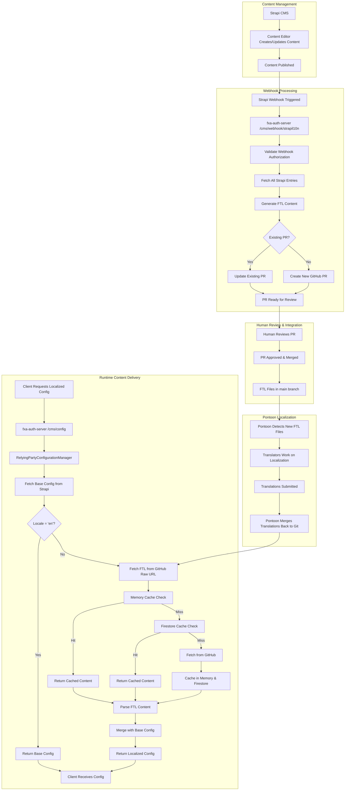
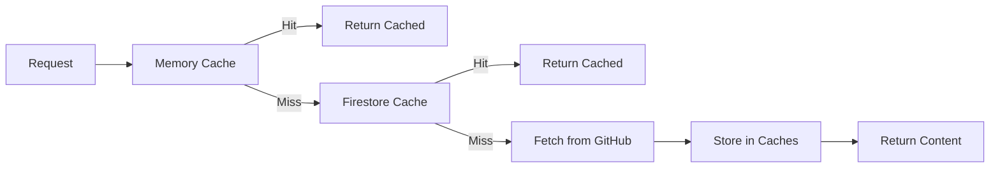
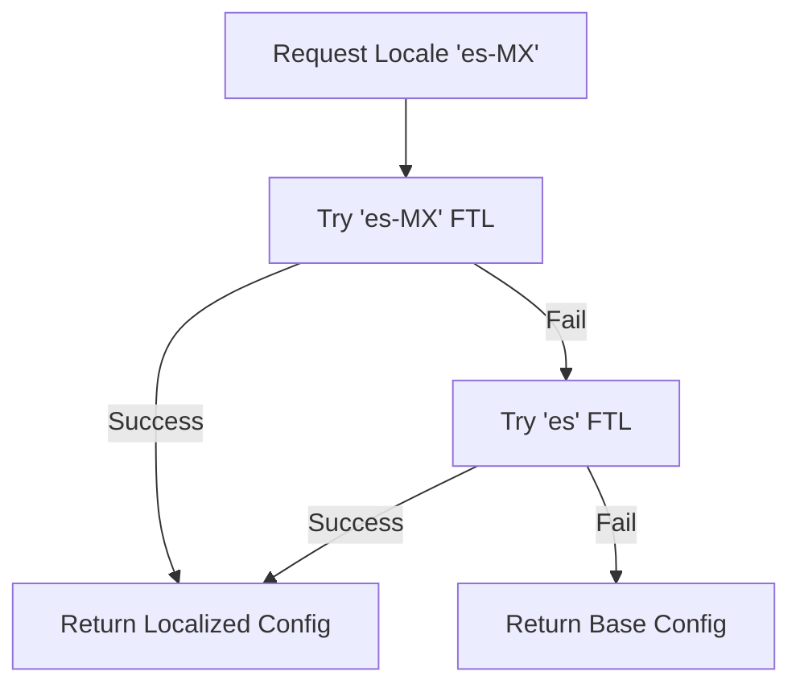

Last updated: `Aug 25th, 2025`

## Overview

This document describes the complete localization workflow for Mozilla Accounts (FxA), covering how content changes in Strapi CMS trigger automated localization processes, and how localized content is delivered to users at runtime.

The Mozilla Accounts localization system enables dynamic, localized user experiences by integrating Strapi CMS, GitHub, Pontoon, and runtime content delivery. The workflow ensures that content changes are automatically processed for localization and efficiently delivered to users with proper caching and error handling.

## Architecture Components

### Core Components

1. **Strapi CMS**: Headless CMS for managing relying party configurations
2. **fxa-auth-server** (`cms.ts`): API layer handling CMS requests and webhook processing
3. **fxa-shared** (`relying-party-configuration-manager.ts`): Configuration management with caching
4. **fxa-settings** (`getCmsInfo`): Frontend integration for localized content
5. **GitHub**: Version control and FTL file storage
6. **Pontoon**: Mozilla's localization platform
7. **FTL (Fluent Translation List)**: Localization file format

## Workflow Diagram



## Detailed Workflow Steps

### 1. Content Creation and Publishing

**Location**: Strapi CMS
**Participants**: Content editors, marketing teams

1. Content creators log into Strapi CMS
2. Create or modify relying party configurations
3. Content includes localizable fields like headlines, descriptions, button text
4. Content is published, triggering the webhook system

### 2. Webhook Processing and FTL Generation

**Location**: `packages/fxa-auth-server/lib/routes/cms.ts:178-297`
**Participants**: Webhook handler, GitHub API

#### Webhook Validation
```typescript
// Webhook authorization is verified using timing-safe comparison
const authHeader = request.headers.authorization;
if (!crypto.timingSafeEqual(
  Buffer.from(authHeader),
  Buffer.from(this.config.cmsl10n.strapiWebhook.secret)
)) {
  throw new Error('Invalid authorization header');
}
```

#### FTL Generation Process
**Location**: `packages/fxa-auth-server/lib/routes/utils/cms/localization.ts:110-192`

1. **Fetch All Entries**: Query Strapi for all published relying party entries
2. **Extract Localizable Content**: Filter out non-localizable fields (IDs, dates, URLs, colors)
3. **Generate FTL Format**: Convert extracted strings to Fluent format with unique identifiers
4. **Create GitHub PR**: Either update existing PR or create new branch and PR

#### FTL Format Example
```ftl
### Generated on 2024-01-15T10:30:00.000Z
### FTL file for CMS localization

## sync-signin - Firefox Sync Sign In
# Headline for Sign In Page
sync-signin-headline-a1b2c3d4 = Sign in to sync your data
# Primary Button Text for Sign In Page
sync-signin-primary-button-text-e5f6g7h8 = Continue
```

### 3. GitHub Integration and PR Management

**Location**: `packages/fxa-auth-server/lib/routes/utils/cms/localization.ts:495-604`

#### PR Creation Process
1. **Branch Creation**: Create timestamped branch `cms-localization-{timestamp}`
2. **File Creation**: Add/update `locales/en/cms.ftl`
3. **PR Creation**: Create PR with detailed description including:
    - Webhook event details
    - Entry count processed
    - Generation timestamp
    - Source information

#### PR Update Process
- **Existing PR Detection**: Search for open PRs with CMS localization titles
- **Content Update**: Update FTL file in existing branch
- **Metadata Preservation**: Maintain PR context and approval history

### 4. Human Review and Approval

**Participants**: Development team, localization coordinators
**Process**:
1. Automated PR contains generated FTL file
2. Reviewers verify content extraction accuracy
3. Check for proper FTL format compliance
4. Approve and merge PR to main branch

### 5. Pontoon Integration

**Location**: External to FxA codebase
**Process**:
1. **Detection**: Pontoon monitors the FxA repository for FTL file changes
2. **Project Update**: New strings are imported into Pontoon projects
3. **Translation**: Community translators and staff work on localizations
4. **Quality Assurance**: Translations are reviewed and approved
5. **Merge Back**: Completed translations are committed back to the repository

### 6. Runtime Localization and Caching

**Location**:
- API: `packages/fxa-auth-server/lib/routes/cms.ts:96-176`
- Configuration Manager: `libs/shared/cms/src/lib/relying-party-configuration.manager.ts`
- Frontend: `packages/fxa-settings/src/models/integrations/integration.ts:167-199`

#### Caching Strategy



#### Cache Configuration
- **Memory Cache TTL**: 5 minutes (configurable via `cmsl10n.ftlCache.memoryTtlSeconds`)
- **Firestore Cache TTL**: 30 minutes (configurable via `cmsl10n.ftlCache.firestoreTtlSeconds`)
- **Firestore Offline TTL**: 7 days (configurable via `cmsl10n.ftlCache.firestoreOfflineTtlSeconds`)

#### Localization Request Flow

1. **Client Request**: Frontend requests `/cms/config?clientId={id}&entrypoint={point}`
2. **Base Configuration**: Fetch base config from Strapi via RelyingPartyConfigurationManager
3. **Locale Detection**: Determine user locale from request headers
4. **Localization Logic**:
    - If locale is 'en' → return base config
    - If localization disabled → return base config
    - Otherwise, proceed with localization
5. **FTL Retrieval**: Fetch localized FTL content with fallback logic:
    - Try specific locale (e.g., 'es-MX')
    - Fallback to base language (e.g., 'es')
    - Use cached content when available
6. **Content Merging**: Parse FTL and merge with base configuration
7. **Response**: Return localized configuration to client

#### FTL URL Template
```typescript
// Configuration example
{
  "cmsl10n": {
    "ftlUrl": {
      "template": "https://raw.githubusercontent.com/mozilla/fxa/{branch}/locales/{locale}/cms.ftl",
      "timeout": 5000
    }
  }
}
```

## Error Handling and Fallbacks

### Webhook Processing Errors
**Location**: `packages/fxa-auth-server/lib/routes/cms.ts:290-296`

- **Authentication Failures**: Invalid webhook secrets are logged and rejected
- **Strapi API Errors**: Network failures fall back gracefully without blocking the webhook
- **GitHub API Errors**: PR creation failures are logged with full context
- **Validation Errors**: Malformed content is logged for debugging

### Runtime Localization Errors
**Location**: `packages/fxa-auth-server/lib/routes/utils/cms/localization.ts:665-716`

- **FTL Fetch Failures**: Automatic fallback to base language, then base config
- **Network Timeouts**: Configurable timeout with graceful degradation
- **Cache Failures**: Continue to next cache level or origin fetch
- **Parse Errors**: Return base configuration on FTL parsing failures

### Fallback Strategy


## Configuration

### Environment Variables
- `FXA_L10N_REPO`: L10n repository URL (default: mozilla/fxa-content-server-l10n)
- `FXA_L10N_BRANCH`: Target branch (default: main)
- `FXA_L10N_SHA`: Specific commit hash for L10n files

### Service Configuration
```typescript
interface CMSLocalizationConfig {
  enabled: boolean;
  strapiWebhook: {
    enabled: boolean;
    secret: string;
    strapiUrl: string;
  };
  github: {
    token: string;
    owner: string;
    repo: string;
    branch: string;
  };
  ftlUrl: {
    template: string;
    timeout: number;
  };
  ftlCache: {
    memoryTtlSeconds: number;
    firestoreTtlSeconds: number;
    firestoreOfflineTtlSeconds: number;
  };
}
```

## Key File Locations

### Backend Components
- **CMS Routes**: `packages/fxa-auth-server/lib/routes/cms.ts`
- **Localization Logic**: `packages/fxa-auth-server/lib/routes/utils/cms/localization.ts`
- **Configuration Manager**: `libs/shared/cms/src/lib/relying-party-configuration.manager.ts`
- **Test Suite**: `packages/fxa-auth-server/test/local/routes/utils/cms/localization.js`

### Frontend Components
- **Integration Layer**: `packages/fxa-settings/src/models/integrations/integration.ts:167`
- **CMS Hooks**: `packages/fxa-settings/src/models/hooks.ts:262`
- **Auth Client**: `packages/fxa-auth-client/lib/client.ts:2428`

### L10n Scripts
- **Clone Script**: `_scripts/l10n/clone.sh`
- **Prime Script**: `_scripts/l10n/prime.sh`
- **Bundle Script**: `_scripts/l10n/bundle.sh`

## Monitoring and Metrics

### StatsD Metrics
- `cms.getConfig.empty`: Config requests returning empty results
- `cms.getConfig.multiple`: Multiple relying parties found for request
- `cms.getConfig.error`: Config fetch errors
- `cms.getLocalizedConfig.success`: Successful localized config delivery
- `cms.getLocalizedConfig.fallback`: Fallback to base config
- `cms.getLocalizedConfig.error`: Localization errors
- `cms.strapiWebhook.processed`: Successfully processed webhooks
- `cms.strapiWebhook.error`: Webhook processing errors
- `cms_ftl_cache_hit`: FTL cache hit timing
- `cms_ftl_request`: FTL fetch timing and errors

### Logging
All components use structured logging with:
- Request correlation IDs
- Client identification
- Locale information
- Error details and stack traces
- Performance metrics

### Testing Localization
```bash
# Run localization-specific tests
NODE_ENV=test yarn test test/local/routes/utils/cms/localization.js

# Test with specific locale
curl "http://localhost:9000/v1/cms/config?clientId={clientId}&entrypoint={entrypoint}" \
  -H "Accept-Language: es-MX"
```

## Troubleshooting

### Common Issues

1. **Empty Localized Config**: Check FTL file availability and cache status
2. **Webhook Failures**: Verify webhook secret configuration and Strapi connectivity
3. **GitHub PR Errors**: Confirm GitHub token permissions and repository access
4. **Cache Inconsistency**: Clear Firestore and memory caches, verify TTL settings
5. **FTL Parse Errors**: Validate FTL file format and character encoding
