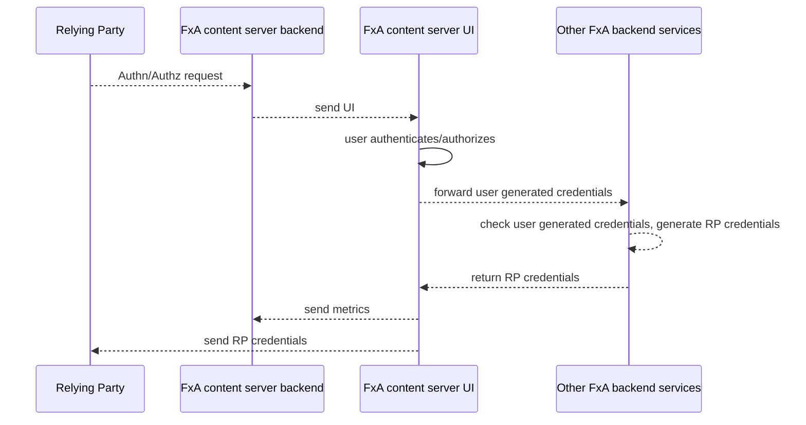

Current as of `Jan 20th, 2020`

## Document purpose

This is a starting point for developers and contributors of the Mozilla accounts Content Server. The content-server
is responsible for displaying the authentication/authorization and account settings related UI to the user.

## Helpful to know before starting

At a high level, FxA is an [authentication (authn) and authorization (authz) system](https://stackoverflow.com/questions/6556522/authentication-versus-authorization). This means a Relying Party (RP) such as Firefox Sync delegates
the responsibility for authenticating and authorizing users to Mozilla accounts. Once the user proves their
identity to FxA, we return one or more tokens the RP can use to access a "protected resource".
The [OAuth 2.0 spec](https://tools.ietf.org/html/rfc6749) does a good job of explaining these concepts.



While FxA is an [OAuth 2.0 authorization server](https://tools.ietf.org/html/rfc6749#section-1.1), OAuth is
only one of several [integration types](#relying-party-integrations) supported by FxA.
For more information about how FxA came to support so many non-standard integrations, see the [App Services and FxA Unofficial History](https://docs.google.com/document/d/1jixykayGuyIGU8ecThHvvUpTeC4yq84KRalGr0Jh0xg/).

Detailed [Maps of the FxA Universe](../reference/system-diagrams) outline how the various Mozilla accounts micro-services
fit together.

### Relying Party Integrations

The content server architecture was heavily influenced by the number of ways Relying Parties (RPs)
integrate with FxA. If portions of the architecture seem byzantine and complex, chances are this is why.

- 4 browser environments for Firefox Sync:
  - Firefox Desktop
  - Firefox for Android (Fennec)
  - Firefox for Android (Fenix)
  - Firefox for iOS
- WebExtensions such as Notes and the Firefox Private Network "secure proxy" (FPN)
- OAuth 2.0 such as [Monitor](https://monitor.firefox.com/)
- Native applications such as the [Firefox Private Network VPN](https://fpn.firefox.com/vpn)
- "Direct access", i.e., users browsing directly to https://accounts.firefox.com

## Content server architecture basics

The content server is comprised of a server and client side components.

The server side is responsible for serving static content and ingesting metrics and error
reports.

The client side is a [Backbone](https://backbonejs.org/) based Single Page Application (SPA) and responsible for screen rendering,
handling user input, communicating with various FxA backend services, and communicating with RPs or browsers.
The client app runs in modern Web capable systems, see [supported browsers](../reference/browser-support) for up to date tier 1 support.  Our use of Backbone isn't strictly Model-View-Controller (MVC), ours is more like MVVM. We use Models and Views and have models for the Views.

:::note
**We're in the middle of a conversion to React which will obsolete Backbone.**  Read more details about [Phase II](https://mozilla-hub.atlassian.net/browse/FXA-6441).
:::


## High Level Web Client Components

### Auth-Brokers
[Auth-Brokers](https://github.com/mozilla/fxa/tree/main/packages/fxa-content-server/app/scripts/models/auth_brokers) have two primary responsibilities:
1. Mediate communication between Mozilla accounts and the RP
2. Screen->screen state machine

To minimize the complexity, each integration type has its own broker so that
customizations can be made without interfering with other brokers.

Brokers are made up of a list of capabilities, methods, and behaviors. Brokers can extend exisiting brokers and overwrite
any of these properites to meet the specification of that integration.

- [capabilities](https://github.com/mozilla/fxa/blob/5c527d8007c416b2f6122d8081f7756f8bc6733b/packages/fxa-content-server/app/scripts/models/auth_brokers/base.js#L539:L602) can be thought of as feature flags, e.g., ["does this integration support signup?"](https://github.com/mozilla/fxa/blob/5c527d8007c416b2f6122d8081f7756f8bc6733b/packages/fxa-content-server/app/scripts/models/auth_brokers/base.js#L539:L602)  (some versions of Firefox for iOS do not)
- methods are invoked by views before and after certain events happen, e.g., [`afterSignIn`](https://github.com/mozilla/fxa/blob/5c527d8007c416b2f6122d8081f7756f8bc6733b/packages/fxa-content-server/app/scripts/models/auth_brokers/base.js#L270:L279) is called after a user signs in and can be used to notify the RP. Methods usually return a "behavior", i.e., "what to do next".
- behaviors define "what to do next" after a method has completed. For example, `afterSignIn` by default [sends the user to the /signin_confirmed screen](https://github.com/mozilla/fxa/blob/5c527d8007c416b2f6122d8081f7756f8bc6733b/packages/fxa-content-server/app/scripts/models/auth_brokers/base.js#L106).

Brokers communicate with RPs via the URL or a [Channel](#channels).

:::note
While placing screen->screen transition logic in auth_brokers might seem like an odd choice, this resulted
in a huge simplification over when complex transition logic was embedded in views. Some screen->screen transitions
depend on the integration type, and embedding this logic within the Views resulted in an unmaintainable
mess. The work to completely remove transition logic from views was never completed, and we have since
made many transitions more universal and it may be that we could move some of this logic back into views.
It may also be that distinct state machines outside of brokers would have been a better choice.
:::

#### Auth Broker implementations

| Broker        | Description   |
| ------------- |:-------------:|
|[base](https://github.com/mozilla/fxa/blob/88f6119cc75ae75bd26f87cf5e42dc71e95411d4/packages/fxa-content-server/app/scripts/models/auth_brokers/base.js#L6)| Base broker that other brokers inhiert from. |
|[fx-desktop-v3](https://github.com/mozilla/fxa/blob/9a26577ee493fca55c4fe752fa940bac0286d066/packages/fxa-content-server/app/scripts/models/auth_brokers/fx-desktop-v3.js#L6)|v3 of the Fx Desktop authentication broker, it allows the uid of a user to change if the user's account has been deleted.|
|[fx-fennec-v1](https://github.com/mozilla/fxa/blob/2d5efe1264157e72ccd1ddbfc60d4bb6361a4d7b/packages/fxa-content-server/app/scripts/models/auth_brokers/fx-fennec-v1.js#L15)|Interfaces with Firefox for Android when authenticating for Sync, it communicates with the browser using WebChannels.|
|[fx-ios-v1](https://github.com/mozilla/fxa/blob/a4f406cddc24478683ef6b8335dfe5423e21a62b/packages/fxa-content-server/app/scripts/models/auth_brokers/fx-ios-v1.js#L7)|Interfaces with Sync on Fx for iOS. Uses the same custom protocol as fx-desktop-v1.|
|[fx-sync](https://github.com/mozilla/fxa/blob/16e58737d95214abe27337bd7ad3bbe07b4da8d2/packages/fxa-content-server/app/scripts/models/auth_brokers/fx-sync.js#L6)|Generic broker used to integrate into Sync. This is used as a base class.|
|[fx-sync-channel](https://github.com/mozilla/fxa/blob/2d5efe1264157e72ccd1ddbfc60d4bb6361a4d7b/packages/fxa-content-server/app/scripts/models/auth_brokers/fx-sync-channel.js#L6)|Base broker that communicates with the Firefox browser.|
|[fx-sync-web-channel](https://github.com/mozilla/fxa/blob/25f33db4437b980f479911eea36ace35728c00df/packages/fxa-content-server/app/scripts/models/auth_brokers/fx-sync-web-channel.js#L6)|Variant of Sync broker that communicates via webchannels.|
|[oauth-redirect](https://github.com/mozilla/fxa/blob/14543fdcd73d300946b7155c275391072d96e247/packages/fxa-content-server/app/scripts/models/auth_brokers/oauth-redirect.js#L5)|Oauth broker that finishes oauth flow by redirecting the current window.|
|[oauth-redirect-chrome-android](https://github.com/mozilla/fxa/blob/8701348cdd79dbdc9879b2b4a55a23a135a32bc1/packages/fxa-content-server/app/scripts/models/auth_brokers/oauth-redirect-chrome-android.js#L12)|Created because Chrome for Android will not allow the page to redirect unless its the result of a user action such as a click.|
|[oauth-webchannel-v1](https://github.com/mozilla/fxa/blob/a4f406cddc24478683ef6b8335dfe5423e21a62b/packages/fxa-content-server/app/scripts/models/auth_brokers/oauth-webchannel-v1.js#L6)|WebChannel OAuth broker that speaks 'v1' of the protocol.|
|[web](https://github.com/mozilla/fxa/blob/3173773c00c9d777b9c82d76be10f120e79af7b2/packages/fxa-content-server/app/scripts/models/auth_brokers/web.js#L6)|Auth broker to handle users who browse directly to the site.|
|[pairing/authority](https://github.com/mozilla/fxa/blob/8701348cdd79dbdc9879b2b4a55a23a135a32bc1/packages/fxa-content-server/app/scripts/models/auth_brokers/pairing/authority.js#L5)|Manages the OAuth flow by WebChannel messages to the browser to help with a pairing-based flow.|
|[pairing/supplicant](https://github.com/mozilla/fxa/blob/fa545b9bc089c15cba6549a3277df45254fc7527/packages/fxa-content-server/app/scripts/models/auth_brokers/pairing/supplicant.js#L11)|SupplicantBroker extends OAuthRedirectBroker to provide a redirect behaviour as an OAuth flow.|
|[pairing/supplicant-webchannel](https://github.com/mozilla/fxa/blob/25f33db4437b980f479911eea36ace35728c00df/packages/fxa-content-server/app/scripts/models/auth_brokers/pairing/supplicant-webchannel.js#L10)|SupplicantWebChannelBroker extends OAuthWebChannelBroker to provide a WebChannel flow.|

### Channels

A [channel](https://github.com/mozilla/fxa/tree/main/packages/fxa-content-server/app/scripts/lib/channels) is a two way communication mechanism between a RP and Mozilla accounts. The method of communication is channel specific.

There are channels to:

- Communicate between FxA and the browser
- Communicate between FxA and a WebExtension
- Communicate between 2 or more FxA tabs

### Reliers

A [Relier](https://github.com/mozilla/fxa/tree/main/packages/fxa-content-server/app/scripts/models/reliers) fetches and holds data about the current RP. A Relier is created on startup and is
a central place to ensure data coming into and out of FxA is safe and well-formed.

Three primary types of Relier models exist:

1. browser (for Sync integrations)
2. oauth
3. web (called relier)

:::danger
Any long lived data (e.g., email address, uid, `client_id`), coming from an RP or on the URL
**MUST BE** validated and transformed within Reliers. While it seems natural to ingest and sanitize
data in the Views, we are unable to control what users and malicious actors do. Assuming users always
enter at `/`, or at `/complete_sign_up`, etc, _does not hold_. To prevent XSS, we would have to validate
and sanitize long lived data *on every screen it is used*, and we saw many cases in the past where we
forgot to do this. Ingesting and validating the data on startup in the Relier model ensures the data
is checked once and is ensured to be safe afterwards.
:::

:::note
The front end could probably be significantly simplified if all query parameter validation logic was moved to the server.
:::

### User

A [User](https://github.com/mozilla/fxa/tree/main/packages/fxa-content-server/app/scripts/models/user.js) holds and persists data about one or more Accounts as well as keeping track of the currently signed in user.

:::note
The user model was a premature solution to allow us to have an "account chooser" where a user visiting
a new RP would be able to choose from any of their signed in Accounts. We never implemented this, and the User
model has been a bit of a pain. The model does handle other things, though we could probably move most of its
responsibilities elsewhere and simplify the overall architecture.
:::

### Account

An [Account](https://github.com/mozilla/fxa/tree/main/packages/fxa-content-server/app/scripts/models/account.js) holds data about a given account and provides an API for making updates to the account. The account
model uses the fxa-js-client, fxa-oauth-client, and fxa-profile-client to operate on the account in any way.

### Router

The [Router](https://github.com/mozilla/fxa/tree/main/packages/fxa-content-server/app/scripts/router.js) is responsible for reacting to URL changes and displaying the Views.

### Views

[Views](https://github.com/mozilla/fxa/tree/main/packages/fxa-content-server/app/scripts/views) represent either an entire screen or a portion of a screen. Views react to user input, and often call
[Broker](#brokers) methods to determine where the user should be sent after a successful form submission. Screen
level views are rendered by the [AppView](https://github.com/mozilla/fxa/blob/main/packages/fxa-content-server/app/scripts/views/app.js). See [View Deepdive](#view-deepdive) for more info.

### Templates

A [template](https://github.com/mozilla/fxa/tree/main/packages/fxa-content-server/app/scripts/templates) is a serialized HTML representation of a View. A view renders a template using data available to it and writes the rendered template to the DOM. Templates use the [mustache](http://mustache.github.io/) template library.

### Clients

Communication with external servers are done via client libraries.

#### fxa-js-client

The [fxa-auth-client](https://github.com/mozilla/fxa/tree/main/packages/fxa-auth-client) communicates with the Mozilla accounts [Auth Server](https://github.com/mozilla/fxa/tree/main/packages/fxa-auth-server/). The fxa-js-client is used for all aspects of authenticating a user - sign up, sign in, password reset, etc.

#### oauth-client

The [oauth-client](https://github.com/mozilla/fxa/tree/main/packages/fxa-content-server/app/scripts/lib/oauth-client.js) used to communicate with the Mozilla accounts OAuth Server and now communicates with the OAuth endpoints on the Auth server. The OAuth client is used to fetch OAuth codes and tokens to send to the RP.

#### [profile-client](https://github.com/mozilla/fxa/tree/main/packages/fxa-content-server/app/scripts/lib/profile-client.js)

The profile-client communicates with the Mozilla accounts [Profile Server](https://github.com/mozilla/fxa/tree/main/packages/fxa-profile-server/). This client allows a user to interact with their profile data.

## Application lifecycle

When the application starts, [app-start.js](https://github.com/mozilla/fxa/tree/main/packages/fxa-content-server/app/scripts/lib/app-start.js) takes care of setting up system-wide dependencies. app-start immediately determines the integration type and creates the appropriate [Broker](https://github.com/mozilla/fxa/tree/main/packages/fxa-content-server/blob/8561ec3c1d06763f454f4ac7cb8ef142eb0c01b0/app/scripts/lib/app-start.js#L234) and [Relier](https://github.com/mozilla/fxa/tree/main/packages/fxa-content-server/blob/8561ec3c1d06763f454f4ac7cb8ef142eb0c01b0/app/scripts/lib/app-start.js#L199). The broker is queried to check support of the current integration. If the integration is supported, other models and the [router](https://github.com/mozilla/qfxa/tree/main/packages/fxa-content-server/blob/8561ec3c1d06763f454f4ac7cb8ef142eb0c01b0/app/scripts/lib/app-start.js#L315) are created. The router takes over and determines the initial View to display based on the browser's URL. The router creates the View, which in turn writes a template to the DOM. The user interacts with the View, either by filling out a form or clicking on links and buttons. A view can communicate with external servers using clients or via an Account model. Views usually invoke broker methods to determine next steps, which could be to redirect to another view, display a status message, or stop. Upon successful authentication with Mozilla accounts, the broker is notified, which in turn notifies a RP. The RP is responsible for the final fate of the Mozilla accounts tab. In the case of OAuth redirect, FxA redirects to the RP. In the case of Sync or a WebExtension, the tab may be closed automatically, or the user may have to close the tab themselves.

## View Deepdive

View take care of all things UI. Each view has access to several models and libraries, the most commonly used are:

* [Broker](#brokers) (this.broker)
* [Relier](#reliers) (this.relier)
* [User](#user) (this.user)

Even though React wasn't a thing, FxA views have their own lifecylce methods
for [rendering](#render-lifecycle-metohds) and [form submission](#submit-lifecycle-methods).


### BaseView

[BaseView](https://github.com/mozilla/fxa/blob/main/packages/fxa-content-server/app/scripts/views/base.js) is the parent of all Views. BaseView is responsible for rendering deciding whether to render a view, and if so, for rendering. BaseView also takes care of status messages, hooking up DOM events, [l10n](#l10n), and logging. BaseView does *not* take care of any form handling, for that, see [FormView](#formview).

### Rendering templates

#### setInitialContext

`setInitialContext` is used to pass data to the Mustache template and is often overridden:

```js
...
setInitialContext(context) {
  context.set({
    email: this.getAccount().get('email')
  });
},
...
```

#### Render lifecycle methods

| method name | purpose |
|-------------|---------|
|beforeRender | Called before `renderTemplate`, can return a promise. If resolves to `false`, rendering is aborted, can be used to redirect a user to a different screen if pre-conditions are not met. |
|renderTemplate | Renders the template with [context](#setinitialcontext). Rarely overridden.
|afterRender  | Called after `renderTemplate`, can return a promise. If resolves to `false`, view is not displayed, can be used to redirect a user to a different screen if pre-conditions are not met. Often used by mixins to initialize based on elements in view.$el before being added to the DOM. |
|afterVisible | Called after a screen has been added to the DOM. |


### FormView

Extend from [FormView](https://github.com/mozilla/fxa/blob/5c527d8007c416b2f6122d8081f7756f8bc6733b/packages/fxa-content-server/app/scripts/views/form.js#L1) for any Views that contain a form that can be submit.
FormView takes care of several aspects of form submission:

- Ensure only one form submission can be in flight at a time
- Form validation
- Print submit error messages

#### Submit lifecycle methods

| method name | purpose |
|-------------|---------|
|isValidStart | Perform validation before individual input elements are validated. Return `false` to indicate form is invalid. |
|isValidEnd  | Perform validation after individual input elements are validated. Return `false` to indicate form is invalid. |
|showValidationErrorsStart | Show validation errors before individual invalid input elements add their tooltips. If a truthy value is returned, no other validation errors are displayed. |
|showValidationErrorsEnd | Show validation errors after individual invalid input elements add their tooltips. |
|beforeSubmit | Called if form is valid, before `submit`. Can return a promise. Resolve to `false` to prevent `submit` from being called. |
|submit | **MUST BE OVERRIDDEN** Do the form submission. Can return a promise. If promise rejects, the error will be displayed as an error message. |
|afterSubmit | Called after the `submit`. Can be used for cleanup housekeeping. |

#### Showing validation errors
The [showValidationError](https://github.com/mozilla/fxa/blob/5c527d8007c416b2f6122d8081f7756f8bc6733b/packages/fxa-content-server/app/scripts/views/form.js#L379) method is used to show validation errors on an individual input element, this is most commonly done in `showValidationErrorsStart` or `showValidationErrorsEnd`.

### Mixins

The content server front-end relies heavily on [Cocktail based mixins](https://github.com/onsi/cocktail). Mixins enable code extraction into standalone modules that are "mixed into" other modules. Mixins have several purposes within FxA:

1. Share functionality across modules without relying on inheritance.
2. Isolate experiment code. If the experiment is deemed a failure,
removing the experiment means removing the mixin rather than updating core View logic.
3. Isolate related tasks to simplify reasoning.

Method name collision between a mixin and a mixed-in View is allowed and frequently used, understanding [Cocktail's collision handling](https://github.com/onsi/cocktail#but-what-about-collisions) is important to avoid any surprises, especially
relating to return values.

### screen->screen navigation

```js
this.navigate('confirm_signin', {
  // fields here are passed to the next view
  account: this.getAccount(),
});
```

The `confirm_signin` view can access the data passed from the previous view:

```js
const account = this.model.get('account');
```

## More useful info

### Adding a new route

1. Create a new View module if needed
2. Add a [route entry to the frontend](https://github.com/mozilla/fxa/blob/5c527d8007c416b2f6122d8081f7756f8bc6733b/packages/fxa-content-server/app/scripts/lib/router.js#L98)
3. Add a [route entry to the backend](https://github.com/mozilla/fxa/blob/5c527d8007c416b2f6122d8081f7756f8bc6733b/packages/fxa-content-server/server/lib/routes/get-frontend.js#L8)
4. Add a [test to ensure the new route responds with a 200](https://github.com/mozilla/fxa/blob/5c527d8007c416b2f6122d8081f7756f8bc6733b/packages/fxa-content-server/tests/server/routes.js#L28)
5. Add some functional tests

### Server errors and error messages

Any time a new error is added [to the auth-server](https://github.com/mozilla/fxa/blob/82553801812397f6fdbbbb748580ee8319a0a542/packages/fxa-auth-server/lib/error.js#L12), a corresponding entry needs to be added [to the content server](https://github.com/mozilla/fxa/blob/82553801812397f6fdbbbb748580ee8319a0a542/packages/fxa-content-server/app/scripts/lib/auth-errors.js#L28) to ensure the error text
is translated.

Error messages can be customized depending if it makes sense for a particular context by setting the
`forceMessage` property on an error before display. See [this example](https://github.com/mozilla/fxa/blob/82553801812397f6fdbbbb748580ee8319a0a542/packages/fxa-content-server/app/scripts/views/mixins/signin-mixin.js#L135:L141).

### Closing FxA and metrics (aka - missing metrics)

When redirecting to an external site, e.g., an OAuth RP, the content server makes its best attempt
at flushing metrics in an [`unload` handler](https://github.com/mozilla/fxa/blob/82553801812397f6fdbbbb748580ee8319a0a542/packages/fxa-content-server/app/scripts/lib/metrics.js#L192). The problem with depending on `unload` handlers
is this only works *some of the time*. The `unload` handler is ignored on iOS, so we have to
ensure metrics are flushed before a redirect happens.

A common problem is setting `navigator.location.href = url` from within view code without first
flushing metrics. Instead of setting `location.href`, call `this.navigateAway` which will ensure
A common problem is setting `navigator.location.href = url` from within view code.
metrics are flushed. `href`s from anchor elements are automatically handled by the
[ExternalLinksMixin](https://github.com/mozilla/fxa/blob/main/packages/fxa-content-server/app/scripts/views/mixins/external-links-mixin.js).

### User data stored on device

Some user data is stored in localStorage to smooth out repeated auth requests and ensure consistent
experiment choices across users.

All FxA related information is keyed with a `__fxa_storage.` prefix.

Account data of all users is located under `__fxa_storage.accounts`. The entry
is an object where the keys are account UIDs and the values are serialized account
data.

In environments that support the `fxaccounts:fxa_status` WebChannel message,
account data stored in localStorage is merged with the `signedInUser` field
of the `fxaccounts:fxa_status` response.

### Keeping tabs synchronized

If multiple FxA tabs are open, we try to keep tab signin state synchronized as much
as possible. Whenever the user signs in or out, [BroadcastChannel](https://developer.mozilla.org/docs/Web/API/BroadcastChannel)
messages are sent to all other FxA tabs. Whenever another tab receives a message, it responds
appropriately.

### Localization

See [localization reference materials](../reference/localization).