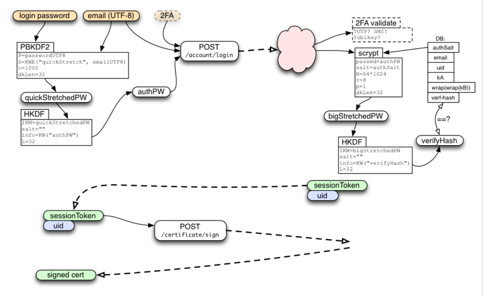
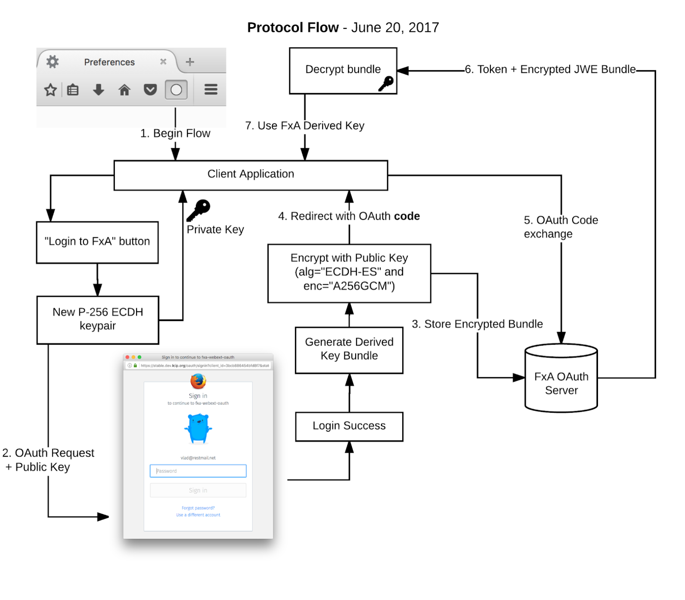

## Scoped Encryption Keys for Mozilla accounts

The ability to provide secure access to per-user encryption keys is a major differentiator for Mozilla accounts over other identity providers.  Indeed, the requirement for client-side encryption keys in Firefox Sync is the main reason that Mozilla develops Mozilla accounts in-house rather than using an existing identity system.

However, it's currently hard to use this capability for any application other than Firefox Sync,  because key material can only be accessed through a bespoke authorization protocol that is:
* **Complex to implement.**  The application has to either directly perform cryptographic operations on the user's account credentials, or to embed web content from accounts.firefox.com.  Keys are not available in the OAuth authorization flow which we prefer to use for new application integrations.
* **Far too powerful.**  The protocol gives the application complete control of the user's Firefox Account, and hands it a copy of their master key material.  There is currently no provision for scoping access down to a subset of data or capabilities.

Since end-to-end encryption is an important part of Mozilla's story around user privacy and security, we want to make it ***easier*** for the next generation of Firefox applications to use the encryption capabilities offered by Mozilla accounts, while giving users ***more control*** over the  capabilities granted to each application.

From short-term to long-term, the things we'd like to support with this work are:

* Enable other teams at Mozilla to quickly prototype new apps and services that use end-to-end encryption, bootstrapping from the existing FxA user-base.
  * Example: "Lockbox", a password-management service with a WebExtension for desktop Firefox and a stand-alone mobile app, that encrypts passwords for storage in the cloud.
  * Example: "[Firefox Notes][fx-notes]", a note-taking extension for Firefox that encrypts data for backing up in the cloud.
* Allow new applications to access a user's sync data in a controlled way, with explicit user permission.
  * Example: a new version of the "Prox" mobile app that can pull down the user's history information to make better suggestions, but is not able to access other data from Firefox Sync.
  * Example: a single-page-web-app bookmarks viewer that can pull in bookmarks data from Firefox Sync.
* Encourage an ecosystem of third-party applications that can easily incorporate end-to-end encryption by securely obtaining key material from Mozilla accounts.

To achieve this, we propose an extension to the standard OAuth authorization flow by which relying applications can obtain encryption keys in a secure and controlled manner.

### Background

We assume some familiarity with the basic data model of Mozilla accounts, as described in the [onepw protocol document][onepwprotocol].

While there is significantly more detail at the above link, the main points necessary for understanding our proposal are:

* A server-side component (the ***"FxA server"***) stores user account data and provides access to it through an authenticated HTTP API.  Alongside the usual account information such as email address and hashed password verifier, each user has a randomly-generated 32-byte key which we call `wrapKb`, and which can only be retrieved by proving knowledge of the user's account password.

* Authenticating to the FxA server API is done through web content loaded from https://accounts.firefox.com (the ***"FxA web content"***).  This web content is what provides the current Sync login UI for Firefox and the authentication UI for current FxA OAuth reliers. It is the only component of the system that sees the user's plaintext account password.

* When an application needs to connect to Firefox Sync, it performs the following steps:

  * The application loads FxA web content inside an embedded web runtime, and listens for custom message events.

  * The FxA web content prompts for the user's account password, stretches it via PBKDF2, then uses HKDF to derive two distinct 32-byte values: an authenticator `authPW` which it can pass to the server to prove knowledge of the password, and a private 32-byte key which we call `unwrapBKey`.

  * The web content passes `authPW` to the FxA server and receives two tokens in return: a long-lived ***session token*** that is used to authenticate subsequent API calls, and a single-use ***key fetch token*** with which it can retrieve the user's `wrapKb`.  It messages these along with `unwrapBKey` back to the client application.

The application fetches `wrapKb` from the FxA server, then calculates the user's ***master key material*** via xor: `kB = wrapkB ⊕ unwrapBKey`.



Constructing the master key material `kB` from two separate components in this manner gives the system some interesting security properties:

* The FxA server never sees the user's raw password or their `kB`, thanks to the inclusion of `unwrapBKey` which is only available to client-side web content.
* Knowledge of the user's account password is not sufficient to calculate `kB`; one must also convince the FxA server to provide a copy of `wrapKb`, which can be protected by operational security measures such as email confirmation loops (or in the future, a 2FA challenge).
* Data that is encrypted using key material derived from `kB` cannot be used to mount a brute-force guessing attack on the user's password, because it incorporates a full 32 bytes of entropy via `wrapKb`.
* The user can change their password without changing the value of `kB`, by calculating a new value of `wrapKb` to match the new value of `unwrapBKey` and storing it on the server.

Of course, these security properties depend on the FxA web content behaving as described and assume that the user trusts this code not to be malicious.  A discussion about ensuring the trustworthiness of FxA web content would be both very interesting, and very beyond the scope of this document.

We intend all new applications to connect to Mozilla accounts and attached services via OAuth, so we assume familiarity with the [OAuth 2.0 standard][oauth2-standard] and will be proposing an extension of it in this document.  We will use the [Javascript Object Signing and Encryption ("JOSE")][jose] family of specifications for the details of cryptographic operations and data formats.

### Requirements

The current Firefox Sync authentication protocol delivers the raw value of `kB` to the application, making it unsuitable for applications that want their own encryption keys but do not need access to sync data.  By contrast, the current FxA OAuth protocol does not provide any access to key material at all.

The purpose of this document is thus twofold:

* To propose a way to derive multiple purpose-specific keys from this single source of master key material, so we can use distinct keys for distinct applications.
* To propose a protocol for delivering these keys to applications that is easy for them to integrate, while keeping the user in control of what capabilities are granted to which applications.

To support the desired range of target applications, and to maintain the existing security properties of the Mozilla accounts system, we will observe the following requirements when designing the extended authorization flow:

* We must maintain the core security promise of the existing FxA protocol: ***key material is never seen by the FxA server***.
  * Key material may, however, be handled by client-side web content from accounts.firefox.com, and the user trusts that said code is not malicious.
* We must allow OAuth reliers to offer a corresponding promise: ***key material need never be seen by the application servers***.
  * As above, the user must trust that application client code will keep the key material confidential.
* We must ensure that ***the user's master key material is never exposed to relying applications***.
  * Applications should receive only purpose-specific key material according to capabilities approved by the user.
* The flow should be usable from ***web-based applications running in any modern browser***.
* The flow should be usable from ***native apps*** that follow the OAuth best-practices from this [internet draft][ietf-oauth-native-apps].

Our approach to satisfying these requirements is based on the following key ideas:

* Control what keys each application can receive in the same way we control what services it can access: via OAuth scopes.
* Use client-side web content from accounts.firefox.com to produce derived key material during the OAuth authorization flow.
* Securely communicate key material back to the client application by encrypting it for transit during the OAuth redirect dance.

We explore each point in turn in the following sections, which are presented in the order in which we intend to build and ship them.

[Data Model](#data-model) defines the overarching view of how we'll model access to encryption keys via special OAuth scopes
[Protocol Flow](#protocol-flow) defines an extension to the OAuth authorization flow that can securely transmit key material from FxA web content back to the relying application.
[Key Rotation and Revocation](#key-rotation-and-revocation) discusses how relying applications will be expected to manage the inevitable rotation of encryption keys.
[Application-Specific Keys](#application-specific-keys) defines the first kind of key that will be available via this flow - a dedicated key for internal use by the relying application.
[Granting Access to Sync Data](#granting-access-to-sync-data) defines the second use-case that will be made available via this flow - OAuth-mediated access to existing Firefox Sync data.
Finally, [Risks and Mitigations](#risks-and-mitigations) steps back to discuss the overall security considerations involved in designing this system.

### Data Model
The ability to access a particular set of encrypted data, or to access a service requiring a particular key, can be viewed as a ***capability*** that applications may be granted or denied or have revoked at the user's discretion.  OAuth has a well-understood mechanism for managing the authorization of particular capabilities to particular applications: ***scopes***.

We will use this as the basis for our data model:

> ***Some OAuth scopes have a corresponding bundle of key material, which an application will receive when the user grants its request for that scope.***

Precisely which scopes exist, and which have corresponding key material, is an implementation decision that is left to the identity provider.  For Mozilla accounts we intend to derive scope-specific key material from the user's master key `kB`, but this is an implementation detail that is not exposed to relying applications.

Using scopes to define what keys can be accessed by which applications has a number of advantages, and maps well to the existing shape of our OAuth infrastructure:
* We already have a screen that prompts the user what permissions to grant during the OAuth flow, which will extend quite naturally to granting keys.
* We have existing infrastructure to control which scopes can be requested by which reliers, making it easy for us to lock this down to specific apps during initial development.
* Applications can refresh their access to keys after a password reset in the same way they would refresh an ordinary OAuth token, and we can give them the updated key material.
* Using special scopes to opt-in to new features is consistent with e.g. [the OpenID Connect spec][openid-connect] and its use of an "openid" scope.

We'll follow prior art from [Google’s OAuth 2.0 scopes][googles-oauth2-scopes] and use URIs to represent permissions that relate to a specific service operated by Mozilla, and short literal strings to represent special permissions that relate directly to the relying application.  We currently have the following specific use-cases in mind:

* ***App-specific keys***.  A relying application may request the special `app_key` scope in order to get a unique key just for its own use, and would depend on Mozilla accounts to ensure this key is not shared with other applications.  Only applications that share a redirect_uri origin would be able to access the same `app_key` key.
* ***Firefox Notes***.  This application consists of a new server-side storage API and corresponding client-side application code.  The application will request the scope `https://identity.mozilla.com/apps/notes` which will allow it to retrieve both some purpose-specific encryption keys, and an OAuth token that can be used to access the storage API.
* ***Sync keys***.  A relying application may request the scope `https://identity.mozilla.com/apps/sync` in order to get access to the user's sync data.  In this case Mozilla accounts would be responsible for ensuring that it provides the same encryption keys as used by existing sync clients, to ensure backwards compatibility.

So we'll end up with a set of supported scopes that looks something like this:

|     |     |
| --- | --- |
| app_key | Get key material that's private to the redirect_uri origin of the requesting application.|
| `https://identity.mozilla.com/apps/notes` | Get read/write access to the Notes API, and receive the Notes encryption key.|
| `https://identity.mozilla.com/apps/notes.readonly` | Get read-only access to the Notes API, and receive the Notes encryption key.|
| `https://identity.mozilla.com/apps/sync` | Get read/write access to the entire Sync API, and receive the Sync encryption key.|
| `https://identity.mozilla.com/apps/sync/bookmarks` | Get read/write access to the Sync API "bookmarks" collection, and receive the Sync encryption key.|
| `https://identity.mozilla.com/apps/sync/bookmarks.readonly` | Get read-only access to the Sync API "bookmarks" collection, and receive the Sync encryption key.|

Other scopes may be added in the future if and when we deploy more services that support end-to-end encryption.  We defer the precise details of how these keys are generated to a later section of this document, since it is an implementation detail that is hidden from the relying application.

For now, the key point is that ***for a given set of scopes, there is a corresponding bundle of key material*** that is generated in client-side FxA web content during the authentication process.

We will provide a standardized representation of key material using [JSON Web Keys][rfc7517]. Reliers that request scopes with associated keys, should expect to receive a JSON object mapping scope strings to JWK objects.  For example, if a relier requested the following scopes:

```text
profile https://identity.mozilla.com/apps/notes https://identity.mozilla.com/app/sync
```

Then in addition to the usual OAuth access and refresh tokens, it would expect to receive a JSON object containing keys like this:

```json
{
    "https://identity.mozilla.com/apps/notes": {
        "kid": "<opaque key identifier>",
        "k": "<notes encryption key, b64url-encoded>",
        "kty": "oct"
    },
    "https://identity.mozilla.com/apps/sync": {
        "kid": "<opaque key identifier>",
        "k": "<sync encryption keys, b64url-encoded>",
        "kty": "oct"
    }
}
```

To maintain the existing security properties of FxA, we need to deliver this bundle of key material back to the client application without exposing it to either the FxA server, or the receiving server on the application side.

### Protocol Flow

Since we must operate within a standard OAuth protocol flow, there is no way for FxA web content to communicate directly with the client application.  The key material must transit the OAuth redirect flow and hence be handled by servers on both sides.  To guard against exposure, we will encrypt it for transit using public-key cryptography with an ephemeral key generated at the start of the OAuth flow.



At a high level, the flow will operate as follows:

1. When initiating the OAuth dance, the client application generates a new P-256 ECDH keypair, stores the private key locally, and includes the JWK-serialized public key in its request to the FxA authorization endpoint.
0. FxA web content is loaded, and prompts the user to enter their password and to grant access to the application. If granted then it will do the following before continuing with the standard OAuth dance:
    1. Authenticate to the FxA server via the onepw protocol, to obtain the master key material kB.
    0. Use HKDF to derive the requested scope-specific keys.
    0. Serialize the derived key material to a JSON object of JWKs as shown in the previous section.
    0. Encrypt the bundle of key material to the provided public key, serializing the result into a JWE using using alg="ECDH-ES" and enc="A256GCM".
    0. Store the resulting JWE on the FxA servers for later retrieval by the client application.
0. The OAuth dance completes as usual and redirects back to the client application, which receives an authorization code.
0. The client application passes the authorization code to the FxA server to complete the OAuth flow.  In addition to the usual access token, it receives back the JWE containing key material from step (2). The FxA server deletes the JWE from its database.
0. The client application uses its saved ECDH private key to decrypt the JWE and retrieve the granted key material, discarding the private key after use.

The important security properties of this flow include:

* Encrypting the key material with "ECDH-ES" at step (2d) means that the resulting JWE can only be decrypted by the application's private key.  It can thus be stored temporarily on the FxA servers without the server being able to decrypt it.
* The use of an ephemeral keypair in step (1) means that the relier can receive the encrypted key material without its supporting servers being able to decrypt the JWE when we redirect back to the application.
* The JWE containing encrypted key material has the same access controls as the corresponding OAuth token:
  * It is not included directly in redirect URL parameters, so it can't be snooped from e.g. referer logs and exposed to potential offline analysis.
  * It can only be obtained by providing the matching authorization code at the end of the OAuth flow.
  * The server is free to delete the JWE after it has been fetched by the client, reducing the likelihood of it leaking in e.g. a server-side compromise.
  * The server is free to delete the JWE after some period of time has elapsed, to guard against abandoned login flows.
* Since there are no static keys in this flow, there is ***no authentication*** on the ephemeral ECDH key or the resulting JWE.  Instead we depend on the existing mechanisms built into OAuth, such as the use of TLS certificates to authenticate the provider, and pre-registration of known redirect URLs to authenticate the relier.

As a concrete example, below is the sequence of steps that would be involved in a new application requesting an app-specific encryption key via this enhanced OAuth flow.

We assume that the application has previously registered as an OAuth client with the following metadata:

```text
    client_id:        ExampleApp
    redirect_uri:        https://example.com/oauth_complete
```

Moreover, we assume that is is a _public_ OAuth client running entirely on the user's machine, such as a single-page-web-app or a native mobile app.  It therefore needs to use [PKCE][rfc7636] to ensure integrity of its OAuth flow.

To begin, the example client application generates a random ECDH keypair and stores it in its local state. It may optionally include a "kid" field to distinguish between keys used in multiple concurrent requests:

```json
    {
"kid":"XXXYYYZZZ",
"kty": "EC",
"crv": "P-256",
         "d": "KXAjjEr4KT9UlYI4BE0BefVdoxP8vqO389U7lQlCigs",
        "x": "SiBn6uebjigmQqw4TpNzs3AUyCae1_sG2b9Fzhq3Fyo",
        "y": "q99Xq1RWNTFpk99pdQOSjUvwELss51PkmAGCXhLfMV4"
    }
```

It then directs the user's user-agent to navigate to the FxA OAuth endpoint, requesting the scopes "profile" and "app_key", and providing the public half of its keypair as an additional b64url-encoded request parameter ***keys_jwk***:

```text
GET https://accounts.firefox.com/oauth/signin?client_id=ExampleApp
&scope=profile+app_key
&state=XYZ987
&code_challenge=E9Melhoa2OwvFrEMTJguCHaoeK1t8URWbuGJSstw+cM=
&keys_jwk=BASE64URL-ENCODE({"kid":"XXXYYYZZZ","kty":"EC","crv":"P-256","x":"SiBn6uebjigmQqw4TpNzs3AUyCae1_sG2b9Fzhq3Fyo","y":"q99Xq1RWNTFpk99pdQOSjUvwELss51PkmAGCXhLfMV4"})
```

The web content loaded from accounts.firefox.com prompts the user for their password, and asks whether they would like to authorize the application to use encryption keys from their account.  If the user agrees, the page uses their password to authenticate to the FxA server and generate an application-specific encryption key, serializing it into a JSON object:

```json
    {
    "app_key": {
            "kid": "20170101123456-ABCDEF123456",
            "k": "mTBrnxQxUwvzmD … Gh4x75AnrMCcFqmxb",
            "kty": "oct"
        }
}
```

It then encrypts this key material to the provided JWK using alg="ECDH-ES" and enc="A256GCM" on curve "P-256".  Following the procedure defined in the [JWE spec][rfc7516], this involves:
* Parsing the provided JWK and checking that it's a valid ECDH key on curve P-256.
* Randomly generating an ephemeral ECDH key to be used only for this encryption.
* Using ECDH key agreement with our ephemeral key and the provided JWK to generate a symmetric encryption key.
* Discarding the private component of our ephemeral key.
* Encrypting the key bundle with the agreed symmetric key using AES-256-GCM.
* Formatting the result as a JWE, including the public component of our ephemeral key in the header.

The result is a string containing a JWE in compact serialization (shown here with encoding expanded for clarity):

```json
BASE64URL({
"alg":"ECDH-ES",
"enc": "A256GCM",
"epk": {
    "kty": "EC",
    "crv": "P-256",
    "x": "T2bouFfRHonsP3UW2Uwfx_N1HYkZmOlpTJ6XFm2Pf5U",
    "y": "HA9LB1pWKMG_C28t9a3FY1yVxTfHKoVg4SwHlIbYBYw"
}
}).                            // b64 JWE header
"".                            // no content key
"AxY8DCtDaGlsbGljb3RoZQ".                // b64 IV
"KDlTtXcTGufMYm … 4HffxfmqCHXaI9wOGY".        // b64 ciphertext
"Mz-VPPyU4RlcuYv1IwIvzw"                // b64 authentication tag
```

FxA web content submits this JWE back to the server when authorizing the OAuth grant.  The user-agent is redirected back to the client application with an authorization code:

```text
    HTTP/1.1 301 Moved Permanently
Location: https://example.com/oauth_complete?state=XYZ987&code=ABC123
```

The client application receives the redirect, checks the "state" token against its local state, and posts the authorization code to the Mozilla accounts server:

```text
POST /authorization HTTP/1.1
    Host: oauth.accounts.firefox.com
    Content-Type: application/x-www-form-urlencoded

grant_type=authorization_code&
code=ABC123&
code_verifier=dBjftJeZ4CVP-mB92K27uhbUJU1p1r_wW1gFWFOEjXk
```

The server responds with both the OAuth access token, and the corresponding JWE of key material:

```text
    HTTP/1.1 200 OK
    Content-Type: application/json

    {
        "access_token": "xxxyyyzzz",
        "keys_jwe": "3tF3md … <JWE data in compact encoding> … kXveOy"
    }
```

The client application uses its stored private key to decrypt the JWE and retrieve the key material.  It now holds both an access token with scope "profile" that can be used to access information about the user, and an encryption key that is specific to the application.

### Key Rotation and Revocation

Reliers must be prepared for a user's encryption keys to change over time, for example if they forget their account password and have to reset it.  To help detect when this occurs, each key includes a unique identifier in the "kid" field, and we guarantee the following semantics:

* When the key corresponding to a particular scope changes, all OAuth tokens that have that scope will be invalidated.
* When the key corresponding to a particular scope changes, the "kid" field for the new key will be lexicographically greater than the "kid" field for the old key.

Applications that use encryption keys obtained via this flow will be expected to:
* Regularly check the validity of their OAuth tokens, and prompt the user to reconnect if the token has been invalidated.
* Explicitly track the "kid" of the encryption keys in use, and reject attempts to use operate with older values of "kid".

We do not specify a mechanism for retrieving old versions of a key, and reliers should not assume that this will be possible in practice.

### Deriving Scoped Keys (kS)

For each new application that wants key material, we will calculate an appropriate key via careful application of HKDF-SHA256 to the user's master key `kB`.  We want to be able to generate the key in a way that:

* Ensures that distinct applications receive distinct keys.
* Allows for easy key rotation on a per-application basis.

The process for calculating the key corresponding to a requested scope will be as follows:

* Authenticate to the FxA server via the existing onepw protocol, to obtain:
  * the account userid `uid`, an opaque 16-byte string unique to the user.
  * the account master key `kB`, a 32-byte cryptographically-strong key.
* Pass the requested scope to the FxA server, which will validate it and return the following information:
  * ***scoped_key_identifier***: a unique URI identifying the requested scoped key, after canonicalization and removal of modifiers such as ".readonly".
    * Example: `https://identity.mozilla.com/apps/notes`
  * ***key_rotation_secret***: a 32-byte string of additional entropy specific to this scoped key, which we can use to manage key rotation on a per-scope basis.
  * ***key_rotation_timestamp***: a 10-digit number. The timestamp at which this scoped key most recently changed (due to either a change in the underlying value of kB, or a change in the value of key_rotation_secret). This value is the UNIX epoch timestamp in UTC.

An example:

```text

> {
>    "clientid": "foobar",
>    "scope": "https://identity.mozilla.com/apps/notes.readonly+profile"
> }

< {
<    "clientId": "foobar",
<    "clientName": "notes client",
<    "scopedKeys": {
<    "https://identity.mozilla.com/apps/notes.readonly": {
<        scoped_key_identifier: "https://identity.mozilla.com/apps/notes",
<        key_rotation_secret: "abcdef123456", // different for each user,
<        key_rotation_timestamp: 1234567890   // specific to each user
<                                             // auth-server-db -> verifierSetAt
<        }
<    }
< }
```
* Derive a 16-byte key fingerprint `kSfp` and a 32-byte key `kS` via HKDF as follows:

```text
 kSfp + kS = HKDF-SHA256(kB + key_rotation_secret,
                         size=16 + 32,
                         salt=uid,
                         context="identity.mozilla.com/picl/v1/scoped_key\n"
                         scoped_key_identifier)
```

* Form the key id for this scoped key as a combination of ***key_rotation_timestamp*** as a base-10 integer string, and the key fingerprint `kSfp`:

```text
    kid =    scoped_key_timestamp + "-" + kSfp
```

_Example:  "1510628805-ABCDEF1234567890"_

* Return the key as a JWK with kS as the key material and kid as the key identifier.


Important properties of this derivation include:

* Including the ***scoped_key_identifier*** in the HKDF context ensures that independent scopes will receive independent keys.
* In the event of a compromise of a specific application or service, the key for the corresponding scope can be rotated or revoked by changing ***key_rotation_secret*** on the FxA server, without needing to disrupt `kB`  or any other unrelated keys.
* Including a timestamp in the `kid` ensures that ids will sort lexicographically and allow receiving applications to identify stale keys.
* Including a fingerprint of the key material derived extracted from the same call to HKDF, allows us to ensure the `kid` is unique to the key without having it reveal any information about the key itself.

In order to simplify initial development, we will default ***key_rotation_secret*** to 32 zero bytes for all scopes.  Reserving its place in the definition here means we have a well-defined way to rotate keys when we need to in future.

With that general definition set, let's now look at some concrete instantiations of it.

#### Application Specific Keys

To allow other teams to quickly prototype new applications that use end-to-end encryption and bootstrap from the existing FxA user-base, we want to allow application-specific keys to be obtained without having to coordinate any special configuration changes in FxA.

From the point-of-view of the relying application, it need only request the special scope `app_key` in order to receive a unique key just for its own use.  Internally to Mozilla accounts, we will allocate a unique ***scoped_key_identifier*** for that application and use it to generate its key.

We will uniquely identify an application by the origin of its redirect URI, allowing a single logical "application" to be associated with multiple OAuth client_ids while preventing unrelated applications from accessing each other's keys.  For example, the "lockbox" application would have separate client_id values for its mobile applications and the desktop WebExtension, all of which share an origin for their redirect_uri:

| client_id | description | redirect_uri |
| --------- | ----------- | ------------ |
| 7a7c6353e0a1a838 | Lockbox WebExtension | `https://lockbox.mozilla.com/oauth/webext` |
| cb1f2de3bdb32a5c | Lockbox for Android | `https://lockbox.mozilla.com/oauth/android` |
| ed0568ab029eecd8 | Lockbox for iOS | `https://lockbox.mozilla.com/oauth/ios` |

When one of these client_ids requests the `app_key` scope, the Mozilla accounts server will:

* Look up the corresponding ***redirect_uri***, and extract its origin as ***app_origin***.
* Calculate ***scoped_key_identifier*** = `app_key: + urlencode(app_origin)`
* Look up the corresponding values of ***key_rotation_secret*** and ***key_rotation_timestamp***.
* Return the scoped key information to FxA web content to calculate the derived key.

#### Applications with a Service Component

Some applications, such as Firefox Notes, consist of both a client-side application and a server-side API hosted by Mozilla.  We will allocate a unique scope string for each such application, which can be used both for obtaining the corresponding encryption keys, and for checking permissions to access the server-side API.

For Firefox Notes we will use the scope `https://identity.mozilla.com/apps/notes`, and this will also be the value of ***scoped_key_identifier***.

### Granting Access to Sync Data

The proposed flow can also be used to grant access to the existing Firefox Sync service, but it will need some special treatment to ensure backwards-compatibility with existing Sync clients and infrastructure.

A relying application may request the scope `https://identity.mozilla.com/apps/sync` in order to get access to the user's sync data.  If it requires access to only a particular data type, it can request a more specific scope such as `https://identity.mozilla.com/apps/sync/bookmarks` or `https://identity.mozilla.com/apps/sync/history`.

If the user grants the authorization request then, in addition to an OAuth access token with which it can access the sync storage service, the application will receive 64 bytes of key material derived from the user's FxA master key according to:

```text
HKDF-SHA256(kB, size=64 context="identity.mozilla.com/picl/v1/oldsync")
```

This is the same derivation done by existing Firefox Sync clients, and would be done in client-side web content as part of the FxA login flow.

The existing Sync service does not support using different encryption keys to access different subsets of its data, so we must give the same key material for scope "sync" or for "sync:bookmarks".  But we can enforce access restrictions at the service level by ensuring that an access token with scope "sync:bookmarks" cannot be used to retrieve the user's encrypted history data.

### Test Vectors (WIP)

The above description of protocol flow was designed for human-readability.  For completeness, this section specifies the specific concrete values that would be expected at each step of the flow.  To avoid ambiguity we will represent ASCII strings like 'literal string' and show raw bytes in hex format as &lt;ABCDEF&gt;.  Linebreaks within values are for readability only.

To begin, assume that the relying application has been registered with FxA with the following client details:

```text
    client_id:        'a4dea33c7b40fc34'
    redirect_uri:        'https://example.com/oauth_complete'
    public_client:    True
```

As a public client, it will need to use PKCE to secure its login flow.  It will begin the OAuth dance by randomly generating an OAuth state token and a PKCE code_verifier, and calculating the corresponding code_challenge via SHA256:

```text
    state:            'd50209fc504a8393'
    code_verifier:    'dBjftJeZ4CVP-mB92K27uhbUJU1p1r_wW1gFWFOEjXk'
    code_challenge:    'E9Melhoa2OwvFrEMTJguCHaoeK1t8URWbuGJSstw+cM'
```

It will also randomly generate an ephemeral ECDH keypair to secure delivery of the scoped keys.  Assume it generates a private key with the following details:

```json
    {
        "kty": "EC",
        "crv": "P-256",
        "d":   "KXAjjEr4KT9UlYI4BE0BefVdoxP8vqO389U7lQlCigs",
        "x":   "SiBn6uebjigmQqw4TpNzs3AUyCae1_sG2b9Fzhq3Fyo",
        "y":   "q99Xq1RWNTFpk99pdQOSjUvwELss51PkmAGCXhLfMV4"
    }
```

Rendering the public-key component to JSON with sorted keys and no whitespace, then base64url-encoding, the client will transmit its public key encoded as:

```text
    keys_jwk:    'eyJjcnYiOiJQLTI1NiIsImt0eSI6IkVDIiwieCI6IlNpQm42dWViamlnbVF
xdzRUcE56czNBVXlDYWUxX3NHMmI5RnpocTNGeW8iLCJ5IjoicTk5WHExUld
OVEZwazk5cGRRT1NqVXZ3RUxzczUxUGttQUdDWGhMZk1WNCJ9'
```

Thus, it will begin the OAuth dance by redirecting to Mozilla accounts at the following URL:

```text
GET https://accounts.firefox.com/oauth/signin?client_id=a4dea33c7b40fc34
&scope=profile+app_key
&state=d50209fc504a8393
&code_challenge=E9Melhoa2OwvFrEMTJguCHaoeK1t8URWbuGJSstw+cM
&code_challenge_method=S256
&keys_jwk=eyJjcnYiOiJQLTI1NiIsImt0eSI6IkVDIiwieCI6IlNpQm42dWVi
amlnbVFxdzRUcE56czNBVXlDYWUxX3NHMmI5RnpocTNGeW8iLCJ5IjoicTk5WH
ExUldOVEZwazk5cGRRT1NqVXZ3RUxzczUxUGttQUdDWGhMZk1WNCJ9
```

The web content running on accounts.firefox.com will prompt the user for their password, and use it to retrieve their account uid (a 16-byte identifier) and encryption key kB (a 32-byte secret value):

```text
uid:    <aeaa1725c7a24ff983c6295725d5fc9b>
kB:    <8b2e1303e21eee06a945683b8d495b9bf079ca30baa37eb8392d9ffa4767be45>
```

It will also pass the provided client_id and scopes to the FxA server for validation, and will receiving back the client's redirect_uri and the details necessary to derived scoped keys:

```text
    scoped_key_identifier:  'app_key:https%3A//example.com'
    key_rotation_secret:    <517d478cb4f994aa69930416648a416fdaa1762c5abf401a2acf11a0f185e98d>
    key_rotation_timestamp: 1510726317
```

Using this information, it will calculate the scoped key and fingerprint via HKDF as defined in the section above, giving:

```text
kSfp:    <56873e11bf48a684c836ea3d965edb8c>
kS:    <2a46e4d7f434a027139a081e0c7ebcf346d0af18a7d912eee43d3435c25acdd4>
```

Serialized into a JSON object mapping scopes to JWK objects, this key would be encoded as the string:

```text
    keys_bundle:    '{"app_key":{"k":"Kkbk1_Q0oCcTmggeDH6880bQrxin2RLu5D00NcJazdQ","kid":"1510726317-Voc-Eb9IpoTINuo9ll7bjA","kty":"oct"}}'
```

FxA web content will then encrypt this string to the public key provided in ***keys_jwk***, using a randomly-generated ECDH key of its own.   Assume it generates an ephemeral private key with the following details:

```json
{
    "kty": "EC",
    "crv": "P-256",
    "d": "X9tJG0Ue55tuepC-6msMg04Qv5gJtL95AIJ0X0gDj8Q",
    "x": "N4zPRazB87vpeBgHzFvkvd_48owFYYxEVXRMrOU6LDo",
    "y": "4ncUxN6x_xT1T1kzy_S_V2fYZ7uUJT_HVRNZBLJRsxU"
}
```

And uses the the following IV for the encryption:

```text
    iv:    <ff4b187fb1dd5ae46fd9c334>
```

Then it will generate an encrypted key bundle equal to:

```text
    kwys_jwe:    'eyJhbGciOiJFQ0RILUVTIiwiZW5jIjoiQTI1NkdDTSIsImVwayI6eyJjcnYi
OiJQLTI1NiIsImt0eSI6IkVDIiwieCI6Ik40elBSYXpCODd2cGVCZ0h6RnZrd
mRfNDhvd0ZZWXhFVlhSTXJPVTZMRG8iLCJ5IjoiNG5jVXhONnhfeFQxVDFren
lfU19WMmZZWjd1VUpUX0hWUk5aQkxKUnN4VSJ9fQ.._0sYf7HdWuRv2cM0.U5
ZK5BYZWhLluS7q4y4ZFW1t_sSPt4me-5Ltscs1dWpoPnIZa3xEng2xsUOBaHf
Bra6m4wdgzrg6qINhBz0LuDwAfrHOtfRlpqeV3nrKhas1mGEQzr6lD4zBVYpm
F_chm61IySnVxprsA1BulinIER2EIJbA.3Lh7cwCocbA2VkBBnsKgXA'
```

Finally, it will store this JWE on the server and allocate an OAuth authorization code with which the client application may retrieve it:

```text
    code:        '67675750e08865338ed540f9656c4102'
```

Then redirect back to the client with the authorization code and state:

```text
    HTTP/1.1 301 Moved Permanently
Location: https://example.com/oauth_complete?
state=d50209fc504a8393&
code=67675750e08865338ed540f9656c4102
```

Upon receiving the redirect, the client can prove its knowledge of the code verifier to exchange the authorization code for an access token and the encrypted key bundle:

```text
POST /authorization HTTP/1.1
    Host: oauth.accounts.firefox.com
    Content-Type: application/x-www-form-urlencoded


grant_type=authorization_code&
code=67675750e08865338ed540f9656c4102&
code_verifier=dBjftJeZ4CVP-mB92K27uhbUJU1p1r_wW1gFWFOEjXk

...

HTTP/1.1 200 OK
    Content-Type: application/json

    {
        "access_token": "9ebeb2bd2003c7d0ec3cd585903955f93e0b51c46b2b917f",
        "keys_jwe": "eyJhbGciOiJFQ0RILUVTIiwiZW5jIjoiQTI1NkdDTSIsImVwayI6eyJjc
nYiOiJQLTI1NiIsImt0eSI6IkVDIiwieCI6Ik40elBSYXpCODd2cGVCZ
0h6RnZrdmRfNDhvd0ZZWXhFVlhSTXJPVTZMRG8iLCJ5IjoiNG5jVXhON
nhfeFQxVDFrenlfU19WMmZZWjd1VUpUX0hWUk5aQkxKUnN4VSJ9fQ.._
0sYf7HdWuRv2cM0.U5ZK5BYZWhLluS7q4y4ZFW1t_sSPt4me-5Ltscs1
dWpoPnIZa3xEng2xsUOBaHfBra6m4wdgzrg6qINhBz0LuDwAfrHOtfRl
pqeV3nrKhas1mGEQzr6lD4zBVYpmF_chm61IySnVxprsA1BulinIER2E
IJbA.3Lh7cwCocbA2VkBBnsKgXA"
    }
```

And finally, it can use its saved ECDH private key to decrypt the JWE and retreive the seralized key bundle.

### Risks and Mitigations

#### Exposure of key material to FxA servers
Key material is handled in client-side web content, and only stored temporarily on the server in encrypted form.  An actively malicious FxA server could send compromised web content that exfiltrates the key material, but that's already possible in today's sync login flow, so the proposal in this document isn't making it any worse.

#### Exposure of key material to relying application servers
Relying applications are only given access to specific derived key material, and it's encrypted for transit during the OAuth dance.  By having the client pass in an ephemeral key at the beginning of the dance, we avoid exposing the derived keys in the redirect at the end.  This will allow the application to keep the key material on the local machine, although of course we cannot actively prevent it from then exposing the keys elsewhere.

#### Side-channel leaks from Web Content
This scheme involves handling key material in web content served from accounts.firefox.com.  It might be possible for other code running in the user's browser or on the user's machine, to observe some side-channel behaviours from this content that would provide information about the keys.  In particular, there is a known side-channel in using standard javascript functions to base64url encode the key material.

We can mitigate this by using established primitives from the webcrypto spec, and by using a constant-time base64 encoding library.

#### Interception by another application
We rely on existing procedures for keeping an OAuth flow secure from eavesdropping or interception, including:
* Pre-registration of fixed client redirect URLs
* Use of a client_secret to authenticate clients with a server-side component
* Use of [PKCE][rfc7636] to authenticate clients without a server-side component

This proposal does not introduce any additional points at which the key material could be intercepted, because the JWE-encrypted data can only be fetched once the OAuth flow has been successfully completed.

#### Theft of keys from client application
The risk of client applications exposing key material is the same as the risk of them exposing OAuth tokens.  Applications are expected to store both tokens and keys securely on the local machine, or if that is not possible, then to keep them only in memory and request them afresh on application startup.  We should provide libraries for application developers which can handle some of these needs automatically.

#### Shared redirect_uri origins
The "app_key" scheme treats the redirect URI origin as a trust boundary, with any URI on an origin being able to receive the app_key key for that origin.  There may be risks here for mutually untrusting apps running in shared-hosting setups or on sub-domains.

We could invent a more fine-grained scheme here, such as allowing a path component in the scoped key identifier.  But the origin is already an established trust boundary for other parts of the web stack so the extra complexity may not be worth it in practice.

#### Revocation
We don't have a good story for how to handle revocation of key material, and ultimately I don't think it's possible within the requirements in this document.  If you are going to trust the application to handle keys for client-side encryption, you must confront the fact that it could keep a copy of those keys indefinitely.

Instead, we rely on the revocation of access to encrypted data, controlled by the same scope-related access control mechanisms as used in standard OAuth.

### Additional Notes and Content

Notes from a previous proposal that didn't get off the ground:
* https://mail.mozilla.org/pipermail/dev-fxacct/2014-December/001260.html

Prior art on keys specifically for in-browser OAuth reliers:
* https://github.com/mozilla/fxa-content-server/commits/c3cc9d4a462e9c96cd702a5e0161065c4d8c0139/docs/relier-keys.md

Related discussion of the pros and cons of the "relier keys" approach linked above:
* https://bugzilla.mozilla.org/show_bug.cgi?id=1115340#c10
* There's some criticisms of the approach in there that are worth us reviewing, and an alternative proposal of an "encryption oracle" architecture with interesting security properties.  But I don't think it's very mobile-app friendly.

The original version of this document:
* https://docs.google.com/document/d/1IvQJFEBFz0PnL4uVlIvt8fBS_IPwSK-avK0BRIHucxQ/edit


[fx-notes]: https://github.com/mozilla/notes
[googles-oauth2-scopes]: https://developers.google.com/identity/protocols/googlescopes
[ietf-oauth-native-apps]: https://tools.ietf.org/html/draft-ietf-oauth-native-apps-12
[jose]: https://tools.ietf.org/wg/jose/
[oauth2-standard]: https://oauth.net/2/
[onepwprotocol]: onepw-protocol
[openid-connect]: http://openid.net/specs/openid-connect-core-1_0.html#Introduction
[rfc7516]: https://tools.ietf.org/html/rfc7516
[rfc7517]: https://tools.ietf.org/html/rfc7517
[rfc7636]: https://tools.ietf.org/html/rfc7636
