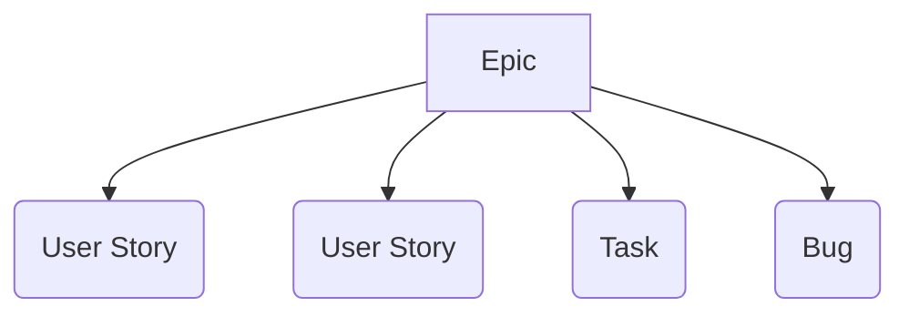

We develop and deploy on a one-week cycle. Every Thursday we cut a release
"Train" (ie. a Sprint) that goes through [deployment to stage and into
production](release-process.md).

## Our weekly process

Above is a diagram illustrating the high level FxA development process.  It
does not represent all the work each group does, nor does it show every group
that is critical to shipping Firefox Accounts.  It's intention is to give an
idea of timeframes:
* On Tuesday, after sign off from QA, the train is pushed to production
* On Thursday, the Engineering team tags the current train and commits to a new
  set of work for the next train.  The operations team pushes the newly tagged
  train to our staging environment and the QA team starts to test it.
* It's important to note that fixing regressions of the train on Stage is a
  higher priority than fixing new Issues in the current train.  Depending on
  the regression's severity it may be picked to Stage, picked to Production, or
  just ride the train the following week.

## Product Planning

Product-level feature planning is currently managed via Epics in Jira.  Each
feature goes through a comprehensive series of steps from defining and
designing, to building and QA, to measuring changes and results, and finally
closing the Epic.

## Issue management

Most of our work takes place on [GitHub][fxa-repository] and [Jira][fxa-jira].

Issue status is reflected by the following:

* The issue itself will have updates indicating *what* the next action is.
* The assignee, if any, indicates *who* is responsible for that action.
* The Sprint (in Jira) indicates *when* we are working on the issue.

Issues, labels, and assignee are synchronized automatically between GitHub and
Jira (a delay of a minute or two).

We also have two relevant components in Bugzilla:
* [Firefox :: Firefox Accounts][bugzilla-fxa]
* [Cloud Services :: Server: Firefox Accounts][bugzilla-fxa-server]

These components are used to help coordinate between other projects using
Bugzilla and for issues relating to security.  Some issues are synchronized to
GitHub.  To force a GitHub bug from Bugzilla, put `[fxa]` in the whiteboard.
To force not filing a Github bug, put `[fxa-waffle-ignore]` in the whiteboard.

If you're wondering where to file a bug, unless it's a security bug, please
file in Jira.

### New Features

New features are expected to be described in an Epic with supporting User
Stories (including acceptance criteria).

Generally, we can expect Epics to be written by the Product team.  User Stories
will likely be written by the Product and Engineering teams as they need to be broken down small enough to fit
inside of a sprint.  [Learn more about user stories][moz-user-stories].

As Tasks and Bugs pop up, they should be associated with open Epics as
appropriate.

### Sprints

Sprints are tracked in Jira.  There is a [dashboard for our current
sprint][fxa-jira-dashboard] and a [detailed view of our current
sprint][fxa-jira-sprint].

### Bug Triage

We triage issues at least every week in our meetings.  Depending on the
size of our backlog, we may schedule other meetings focused solely on triaging.

Triage is done [from the backlog in Jira][fxa-jira-backlog].

Clicking the link should show you a page similar to the screenshot above.  Some
notable parts:

* At the top of the page is a section called *QUICK FILTERS*.  These will
  filter the list of Issues below.
* You can see two collapsed sections in the middle of the page, one for *FxA
  Train 155* and one for *FxA Train 156*.  The former is `ACTIVE`.  This is the
  current train we're working on and the next train and if you click the arrow
  in the top left next to the title, the section will expand and show you what
  tasks are in each train.
* Clicking the *Create Sprint* button will create a new Sprint and add it to
  this page.
* The Backlog on the bottom half of the screen has many issues in it.  You can
  drag items from it into the Sprints or right-click on items and send them to
  Sprints.  If you're going to do much with the tasks, it's likely more
  effecient to use other views in Jira (with Filters) as the size of the FxA
  backlog is unwieldy.
* In vertical text on the left of the page is *VERSIONS* and *EPICS*.  Clicking
  on *EPICS* will expand and show all the current epics (and allow
  dragging/dropping to them).

Roughly, our triage flow is:

0. Load the [Jira Backlog][fxa-jira-backlog].
0. Click the *Un-triaged* quick filter.  The list of issues at the bottom of
   the screen will change to only show issues that haven't been marked as
   triaged.
0. Click on the first issue in the Backlog.  A short preview will appear on the
   right.  As appropriate, fill in as many fields as you know.  For a more
   complete editing interface, press `e`.
0. Once all the fields are set correctly, change the `Fix Version/s` field to
   *Triaged*.  That's the flag that will take it out of the quick filter after
   you save it.

## Checkin Meetings

The team meets regularly to stay in sync about development status and ensure
nothing is falling through the cracks.  During meetings we take notes and
afterward we send a summary of each meeting to an appropriate mailing list.

Please see our [project calendar][fxa-calendar] for details.

## Code Review

This project is production Mozilla code and subject to our [engineering practices and quality standards][moz-standards].  Every patch must be [reviewed][moz-code-review] by an owner or peer of the [Firefox Accounts module][fxa-module].

### Review Checklist

Here are some handy questions and things to consider when reviewing code for Firefox Accounts:

* How will we tell if this change is successful?
    * If it's fixing a bug, have we introduced tests to ensure the bug stays fixed?
    * If it's a feature, do we have metrics to tell whether it's providing value?
    * Should it be A/B tested to check whether it's a good idea at all?
* Did test coverage increase, or at least stay the same?
    * We need a pretty good reason to merge code that decreases test coverage...
    * If it's hard to answer this question, consider adding a test that tests the test coverage.
* Does it introduce new user-facing strings?
    * These strings will need to go through our localization process.  Check that the
      templates in which they're defined are covered by our string extraction scripts.
    * The code must be merged before the string-extraction date for that development cycle.
* Does it store user-provided data?
    * The validation rules should be explicit, documented, and clearly enforced before storage.
* Does it display user-controlled data?
    * It must be appropriately escaped, e.g. htmlescaped before being inserted into web content.
* Does it involve a database schema migration?
    * The changes must be backwards-compatible with the previous deployed version.  This means
      that you can't do something like `ALTER TABLE CHANGE COLUMN` in a single deployment, but
      must split it into two: one to add the new column and start using it, and second to
      drop the now-unused old column.
    * Does it contain any long-running statements that might lock tables during deployment?
    * Can the changes be rolled back without data loss or a service outage?
    * Has the canonical db schema been kept in sync with the patch files?
    * Once merged, please file an Ops bug to track deployment in stage and production.
* Does it alter the public API of a service?
    * Ensure that the chage is backwards compatible.
    * Ensure that it's documented appropriately in the API description.
    * Note whether we should announce it on one or more developer mailing lists.
* Does it add new metrics or logging?
    * Make sure they're documented for future reference.
* Does it conform to the prevailing style of the codebase?
    * If it introduces new files, ensure they're covered by the linter.
    * If you notice a stylistic issue that was *not* detected by the linter,
      consider updating the linter.
* For fixes that are patching a train,
  has the PR been opened against the correct train branch?
    * If the PR is against `master`,
      it is likely that it will mess up
      our change logs and the git history
      when merged.
    * If no appropriate train branch exists,
      one can be created at the appropriate point in history
      and pushed.
      After the patch has been tagged (see below),
      the train branch can then be merged to `master`.
      Commits should not be cherry-picked
      between train branches and `master`.

## Browser Support
`Last updated: Aug 15, 2019`

Firefox Accounts must work in the following environments:

- Firefox Desktop ESR - 1
- Firefox for Android ESR - 1
- Firefox for iOS 17
- Latest versions of modern browsers (Chrome, Safari, Opera, Edge)
- iOS 12+ (and iOS WebView for Firefox iOS)
- Android 7.0 (and Android WebView for Lockbox)

## Deployment Documentation
We maintain a [private deployment document][fxa-deploy-doc] to keep track of any configuration changes, any database changes, etc.  **Anything that needs to be done aside from deploying updated code should be tracked in this document.**  If your patch needs any additional changes or config you are responsible for putting those notes in this document before the train ends.

## Security issues

Since most of our work happens in the open, we need special procedures
for dealing with security-sensitive issues that must be fixed in production
before being made visible to the public.

We use private bugzilla bugs for tracking security-related issues,
because this allows us to manage visibility for other stakeholders at Mozilla
while maintaining confidentiality.

We use private github repos for developing security fixes
and tagging security-related releases.

### Filing security issues

If you believe you have found a security-sensitive issue
with any part of the Firefox Accounts service,
please file it as confidential security bug
in Bugzilla via this link:

* [File a security-sensitive FxA bug][fxa-security-bug]

The Firefox Accounts service is part of Mozilla's [bug bounty program][moz-bug-bounty],
which provides additional guidelines on [reporting security bugs][moz-sec-bugs].

### Making a private point-release

We maintain the following private github repos
that can be used for making security-related point-releases

* https://github.com/mozilla/fxa-content-server-private
* https://github.com/mozilla/fxa-auth-server-private
* https://github.com/mozilla/fxa-auth-db-mysql-private
* https://github.com/mozilla/fxa-customs-server-private
* https://github.com/mozilla/fxa-js-client-private

The recommended procedure for doing so is:

* Check out the private repo, independently from your normal working repo:
  * `git clone git@github.com:mozilla/fxa-auth-server-private`
  * `cd fxa-auth-server-private`
  * N.B: Do not add it
    as a remote on your normal working repo,
    because this increases the risk
    of pushing a private fix to the public repo
    by mistake.
* Add the corresponding public repo as a remote named "public",
  and ensure it's up-to-date:
  * `git remote add public git@github.com:mozilla/fxa-auth-server`
  * `git fetch public`
* Check out the latest release branch and push it to the private repo:
  * `git checkout public/train-XYZ`
  * `git push origin train-XYZ`
* Develop your fix against this as a new branch in the private repo:
  * `git checkout -b train-XYZ-my-security-fix`
  * `git commit -a`
  * git push -u origin train-XYZ-my-security-fix`
* Submit and review the fix as a PR in the private repo,
  targetting the `train-XYZ` branch.
* Tag a point release in the private repo, following the [steps above](#tagging-releases):
  * `git checkout train-XYZ; git pull  # ensure we have the merged PR`
  * `grunt version:patch`
  * `git push`
* Push the tag in order to trigger a CircleCI build:
  * `git push origin v1.XYZ.N`
  * N.B: Do not use `git push --tags`
    as this will not correctly trigger
    the CircleCI build.
* File an issue on the public repo
  as a reminder to uplift the fix
  once it has been deployed to production.

Once the fix has been deployed
and is safe to reveal publicly,
it can be merged back into the public repo
by doing the following:

* Push the private train branch to the public repo,
  as a new branch:
  * `git push public train-XYZ:train-XYZ-uplift`
* Open a PR in the public repo,
  targeting the public `train-XYZ` branch,
  for review and merge.
* Push the tag to the public repo:
  * `git push public v1.XYZ.N`
* Merge the `train-XYZ` branch to master
  following the [usual steps](#tagging-releases).

[bugzilla-triage-process]: https://mozilla.github.io/bug-handling/triage-bugzilla
[bugzilla-fxa]: https://bugzilla.mozilla.org/buglist.cgi?list_id=15068002&resolution=---&classification=Client%20Software&classification=Developer%20Infrastructure&classification=Components&classification=Server%20Software&classification=Other&query_based_on=Firefox%3A%3AFirefoxAccounts&query_format=advanced&component=Firefox%20Accounts&product=Firefox&known_name=Firefox%3A%3AFirefoxAccounts
[bugzilla-fxa-server]: https://bugzilla.mozilla.org/buglist.cgi?list_id=15067999&resolution=---&classification=Client%20Software&classification=Developer%20Infrastructure&classification=Components&classification=Server%20Software&classification=Other&query_based_on=CloudServices%3A%3AServer%3AFirefoxAccounts&query_format=advanced&component=Server%3A%20Firefox%20Accounts&product=Cloud%20Services&known_name=CloudServices%3A%3AServer%3AFirefoxAccounts
[fxa-calendar]: https://www.google.com/calendar/embed?src=mozilla.com_urbkla6jvphpk1t8adi5c12kic%40group.calendar.google.com
[fxa-deploy-doc]: https://docs.google.com/document/d/1lc5T1ZvQZlhXY6j1l_VMeQT9rs1mN7yYIcHbRPR2IbQ/edit
[fxa-milestones]: https://github.com/mozilla/fxa/milestones
[fxa-module]: https://wiki.mozilla.org/Modules/Other#Firefox_Accounts
[fxa-security-bug]: https://bugzilla.mozilla.org/enter_bug.cgi?product=Cloud%20Services&component=Server:%20Firefox%20Accounts&groups=cloud-services-security
[fxa-repository]: https://github.com/mozilla/fxa
[fxa-jira]: https://jira.mozilla.com/projects/FXA/issues/
[fxa-jira-dashboard]: https://jira.mozilla.com/secure/Dashboard.jspa?selectPageId=11006
[fxa-jira-sprint]: https://jira.mozilla.com/secure/RapidBoard.jspa?rapidView=359&projectKey=FXA
[fxa-jira-backlog]: https://jira.mozilla.com/secure/RapidBoard.jspa?rapidView=359&projectKey=FXA&view=planning.nodetail
[moz-bug-bounty]: https://www.mozilla.org/security/bug-bounty/
[moz-code-review]: https://developer.mozilla.org/docs/Code_Review_FAQ
[moz-sec-bugs]: https://www.mozilla.org/security/bug-bounty/faq-webapp/#bug-reporting
[moz-standards]: https://developer.mozilla.org/docs/Mozilla/Developer_guide/Committing_Rules_and_Responsibilities
[moz-user-stories]: https://docs.google.com/presentation/d/1zepsrOiHINBMS3TJ8nFDJ4gf8u6kRONe1hdMDnlyZvI/edit
