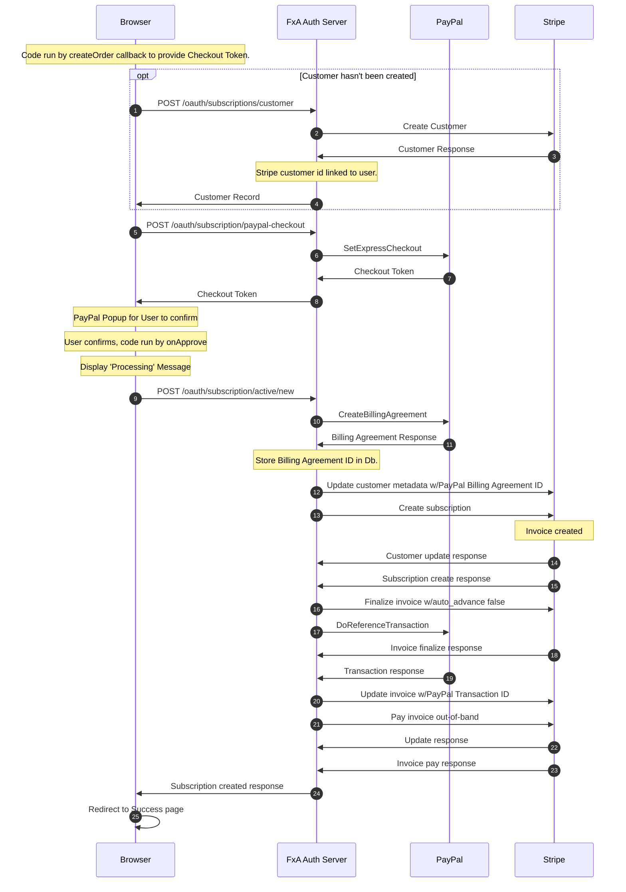

## Getting Started

Current as of `March 10, 2020`.

### Pre-Development

To begin working on the subscription platform in the FxA codebase, you will need access to a Stripe account for private and public API developer keys.

If you're a Mozilla employee, you can request access to the Stripe dev (and/or stage) account, created for the FxA Subscription Platform team to easily connect with fake products and plans. Otherwise, you can create your own Stripe account to use for testing that is not linked to any bank account information with your own products and plans. These keys should be taken from Stripe's test environment which you can verify by checking that the key includes the word `test`.

The `fxa-payments-server` needs the Stripe public key (`pk`) and communicates with the `fxa-auth-server` that requires a Stripe private or secret key (`sk`).¹ These can be found in the Stripe Dashboard, and configuration details can be found below.

¹ We have, in the past, given out restricted keys for use (`rk`). We may choose to do this again in the future or even use them in our dev environment.

### Configuration

You will need to create the file `fxa/packages/fxa-auth-server/config/secrets.json` and specify `subscriptions.stripeApiKey` with the value of your private Stripe API key. Ensure the key begins with `sk_test` to guarantee you are using the secret key and testing in the correct environment.

Ex:

```
{
  "subscriptions": {
    "stripeApiKey": "sk_test_####"
  }
}
```

Additionally create the file `fxa/packages/fxa-payments-server/server/config/secrets.json` and specify `stripe.apiKey` to override the default Mozilla Stripe public API key with your own public key:

```
{
  "stripe": {
    "apiKey": "pk_test_####"
  }
}
```

Note that neither `secrets.json` files are tracked in Git, and they take precedence over each server's default configurations, should you need to make any additional local-only modifications.

#### Stripe Product/Plans

To see the available products or create a new one in the Stripe dashboard, navigate to Billing > Products and click into one of the products to see information including the product name, product ID, plan name, plan ID, metadata, logs, and events.

If you are using a new Stripe account, you will need to setup a product and its plan. The product should have additional metadata configured as needed.

**Please note:** Product Names are the canonical displayed name shown in Sub Plat UI. In some cases these may be paired with a plan's billing interval. Plan names are not displayed to users.

##### Product Metadata

| Key                                        | Value                                                                                                                                                                                           |
| ------------------------------------------ | ----------------------------------------------------------------------------------------------------------------------------------------------------------------------------------------------- |
| productSet                                 | An arbitrary string used to group products in a set of upgrades & downgrades.                                                                                                                   |
| productOrder                               | A number used for sorting products in a set.                                                                                                                                                    |
| webIconURL                                 | Image URL for product icon in web content.                                                                                                                                                      |
| capabilities                               | Comma-separated list of capabilities enabled by this product for all Relying Party's.                                                                                                           |
| capabilities:{clientID}                    | Comma-separated list of capabilities enabled by this product for the Relying Party identified by {clientID}.                                                                                    |
| upgradeCTA                                 | HTML content string describing available upgrades from this plan. By convention, should include a link back to a product lead page. That lead page links back to FxA's plan subscription pages. |
| downloadURL                                | The download URL for the product.                                                                                                                                                               |
| emailIconURL                               | Image URL for product icon in email content.                                                                                                                                                    |
| product:subtitle                           | A subtitle for the product, usually displayed beneath the name in UI                                                                                                                            |
| product:subtitle:{locale}                  | Localized string override for product:subtitle, where {locale} is the locale (e.g. fr-FR, zh-CN, de, etc)                                                                                       |
| product:details:{n}                        | Bullet-point feature details for the product, where {n} is a number or ordering the points                                                                                                      |
| product:details:{n}:{locale}               | Localized string override for product:details:{n}, where {locale} is the locale (e.g. fr-FR, zh-CN, de, etc)                                                                                    |
| product:playStoreLink                      | The google play store download URL for the product                                                                                                                                              |
| product:appStoreLink                       | The App store download URL for the product                                                                                                                                                      |
| product:termsOfServiceURL                  | The URL for the webpage containing the Terms of Service for the product offering                                                                                                                |
| product:termsOfServiceURL:{locale}         | Localized override URL for the webpage containing the Terms of Service for the product offering                                                                                                 |
| product:termsOfServiceDownloadURL          | The URL for a downloadable version of the Terms of Service for the product offering, used in emails                                                                                             |
| product:termsOfServiceDownloadURL:{locale} | Localized override URL for a downloadable version of the Terms of Service for the product offering, used in emails                                                                              |
| product:privacyNoticeURL                   | The URL for the webpage containing the Privacy Notice for the product offering                                                                                                                  |
| product:privacyNoticeURL:{locale}          | Localized override URL for the webpage containing the Privacy Notice for the product offering                                                                                                   |
| product:privacyNoticeDownloadURL           | The URL for a downloadable version of the Privacy Notice for the product offering                                                                                                               |
| product:privacyNoticeDownloadURL:{locale}  | Localized override URL a downloadable version of the Privacy Notice for the product offering                                                                                                    |

###### Product Metadata defaults

Some of the metadata properties listed above [have defaults][product-details-defaults] that are used when they're not defined in Stripe:

```
  subtitle: 'Full-device VPN',
  details: [
    'Device-level encryption',
    'Servers in 30+ countries',
    'Connect 5 devices with one subscription',
    'Available for Windows, iOS and Android',
  ],
  termsOfServiceURL:
    'https://www.mozilla.org/about/legal/terms/firefox-private-network',
  termsOfServiceDownloadURL:
    'https://accounts-static.cdn.mozilla.net/legal/Mozilla_VPN_ToS/en-US.pdf',
  privacyNoticeURL: 'https://www.mozilla.org/privacy/firefox-private-network',
  privacyNoticeDownloadURL:
    'https://accounts-static.cdn.mozilla.net/legal/mozilla_vpn_privacy_notice/en-US.pdf',
```

[product-details-defaults]: https://github.com/mozilla/fxa/blob/main/packages/fxa-shared/subscriptions/metadata.ts#L14

##### Subscription Metadata

| Key                       | Value                                                                                          |
| ------------------------- | ---------------------------------------------------------------------------------------------- |
| previous_plan_id          | The value of the previous plan that the user had been subscribed to.                           |
| plan_change_date          | Unix timestamp of the date the plan was changed.                                               |
| cancelled_for_customer_at | Unix timestamp of the date when the subscription was cancelled for the customer through FxA UI |

## Navigating the Payment Flow

Once your API keys are set, restart the affected servers (`auth` or `payments`) if needed.

Reference the [workflow](https://github.com/mozilla/fxa#workflow) section of the FxA docs to sign up for and verify an account. You should now be able to access the payment flow at:

```
http://127.0.0.1:3030/subscriptions/products/{productId}?plan={planId}
```

The `productId` should match the ID from a product taken from the Stripe dashboard. The `plan` parameter is optional. If you are running the entire FxA stack and are using the keys from the Stripe FxA dev account, you can navigate to `123done` on port `:8080` to click on the link beginning with "Subscribe" to reach the form with a prepopulated product.

Enter any name, valid expiration date, CVC number, and any card number from the [Stripe test cards docs](https://stripe.com/docs/testing#cards) to successfully create a test subscription.

Navigate back to `http://127.0.0.1:3031/subscriptions` to manage your subscriptions.

## Understanding Subscription Status

Stripe defines the [valid states a subscription status can be in their API docs](https://stripe.com/docs/api/subscriptions/object#subscription_object-status).
Since `incomplete` and `incomplete_expired` are subscriptions that have never been paid, FxA ignores them except for the following condition: if a user with a subscription in an `incomplete` state successfully enters valid payment information, the `incomplete` subscription will be paid and activated.

FxA's Stripe account is configured to not allow subscriptions to become `unpaid` and will cancel the subscription instead.

The last 4 states are `active`, `trialing`, `past_due`, and `cancelled`. The first three of these are considered active for the purposes of allowing the user access to the capabilities provided by the subscription, while `cancelled` subscriptions grant none.

### Stripe Radar and Payment Blocking

We use [Stripe Radar](https://stripe.com/docs/radar/rules) to block payments from both potentially abusive sources as well as from potential subscribers in currently unsupported regions. Our production radar rules are [documented in Mana](https://mana.mozilla.org/wiki/display/FIREFOX/Stripe+Radar+Rules).

## Interactions with Stripe

### Payments Server

The payments server is an isolated service that serves all subscription related
pages that utilize the Stripe Javascript SDK. It's isolated from the primary FxA
domain to comply with constraints on 3rd party Javascript on pages handling FxA
authentication.

When a subscription page is loaded, the React application served by the payment
server:

1. Loads the Stripe Javascript SDK (for tokenizing credit cards)
2. Makes direct OAuth authenticated API calls to [account](https://github.com/mozilla/fxa/blob/main/packages/fxa-auth-server/docs/api.md#account)/[subscription endpoints][]
   on the Auth Server as needed

The payments server handles the payment flow as well as serving pages for managing
a user's subscription that are linked from the Settings page.

### Auth Server

FxA's Auth Server makes Stripe API calls for authenticated FxA users via its [subscription
endpoints][]. Stripe updates are sent back to the Auth Server via Stripe webhooks when a
users subscription has been created/updated/deleted.

[subscription endpoints]: https://github.com/mozilla/fxa/blob/main/packages/fxa-auth-server/docs/api.md#subscriptions

## Ladder Diagrams of Payment Interactions

### PayPal Checkout

Conditions for this flow:

- User has no payment source on file, or is a new customer.
- User clicks the displayed [PayPal Smart Button](https://developer.paypal.com/docs/checkout/integrate/#3-render-the-smart-payment-buttons) to pay with PayPal.

This diagram represents the activity after the PayPal button is clicked.


