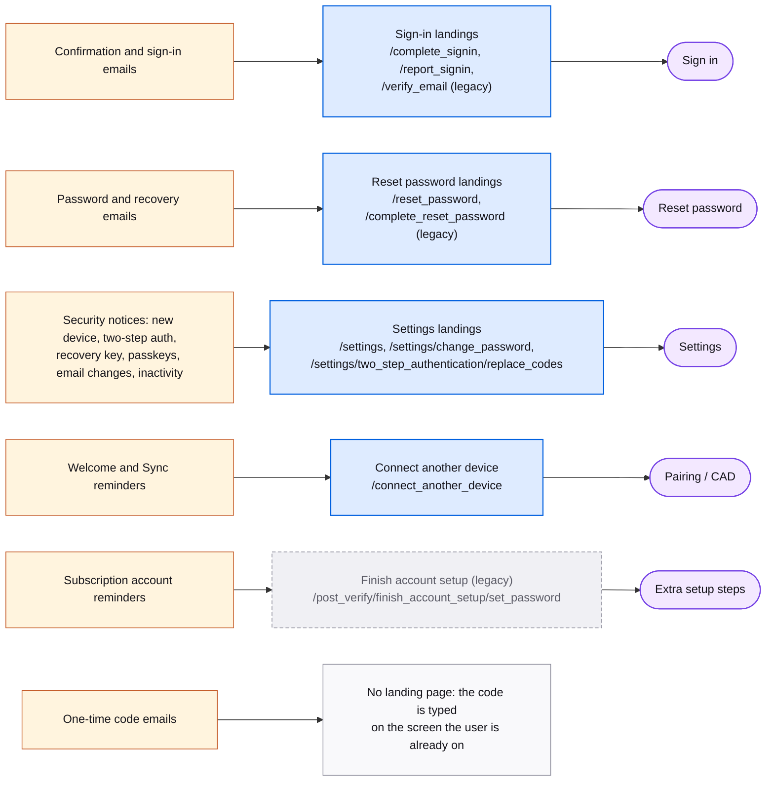

# Emails

Many screens are reached from an email link rather than from another screen. Hover an email name for a preview of the email; hover a route for the screen it lands on. Subscription Platform emails are out of scope, except two that land on an accounts screen.

Templates: `libs/accounts/email-renderer/src/templates/`. Links are built by `libs/accounts/email-renderer/src/renderer/email-link-builder.ts`.

## Map

## Emails by landing screen

| Landing route | Emails | Sent when |
| --- | --- | --- |
| `/verify_email` | [verify](https://mozilla.github.io/fxa/storybooks/main/email-renderer/?path=/story/fxa-emails-templates-verify--verify-email), [verifyPrimary](https://mozilla.github.io/fxa/storybooks/main/email-renderer/?path=/story/fxa-emails-templates-verifyprimary--verify-primary-email), [verificationReminderFirst](https://mozilla.github.io/fxa/storybooks/main/email-renderer/?path=/story/fxa-emails-templates-verificationreminderfirst--verification-reminder-first), [verificationReminderSecond](https://mozilla.github.io/fxa/storybooks/main/email-renderer/?path=/story/fxa-emails-templates-verificationremindersecond--verification-reminder-second), [verificationReminderFinal](https://mozilla.github.io/fxa/storybooks/main/email-renderer/?path=/story/fxa-emails-templates-verificationreminderfinal--verification-reminder-final) | Link-based account or primary-email confirmation, and reminders at 1, 5, and 15 days. Current sign-up uses codes. |
| `/complete_signin` | [verifyLogin](https://mozilla.github.io/fxa/storybooks/main/email-renderer/?path=/story/fxa-emails-templates-verifylogin--verify-login-firefox) | Confirm a sign-in from a new device by link. |
| `/report_signin` | [unblockCode](https://mozilla.github.io/fxa/storybooks/main/email-renderer/?path=/story/fxa-emails-templates-unblockcode--unblock-code) | Customs blocked a sign-in; the code unblocks, the link reports. |
| `/complete_reset_password` | [recovery](https://mozilla.github.io/fxa/storybooks/main/email-renderer/?path=/story/fxa-emails-templates-recovery--recovery) | Link-based password reset. Current reset uses a code. |
| `/reset_password` | [passwordChanged](https://mozilla.github.io/fxa/storybooks/main/email-renderer/?path=/story/fxa-emails-templates-passwordchanged--password-changed), [passwordReset](https://mozilla.github.io/fxa/storybooks/main/email-renderer/?path=/story/fxa-emails-templates-passwordreset--password-reset), [postChangeRecoveryPhone](https://mozilla.github.io/fxa/storybooks/main/email-renderer/?path=/story/fxa-emails-templates-postchangerecoveryphone--post-change-recovery-phone), [postRemoveRecoveryPhone](https://mozilla.github.io/fxa/storybooks/main/email-renderer/?path=/story/fxa-emails-templates-postremoverecoveryphone--post-remove-recovery-phone) | Password or recovery phone changed; "wasn't you?" link. |
| `/settings/change_password` | [passwordChangeRequired](https://mozilla.github.io/fxa/storybooks/main/email-renderer/?path=/story/fxa-emails-templates-passwordchangerequired--password-change-required) | Suspicious activity; password change is mandatory. |
| `/settings/two_step_authentication/replace_codes` | [lowRecoveryCodes](https://mozilla.github.io/fxa/storybooks/main/email-renderer/?path=/story/fxa-emails-templates-lowrecoverycodes--low-recovery-codes-zero) | Few backup codes left. |
| `/settings` | [newDeviceLogin](https://mozilla.github.io/fxa/storybooks/main/email-renderer/?path=/story/fxa-emails-templates-newdevicelogin--new-device-login-firefox) | Sign-in from a new device. |
| `/settings` | [postAddTwoStepAuthentication](https://mozilla.github.io/fxa/storybooks/main/email-renderer/?path=/story/fxa-emails-templates-postaddtwostepauthentication--post-add-two-step-authentication-with-codes), [postChangeTwoStepAuthentication](https://mozilla.github.io/fxa/storybooks/main/email-renderer/?path=/story/fxa-emails-templates-postchangetwostepauthentication--default), [postRemoveTwoStepAuthentication](https://mozilla.github.io/fxa/storybooks/main/email-renderer/?path=/story/fxa-emails-templates-postremovetwostepauthentication--post-remove-account-recovery), [postNewRecoveryCodes](https://mozilla.github.io/fxa/storybooks/main/email-renderer/?path=/story/fxa-emails-templates-postnewrecoverycodes--post-new-recovery-codes), [postConsumeRecoveryCode](https://mozilla.github.io/fxa/storybooks/main/email-renderer/?path=/story/fxa-emails-templates-postconsumerecoverycode--post-consume-recovery-code) | Two-step authentication and backup code changes. |
| `/settings` | [postAddRecoveryPhone](https://mozilla.github.io/fxa/storybooks/main/email-renderer/?path=/story/fxa-emails-templates-postaddrecoveryphone--post-add-recovery-phone), [postSigninRecoveryPhone](https://mozilla.github.io/fxa/storybooks/main/email-renderer/?path=/story/fxa-emails-templates-postsigninrecoveryphone--post-signin-recovery-phone), [postSigninRecoveryCode](https://mozilla.github.io/fxa/storybooks/main/email-renderer/?path=/story/fxa-emails-templates-postsigninrecoverycode--post-signin-recovery-code) | Recovery phone added or used; backup code used. |
| `/settings` | [postAddAccountRecovery](https://mozilla.github.io/fxa/storybooks/main/email-renderer/?path=/story/fxa-emails-templates-postaddaccountrecovery--post-add-account-recovery), [postChangeAccountRecovery](https://mozilla.github.io/fxa/storybooks/main/email-renderer/?path=/story/fxa-emails-templates-postchangeaccountrecovery--post-add-account-recovery), [postRemoveAccountRecovery](https://mozilla.github.io/fxa/storybooks/main/email-renderer/?path=/story/fxa-emails-templates-postremoveaccountrecovery--post-remove-account-recovery), [passwordResetAccountRecovery](https://mozilla.github.io/fxa/storybooks/main/email-renderer/?path=/story/fxa-emails-templates-passwordresetaccountrecovery--password-reset-account-recovery), [passwordResetWithRecoveryKeyPrompt](https://mozilla.github.io/fxa/storybooks/main/email-renderer/?path=/story/fxa-emails-templates-passwordresetwithrecoverykeyprompt--password-reset-with-recovery-key-prompt), [passwordResetRecoveryPhone](https://mozilla.github.io/fxa/storybooks/main/email-renderer/?path=/story/fxa-emails-templates-passwordresetrecoveryphone--password-reset-recovery-phone) | Account recovery key created, changed, removed, or used. |
| `/settings` | [postAddPasskey](https://mozilla.github.io/fxa/storybooks/main/email-renderer/?path=/story/fxa-emails-templates-postaddpasskey--post-add-passkey), [postRemovePasskey](https://mozilla.github.io/fxa/storybooks/main/email-renderer/?path=/story/fxa-emails-templates-postremovepasskey--post-remove-passkey), [postAddLinkedAccount](https://mozilla.github.io/fxa/storybooks/main/email-renderer/?path=/story/fxa-emails-templates-postaddlinkedaccount--post-add-linked-account-apple) | Passkey registered or removed; Google or Apple account linked. |
| `/settings` | [postChangePrimary](https://mozilla.github.io/fxa/storybooks/main/email-renderer/?path=/story/fxa-emails-templates-postchangeprimary--post-change-primary), [postVerifySecondary](https://mozilla.github.io/fxa/storybooks/main/email-renderer/?path=/story/fxa-emails-templates-postverifysecondary--post-verify-secondary), [postRemoveSecondary](https://mozilla.github.io/fxa/storybooks/main/email-renderer/?path=/story/fxa-emails-templates-postremovesecondary--post-remove-secondary) | Primary or secondary email changes. |
| `/settings` | [inactiveAccountFirstWarning](https://mozilla.github.io/fxa/storybooks/main/email-renderer/?path=/story/fxa-emails-templates-inactiveaccountfirstwarning--inactive-account-first-warning), [inactiveAccountSecondWarning](https://mozilla.github.io/fxa/storybooks/main/email-renderer/?path=/story/fxa-emails-templates-inactiveaccountsecondwarning--inactive-account-second-warning), [inactiveAccountFinalWarning](https://mozilla.github.io/fxa/storybooks/main/email-renderer/?path=/story/fxa-emails-templates-inactiveaccountfinalwarning--inactive-account-final-warning) | Account scheduled for deletion due to inactivity. |
| `/connect_another_device` | [postVerify](https://mozilla.github.io/fxa/storybooks/main/email-renderer/?path=/story/fxa-emails-templates-postverify--post-verify-desktop-tablet), [cadReminderFirst](https://mozilla.github.io/fxa/storybooks/main/email-renderer/?path=/story/fxa-emails-templates-cadreminderfirst--cad-reminder-default), [cadReminderSecond](https://mozilla.github.io/fxa/storybooks/main/email-renderer/?path=/story/fxa-emails-templates-cadremindersecond--cad-reminder-default) | Welcome after confirmation; nudges to set up a second device. |
| `/post_verify/finish_account_setup/set_password` | [subscriptionAccountReminderFirst](https://mozilla.github.io/fxa/storybooks/main/email-renderer/?path=/story/subplat-emails-templates-subscriptionaccountreminderfirst--subscription-account-reminder-first), [subscriptionAccountReminderSecond](https://mozilla.github.io/fxa/storybooks/main/email-renderer/?path=/story/subplat-emails-templates-subscriptionaccountremindersecond--subscription-account-reminder-second) | Account created by a subscription purchase has no password yet. |
| none, code typed on the current screen | [verifyShortCode](https://mozilla.github.io/fxa/storybooks/main/email-renderer/?path=/story/fxa-emails-templates-verifyshortcode--verify-short-code), [verifyLoginCode](https://mozilla.github.io/fxa/storybooks/main/email-renderer/?path=/story/fxa-emails-templates-verifylogincode--verify-login-code-email), [passwordForgotOtp](https://mozilla.github.io/fxa/storybooks/main/email-renderer/?path=/story/fxa-emails-templates-passwordforgototp--password-forgot-otp), [verifySecondaryCode](https://mozilla.github.io/fxa/storybooks/main/email-renderer/?path=/story/fxa-emails-templates-verifysecondarycode--verify-secondary-code), [verifyAccountChange](https://mozilla.github.io/fxa/storybooks/main/email-renderer/?path=/story/fxa-emails-templates-verifyaccountchange--verify-account-change-email), [passwordlessSigninOtp](https://mozilla.github.io/fxa/storybooks/main/email-renderer/?path=/story/fxa-emails-templates-passwordlesssigninotp--passwordless-signin-otp), [passwordlessSignupOtp](https://mozilla.github.io/fxa/storybooks/main/email-renderer/?path=/story/fxa-emails-templates-passwordlesssignupotp--passwordless-signup-otp) | One-time codes. |
| none | [adminResetAccounts](https://mozilla.github.io/fxa/storybooks/main/email-renderer/?path=/story/fxa-emails-templates-adminresetaccounts--cad-reminder-default) | Admin-initiated bulk password reset notice. |

Query parameters on email links

- `/verify_email` and `/complete_signin`: `code`, `uid`, optionally `service`, `redirectTo`, `resume`. Reminders add `reminder=first|second|final`.
- `/complete_reset_password`: `uid`, `token`, `code`, `email`, `resume`, `emailToHashWith`, optionally `service` and `redirectTo`.
- `/reset_password`, `/settings/change_password`: `email`.
- `/settings` and its fragments: `email`, `uid`.
- `/settings/two_step_authentication/replace_codes`: `low_recovery_codes=true`, `email`, `uid`.
- `/report_signin`: `uid`, `unblockCode`.
- `/post_verify/finish_account_setup/set_password`: `email`, `product_name`, `token`, `product_id`, `flowId`, `flowBeginTime`, `deviceId`.
- Every link gets `utm_medium=email`, `utm_campaign`, `utm_content` unless the account opted out of metrics.

Known oddities

- `/verify_primary_email` and `/verify_secondary_email` are still derived in auth-server config, but no current email links to them.
- `/settings/account_recovery` has a link builder in the legacy mailer, but no current template renders it.
- `verifyShortCode` and `verifyLoginCode` carry their link only in an `X-Link` mail header, not in the body.

