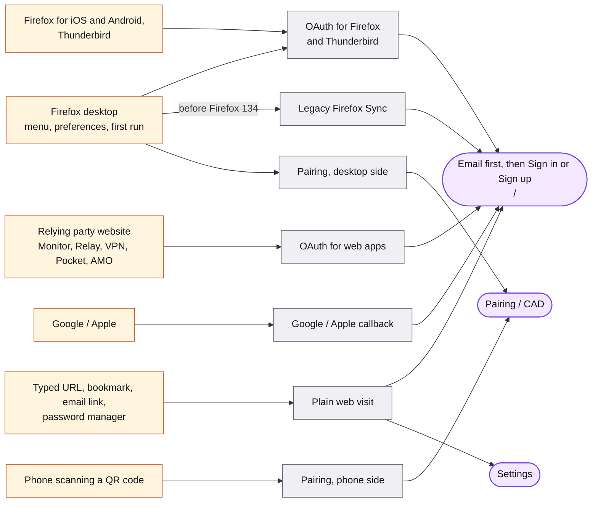

# Entry modes

The same screen behaves differently depending on who sent the user and how the result must get back. The app decides this once, at startup, by building an **integration** from the URL. Code: `packages/fxa-settings/src/lib/integrations/integration-factory.ts`.

## Map

## Integration types

The map shows who arrives and how. The code checks these top to bottom; the first match wins.

| Entry mode | Code name | Selected when | Used by | Result goes back via |
| --- | --- | --- | --- | --- |
| Google / Apple callback | `ThirdPartyAuthCallback` | Path is the Google/Apple callback with a `state` and a `code` | Google and Apple sign-in | Reloads the original URL saved in `state` |
| Pairing, desktop side | `PairingAuthority` | `redirect_uri` is the pairing URN, or path under `/pair/authority/` | Firefox desktop authorizing a phone | WebChannel `fxaccounts:pair_*` |
| Pairing, phone side | `PairingSupplicant` | Path under `/pair/supp`, `/pair/supplicant/`, or `/pair#...v=2` | Firefox for Android and iOS scanning a QR code | Encrypted pairing channel, then `fxaccounts:oauth_login` |
| OAuth for Firefox and Thunderbird | `OAuthNative` | `client_id` and `context=oauth_webchannel_v1` | Firefox desktop 134+, Firefox mobile, Thunderbird. `service` is `sync`, `relay`, `smartwindow`, or `vpn` | WebChannel `fxaccounts:oauth_login` |
| OAuth for web apps | `OAuthWeb` | `client_id` without the WebChannel context | Monitor, Relay web, Pocket, VPN, add-ons, 123done | Redirect to `redirect_uri` with `code` and `state` |
| Legacy Firefox Sync | `SyncDesktopV3` | `context=fx_desktop_v3`, no `client_id` | Firefox desktop before 134 | WebChannel `fxaccounts:login` with keys |
| Sync in another browser | `SyncBasic` | `service=sync`, nothing else | Sync verification opened in a different browser | None |
| Plain web visit | `Web` | Everything else | Direct visits, Settings links, password managers | In-app navigation to `/settings` or an allowlisted `redirect_to` |

## Key parameters

| Param | Meaning |
| --- | --- |
| `context` | `oauth_webchannel_v1`, `fx_desktop_v3`, `web`, or `oauth`. The main selector. |
| `client_id` | Hex relying-party id. Present for every OAuth entry. |
| `service` | Native clients: `sync`, `relay`, `smartwindow`, `vpn`. Web relying parties: historically the client id. |
| `action` | `signin`, `signup`, `email`, `force_auth`, or `pairing`. Where `/authorization` sends the user. |
| `scope`, `state`, `redirect_uri` | Standard OAuth. `redirect_uri` must match the client registration. |
| `acr_values` | `AAL2` means the relying party requires two-step authentication. |
| `prompt` | `consent`, `none`, or `login`. |
| `email`, `login_hint` | Prefill or lock the email. |
| `redirect_to` | Where a web sign-in ends, checked against an allowlist. |
| `entrypoint` | Where in the client the user clicked, for example `fxa_app_menu` or `preferences`. |
| `utm_*`, `flow_id`, `flow_begin_time` | Attribution and metrics. |

Entry URLs

| URL | What happens |
| --- | --- |
| `/authorization` | The OAuth start. The auth server redirects here; the page reads `action` and moves on. |
| `/`, `/oauth` | Email first, with relying-party branding under `/oauth`. |
| `/oauth/signin`, `/oauth/signup`, `/oauth/force_auth` | The regular screens when the client already knows the action. |
| `/pair`, `/pair/supp`, `/pair/authority/*`, `/pair/supplicant/*` | Pairing. `/oauth?channel_id=...` is the desktop authority's entry. |
| `/post_verify/third_party_auth/callback` | Google and Apple return here. |
| `/complete_signin`, `/report_signin`, `/complete_reset_password`, `/verify_email` | Email-link landings. `/v1/...` versions redirect to these. |
| `/settings`, `/settings/*` | Served by the fxa-settings build directly. Signed-out visitors bounce to `/` with `redirect_to`. |
| `/.well-known/change-password` | Redirects to `/settings/change_password` for password managers. |
| `/update_firefox`, `/download_firefox` | Landing for retired Firefox contexts, and a download redirect. |
| `/clear`, `/cookies_disabled` | Utility pages. |

Firefox desktop and WebChannels

Firefox opens accounts pages in a tab and talks to them over a WebChannel, a message bus between page content and the browser. On load, the page sends `fxaccounts:fxa_status` and the browser answers with its capabilities. Full protocol: [WebChannels](../reference/webchannels.md).

- **Before Firefox 134**: `?context=fx_desktop_v3&service=sync`. After sign-in the page sends `fxaccounts:login` with the session token and key material.
- **Firefox 134 and later**: `?context=oauth_webchannel_v1&client_id=5882386c6d801776&service=sync` (or `relay`, `smartwindow`, `vpn`). The page sends `fxaccounts:oauth_login` with an OAuth code. Relay sign-in from the browser arrived in Firefox 135; key-optional login in Firefox 147.

Legacy contexts `fx_ios_v1`, `fx_desktop_v1`, `fx_desktop_v2`, `fx_firstrun_v2`, and `iframe` are rejected; the server redirects most of them to `/update_firefox`.

All parameters

Bound on the integration data models in `models/integrations/data/data.ts`.

**Every integration**: `context`, `service`, `action`, `email`, `login_hint`, `redirect_to`, `entrypoint`, `entrypoint_experiment`, `entrypoint_variation`, `utm_campaign`, `utm_content`, `utm_medium`, `utm_source`, `utm_term`, `flow_id`, `flow_begin_time`.

**OAuth adds**: `client_id`, `scope`, `state`, `redirect_uri`, `code_challenge`, `code_challenge_method` (`S256`), `access_type` (`online` or `offline`), `acr_values`, `prompt`, `keys_jwk`, `id_token_hint`, `max_age`, `return_on_error`, `permissions`, `device_id`. `scope` is required for web relying parties and optional for native clients, where the server derives it from `service`. `state` is required for native Sync.

**Sync adds**: `country`, `signinCode`, `syncPreference`, `multiService`, `tokenCode`.

**Web adds**: `uid`, `emailToHashWith`, `reset_password_confirm`, `setting`, `style`.

**Pairing**: `channel_id` in the query for the authority; `channel_id`, `channel_key`, `v` in the URL hash for the supplicant, so the key never reaches the server.

**Ad hoc**: `resume` restores saved OAuth state after an email round trip; `showReactApp=true` opts into React for routes not fully rolled out; `redirect_immediately=true` sends connect-another-device straight to Settings; `force_passwordless=true`.

Feature-gated entries

| Entry | Gate |
| --- | --- |
| Passwordless sign-in and sign-up (`/signin_passwordless_code`) | `featureFlags.passwordlessEnabled` or `force_passwordless=true`, plus browser support, and not Sync |
| Passkeys (`/signin_passkey_fallback`, `/settings/passkeys/add`) | `featureFlags.passkeysEnabled` and related flags |
| Pairing v2 (`/pair/authority/*`, `/pair/supplicant/*`) | content-server `showReactApp.pair2Routes` |
| Proof-of-concept pairing (`/poc_*`) | `showReactApp.pocPairingRoutes`; slated for removal |
| WebChannel example (`/web_channel_example`) | `showReactApp.webChannelExampleRoutes` and `?showReactApp=true`; development only |

