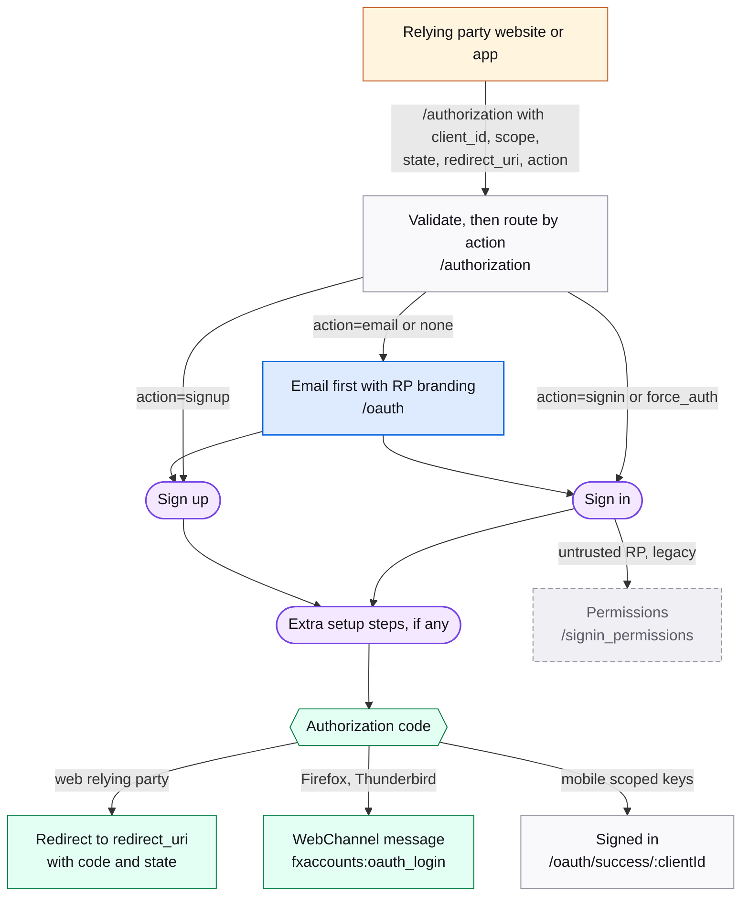

# OAuth relying party

A Mozilla product or a native client borrows the sign-in and sign-up screens and gets an OAuth code back. The screens are the ordinary ones; the wrapper differs. Protocol details: [OAuth details](../reference/oauth-details.md).

## Map

## Screens

| Route | Screen | Purpose |
| --- | --- | --- |
| `/authorization` | AuthorizationContainer | No UI. Validates the OAuth params, handles `prompt=none`, then navigates by `action`. |
| `/oauth` | [Index](https://mozilla.github.io/fxa/storybooks/main/fxa-settings/?path=/story/pages-index--default) | Email first with the relying party's name and logo. |
| `/oauth/signin`, `/oauth/signup`, `/oauth/force_auth` | see [Sign in](./flow-signin.md), [Sign up](./flow-signup.md) | The regular screens with relying-party branding. |
| `/post_verify/service_welcome` | [ServiceWelcome](https://mozilla.github.io/fxa/storybooks/main/fxa-settings/?path=/story/pages-postverify-servicewelcome--from-signin) | Welcome interstitial for a new account. |
| `/oauth/success/:clientId` | [PairSuccess](https://mozilla.github.io/fxa/storybooks/main/fxa-settings/?path=/story/pages-pair-success--default) | Terminal screen for clients that receive the code without a redirect. |
| `/signin_permissions`, `/signup_permissions` | permissions (legacy) | Scope consent for untrusted relying parties. Not reachable from React. |
| `/subscriptions` | redirect (legacy) | Redirects to the Subscription Platform. |

## Notes

- **Exit**: web relying parties get a redirect to `redirect_uri` with the code; native clients (Firefox, Thunderbird) get a WebChannel message and stay on a success screen.
- `acr_values=AAL2` means the relying party requires two-step authentication, which inserts `/inline_totp_setup`.
- Native client ids: Firefox desktop `5882386c6d801776`, Firefox iOS `1b1a3e44c54fbb58`, Firefox for Android `a2270f727f45f648`, Thunderbird `8269bacd7bbc7f80`.
