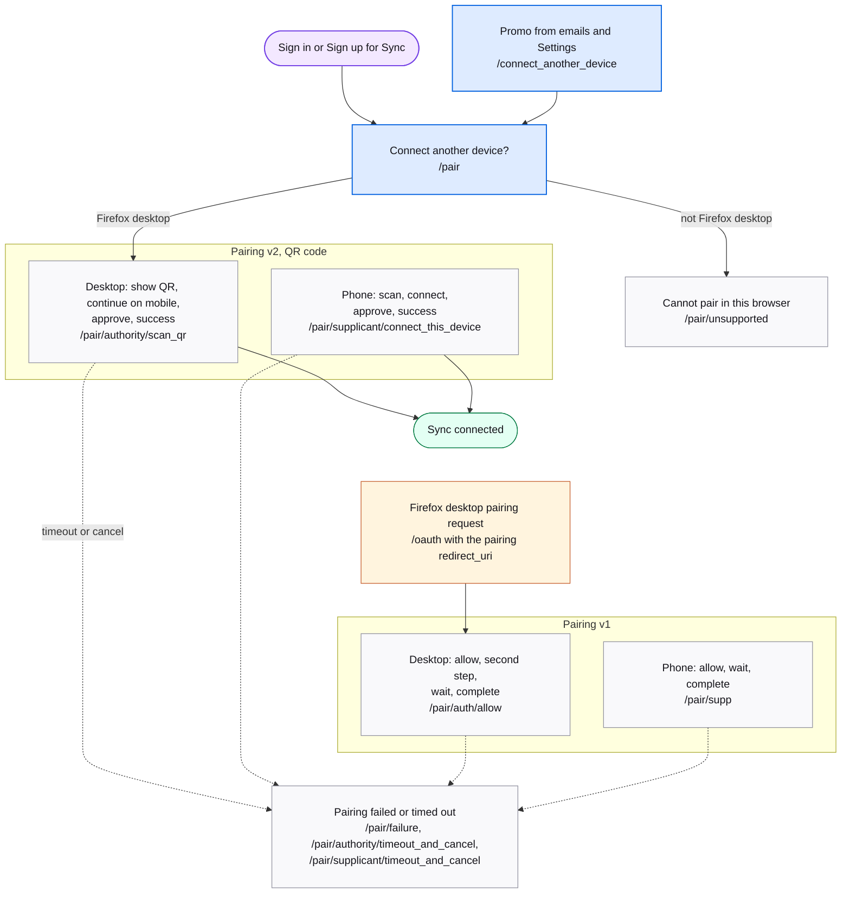

# Pairing and connect another device

Getting a second device onto Sync without retyping the password. Two generations coexist: v2 shows a QR code on the desktop that the phone scans; v1 is the older channel-based flow. Protocol: [Pairing flow architecture](../explanation/pairing-flow-architecture.md).

## Map

## Screens

| Route | Screen | Purpose |
| --- | --- | --- |
| `/pair` | [Pair](https://mozilla.github.io/fxa/storybooks/main/fxa-settings/?path=/story/pages-pair--choice-screen) | Choice screen after a Sync sign-in. Firefox desktop goes to the QR flow; other browsers to Unsupported. |
| `/connect_another_device` | [ConnectAnotherDevice](https://mozilla.github.io/fxa/storybooks/main/fxa-settings/?path=/story/pages-connectanotherdevice--can-sign-in-no-success-message) | Promo with app-store links; points at `/pair`. Linked from emails. |
| `/pair/unsupported` | [PairUnsupported](https://mozilla.github.io/fxa/storybooks/main/fxa-settings/?path=/story/pages-pair-unsupported--default) | Browser cannot pair. |
| `/pair/authority/scan_qr`, `/pair/authority/continue_on_mobile`, `/pair/authority/approve_signin`, `/pair/authority/sync_success` | [Pair2 Authority](https://mozilla.github.io/fxa/storybooks/main/fxa-settings/?path=/story/pages-pair2-authority-scanqr--default) | v2 desktop: show QR, wait, approve, done. |
| `/pair/authority/timeout_and_cancel`, `/pair/authority/download_firefox` | [Pair2 Authority errors](https://mozilla.github.io/fxa/storybooks/main/fxa-settings/?path=/story/pages-pair2-authority-timeoutandcancel--timed-out) | v2 desktop: timed out, or the phone has no Firefox. |
| `/pair/supplicant/ready_to_scan`, `/pair/supplicant/connect_this_device`, `/pair/supplicant/approve_signin`, `/pair/supplicant/sync_success` | [Pair2 Supplicant](https://mozilla.github.io/fxa/storybooks/main/fxa-settings/?path=/story/pages-pair2-supplicant-connectthisdevice--with-device-name) | v2 phone: scan, connect, approve, done. |
| `/pair/supplicant/timeout_and_cancel`, `/pair/supplicant/download_firefox` | [Pair2 Supplicant errors](https://mozilla.github.io/fxa/storybooks/main/fxa-settings/?path=/story/pages-pair2-supplicant-timeoutandcancel--timed-out) | v2 phone: timed out, or opened outside Firefox. |
| `/pair/auth/allow`, `/pair/auth/totp`, `/pair/auth/wait_for_supp`, `/pair/auth/complete` | [Pair Auth](https://mozilla.github.io/fxa/storybooks/main/fxa-settings/?path=/story/pages-pair-authallow--with-location) | v1 desktop: allow, second step, wait, done. |
| `/pair/supp`, `/pair/supp/allow`, `/pair/supp/wait_for_auth` | [Pair Supp](https://mozilla.github.io/fxa/storybooks/main/fxa-settings/?path=/story/pages-pair-suppallow--with-location) | v1 phone: allow, wait. |
| `/pair/supp/complete`, `/pair/success` | [PairSuccess](https://mozilla.github.io/fxa/storybooks/main/fxa-settings/?path=/story/pages-pair-success--default) | v1 phone: done. |
| `/pair/failure` | [PairFailure](https://mozilla.github.io/fxa/storybooks/main/fxa-settings/?path=/story/pages-pair-failure--default) | Pairing failed or was rejected. |
| `/oauth/success/:clientId` | [PairSuccess](https://mozilla.github.io/fxa/storybooks/main/fxa-settings/?path=/story/pages-pair-success--default) | Terminal screen when the code is delivered without a WebChannel. |
| `/poc_deep_link`, `/poc_pair_init`, `/poc_pair_start` | proof of concept | Development pages behind the `pocPairingRoutes` flag. |
| `/post_verify/cad_qr/get_started`, `/post_verify/cad_qr/ready_to_scan`, `/post_verify/cad_qr/scan_code`, `/post_verify/cad_qr/connected` | cad_qr (legacy) | Earlier QR flow, replaced by v2. |

## Notes

- v2 is served only when the content server's `showReactApp.pair2Routes` flag is on. The QR payload carries the channel id and key in the URL hash, so the key never reaches the server.
