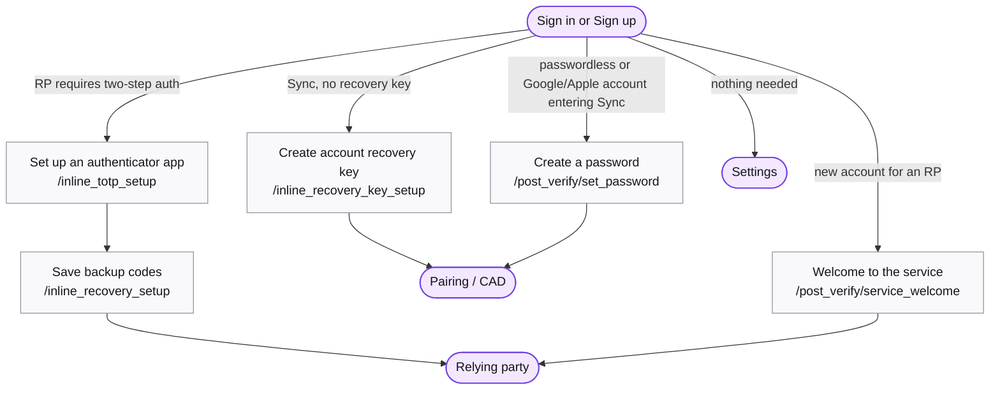

# Extra setup steps

Screens that interrupt a sign-in or sign-up to finish account setup before the user reaches their destination. Never entered directly.

## Map

## Screens

| Route | Screen | Purpose |
| --- | --- | --- |
| `/inline_totp_setup` | [InlineTotpSetup](https://mozilla.github.io/fxa/storybooks/main/fxa-settings/?path=/story/pages-inlinetotpsetup--default) | The relying party requires two-step authentication; scan the QR code and confirm. |
| `/inline_recovery_setup` | [InlineRecoverySetup](https://mozilla.github.io/fxa/storybooks/main/fxa-settings/?path=/story/pages-inlinerecoverysetup--choice-screen) | Save backup codes for the new authenticator. |
| `/inline_recovery_key_setup` | [InlineRecoveryKeySetup](https://mozilla.github.io/fxa/storybooks/main/fxa-settings/?path=/story/pages-inlinerecoverykeysetup--step-one) | Sync users without a recovery key are offered one. |
| `/post_verify/set_password` | [SetPassword](https://mozilla.github.io/fxa/storybooks/main/fxa-settings/?path=/story/pages-postverify-setpassword--default) | A passwordless or Google/Apple account entering Sync needs a password for encryption keys. |
| `/post_verify/third_party_auth/set_password` | [SetPassword](https://mozilla.github.io/fxa/storybooks/main/fxa-settings/?path=/story/pages-postverify-setpassword--default) | Alias kept for in-flight links. |
| `/post_verify/service_welcome` | [ServiceWelcome](https://mozilla.github.io/fxa/storybooks/main/fxa-settings/?path=/story/pages-postverify-servicewelcome--from-signin) | Welcome interstitial naming the relying party. |
| `/post_verify/password/force_password_change` | force_password_change (legacy) | Mandatory password change. Sign in still hard-navigates here. |
| `/post_verify/finish_account_setup/set_password` | finish_account_setup (legacy) | Password for an account created by a subscription purchase, from reminder emails. |
| `/post_verify/newsletters/add_newsletters` | newsletters (legacy) | Newsletter opt-in. Not reachable from React. |
| `/post_verify/secondary_email/add_secondary_email`, `/post_verify/secondary_email/confirm_secondary_email`, `/post_verify/secondary_email/verified_secondary_email` | secondary_email (legacy) | Add a secondary email after verification. Settings does this now. |
