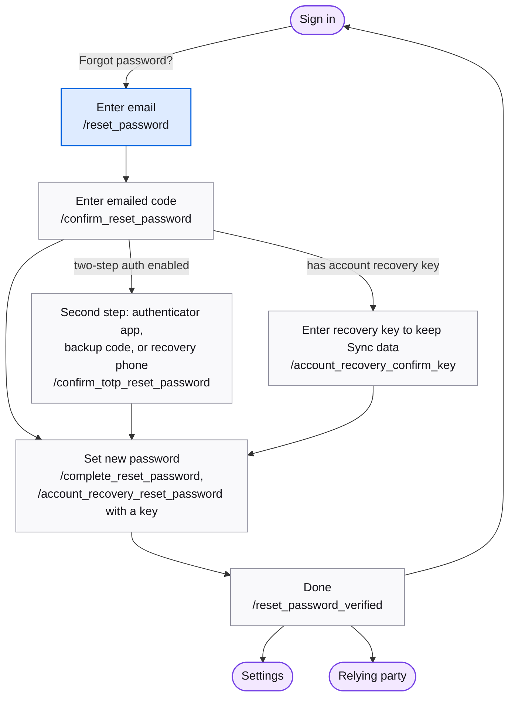

# Reset password

Regaining access when the password is forgotten: prove control of the email with a code, then a second factor if enabled, then optionally an account recovery key to keep Sync data.

## Map

## Screens

| Route | Screen | Purpose |
| --- | --- | --- |
| `/reset_password` | [ResetPassword](https://mozilla.github.io/fxa/storybooks/main/fxa-settings/?path=/story/pages-resetpassword-resetpassword--default) | Enter the account email. |
| `/confirm_reset_password` | [ConfirmResetPassword](https://mozilla.github.io/fxa/storybooks/main/fxa-settings/?path=/story/pages-resetpassword-confirmresetpassword--with-resend-success) | Emailed code. Routes onward by second factor and recovery key. |
| `/confirm_totp_reset_password` | [ConfirmTotpResetPassword](https://mozilla.github.io/fxa/storybooks/main/fxa-settings/?path=/story/pages-resetpassword-confirmtotpresetpassword--default) | Authenticator app code. |
| `/reset_password_totp_recovery_choice` | [ResetPasswordRecoveryChoice](https://mozilla.github.io/fxa/storybooks/main/fxa-settings/?path=/story/pages-resetpassword-resetpasswordrecoverychoice--default) | Backup code or recovery phone. |
| `/confirm_backup_code_reset_password` | [ConfirmBackupCodeResetPassword](https://mozilla.github.io/fxa/storybooks/main/fxa-settings/?path=/story/pages-resetpassword-confirmbackupcoderesetpassword--default) | Backup authentication code. |
| `/reset_password_recovery_phone` | [ResetPasswordRecoveryPhone](https://mozilla.github.io/fxa/storybooks/main/fxa-settings/?path=/story/pages-resetpassword-resetpasswordrecoveryphone--basic) | SMS code. |
| `/account_recovery_confirm_key` | [AccountRecoveryConfirmKey](https://mozilla.github.io/fxa/storybooks/main/fxa-settings/?path=/story/pages-resetpassword-accountrecoveryconfirmkey--default) | Enter the account recovery key so Sync data survives. |
| `/complete_reset_password` | [CompleteResetPassword](https://mozilla.github.io/fxa/storybooks/main/fxa-settings/?path=/story/pages-resetpassword-completeresetpassword--no-sync) | Set the new password. Warns Sync users about data loss without a key. |
| `/account_recovery_reset_password` | [CompleteResetPassword](https://mozilla.github.io/fxa/storybooks/main/fxa-settings/?path=/story/pages-resetpassword-completeresetpassword--no-sync) | Same screen after a valid key; data is kept. |
| `/reset_password_verified` | [ResetPasswordConfirmed](https://mozilla.github.io/fxa/storybooks/main/fxa-settings/?path=/story/pages-resetpassword-resetpasswordconfirmed--default) | Done. Continue to Settings or the relying party. |
| `/reset_password_with_recovery_key_verified` | [ResetPasswordWithRecoveryKeyVerified](https://mozilla.github.io/fxa/storybooks/main/fxa-settings/?path=/story/pages-resetpassword-resetpasswordwithrecoverykeyverified--recovery-key-generated) | Done; the used key is spent, so a new one is offered. |
