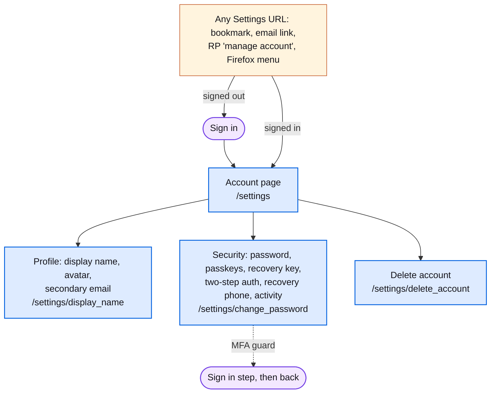

# Settings

The signed-in account page at `/settings`: one long page of sections, plus a sub-page for each edit. Any settings URL is also an entry point: a signed-out visitor is sent through sign-in and back.

## Map

## Screens

| Route | Screen | Purpose |
| --- | --- | --- |
| `/settings` | [PageSettings](https://mozilla.github.io/fxa/storybooks/main/fxa-settings/?path=/story/pages-settings--cold-start) | Profile, Security, Connected services, Linked accounts, Data collection, Delete account. |
| `/settings/display_name` | [PageDisplayName](https://mozilla.github.io/fxa/storybooks/main/fxa-settings/?path=/story/pages-settings-displayname--default) | Display name. |
| `/settings/avatar`, `/settings/avatar/change` | [PageAvatar](https://mozilla.github.io/fxa/storybooks/main/fxa-settings/?path=/story/pages-settings-avatar--default) | Profile picture. The `change` path is a redirect kept for Firefox. |
| `/settings/emails`, `/settings/emails/verify` | [PageSecondaryEmailAdd](https://mozilla.github.io/fxa/storybooks/main/fxa-settings/?path=/story/pages-settings-secondaryemailadd--default) | Add and confirm a secondary email. |
| `/settings/change_password` | [PageChangePassword](https://mozilla.github.io/fxa/storybooks/main/fxa-settings/?path=/story/pages-settings-changepassword--default) | Change password. Also the target of `/.well-known/change-password`. Accounts without a password are redirected to `/settings/create_password`. |
| `/settings/create_password` | [PageCreatePassword](https://mozilla.github.io/fxa/storybooks/main/fxa-settings/?path=/story/pages-settings-createpassword--default) | First password for a passwordless or Google/Apple account. |
| `/settings/passkeys/add` | [PagePasskeyAdd](https://mozilla.github.io/fxa/storybooks/main/fxa-settings/?path=/story/pages-settings-passkeyadd--ceremony-in-progress) | Register a passkey. |
| `/settings/account_recovery` | [PageRecoveryKeyCreate](https://mozilla.github.io/fxa/storybooks/main/fxa-settings/?path=/story/pages-settings-recoverykeycreate--create-key-with-success) | Create or replace the account recovery key. |
| `/settings/two_step_authentication` | [Page2faSetup](https://mozilla.github.io/fxa/storybooks/main/fxa-settings/?path=/story/pages-settings-twostepauthsetup--with-recovery-phone-option) | Enable two-step authentication and choose a backup method. |
| `/settings/two_step_authentication/change` | [Page2faChange](https://mozilla.github.io/fxa/storybooks/main/fxa-settings/?path=/story/pages-settings-twostepauthchange--default) | Switch authenticator app. |
| `/settings/two_step_authentication/replace_codes` | [Page2faReplaceBackupCodes](https://mozilla.github.io/fxa/storybooks/main/fxa-settings/?path=/story/pages-settings-replacebackupcodes--replace-existing-codes) | New backup codes. Linked from the low-codes email. |
| `/settings/recovery_phone/setup`, `/settings/recovery_phone/remove` | [PageRecoveryPhoneSetup](https://mozilla.github.io/fxa/storybooks/main/fxa-settings/?path=/story/pages-settings-recoveryphonesetup--add-with-success) | Add or remove the recovery phone. |
| `/settings/recent_activity` | [PageRecentActivity](https://mozilla.github.io/fxa/storybooks/main/fxa-settings/?path=/story/pages-settings-recentactivity--default) | Security event history. |
| `/settings/clients` | [ConnectedServices](https://mozilla.github.io/fxa/storybooks/main/fxa-settings/?path=/story/components-settings-connectedservices--default) | Redirects to the Connected services section of `/settings`: devices and services with access. |
| `/settings/delete_account` | [PageDeleteAccount](https://mozilla.github.io/fxa/storybooks/main/fxa-settings/?path=/story/pages-settings-deleteaccount--default) | Delete the account. |
| `/security_events`, `/secondary_email_verified` | legacy | Older screens replaced by Recent activity and Settings. |

## Notes

- Sensitive edits are wrapped in an MFA guard: an old or low-assurance session is sent to the matching sign-in step and returned to Settings.
- A Sync client that reaches Settings without a valid session sees [SignoutSync](https://mozilla.github.io/fxa/storybooks/main/fxa-settings/?path=/story/pages-signoutsync--basic), asking the user to sign out of Sync manually.
