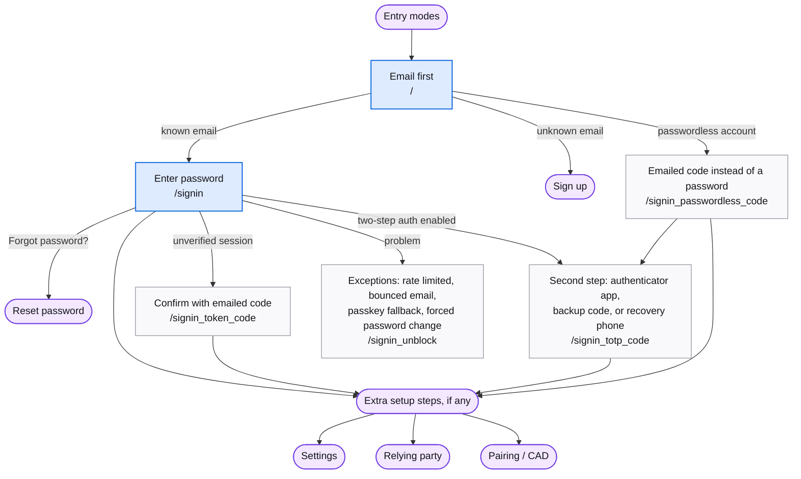

# Sign in

An existing user proves who they are. Every entry mode shares these screens; only the exit differs.

## Map

## Screens

| Route | Screen | Purpose |
| --- | --- | --- |
| `/` | [Index](https://mozilla.github.io/fxa/storybooks/main/fxa-settings/?path=/story/pages-index--default) | Email first. Decides between sign in and sign up. |
| `/signin`, `/oauth/signin` | [Signin](https://mozilla.github.io/fxa/storybooks/main/fxa-settings/?path=/story/pages-signin--non-cached-account-has-password-settings-or-rp) | Enter the password. Also hosts the passkey and Google/Apple buttons. |
| `/force_auth`, `/oauth/force_auth` | [Signin](https://mozilla.github.io/fxa/storybooks/main/fxa-settings/?path=/story/pages-signin--non-cached-account-has-password-settings-or-rp) | Same screen with the email locked, for a client that already knows the account. |
| `/signin_passkey_fallback` | [SigninPasskeyFallback](https://mozilla.github.io/fxa/storybooks/main/fxa-settings/?path=/story/pages-signin-signinpasskeyfallback--default) | Passkey failed or unsupported; use the password. |
| `/signin_passwordless_code`, `/oauth/signin_passwordless_code` | [SigninPasswordlessCode](https://mozilla.github.io/fxa/storybooks/main/fxa-settings/?path=/story/pages-signin-signinpasswordlesscode--default-signin) | Emailed code for an account with no password. |
| `/signin_token_code` | [SigninTokenCode](https://mozilla.github.io/fxa/storybooks/main/fxa-settings/?path=/story/pages-signin-signintokencode--default) | Emailed code to confirm an unverified session. |
| `/signin_totp_code` | [SigninTotpCode](https://mozilla.github.io/fxa/storybooks/main/fxa-settings/?path=/story/pages-signin-signintotpcode--default) | Authenticator app code. |
| `/signin_recovery_choice` | [SigninRecoveryChoice](https://mozilla.github.io/fxa/storybooks/main/fxa-settings/?path=/story/pages-signin-signinrecoverychoice--default) | Choose a backup code or the recovery phone. |
| `/signin_recovery_code` | [SigninRecoveryCode](https://mozilla.github.io/fxa/storybooks/main/fxa-settings/?path=/story/pages-signin-signinrecoverycode--default) | Backup authentication code. |
| `/signin_recovery_phone` | [SigninRecoveryPhone](https://mozilla.github.io/fxa/storybooks/main/fxa-settings/?path=/story/pages-signin-signinrecoveryphone--basic) | SMS code to the recovery phone. |
| `/signin_unblock` | [SigninUnblock](https://mozilla.github.io/fxa/storybooks/main/fxa-settings/?path=/story/pages-signin-signinunblock--default) | Unblock code emailed after rate limiting. |
| `/signin_bounced` | [SigninBounced](https://mozilla.github.io/fxa/storybooks/main/fxa-settings/?path=/story/pages-signin-signinbounced--default) | The account email bounced. |
| `/complete_signin` | [CompleteSignin](https://mozilla.github.io/fxa/storybooks/main/fxa-settings/?path=/story/pages-signin-completesignin--validation-in-progress) | Landing for the confirm sign-in email link; finishes the session and continues to `/pair`. |
| `/signin_confirmed`, `/signin_verified` | [SigninConfirmed](https://mozilla.github.io/fxa/storybooks/main/fxa-settings/?path=/story/pages-signin-signinconfirmed--default-signed-in) | Signed-in confirmation kept for old links. The current flow continues to `/pair` instead. |
| `/report_signin` | [ReportSignin](https://mozilla.github.io/fxa/storybooks/main/fxa-settings/?path=/story/pages-signin-reportsignin--default) | Landing for the "this wasn't me" email link. |
| `/signin_reported` | [SigninReported](https://mozilla.github.io/fxa/storybooks/main/fxa-settings/?path=/story/pages-signin-signinreported--default) | Report confirmation. |
| `/post_verify/password/force_password_change` | force_password_change (legacy) | Mandatory password change after a security event. |
| `/signin_permissions` | permissions (legacy) | Consent screen for untrusted relying parties. Not reachable from React. |
| `/confirm_signin`, `/confirm` | confirm (legacy) | Link-based "check your email" screens, replaced by code entry. |

## Notes

- **Exit** depends on the entry mode: web goes to `/settings`, a relying party gets a redirect with a code, Sync sends credentials to the browser and continues to `/pair`. See [Entry modes](./entry-modes.md).
- A relying party that requires two-step authentication sends the user through `/inline_totp_setup` first. A passwordless account entering Sync goes through `/post_verify/set_password`.
