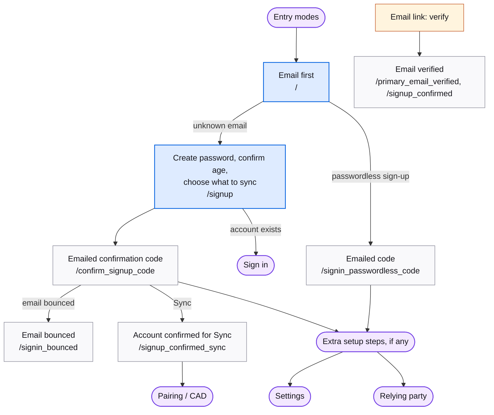

# Sign up

Creating an account. Entry is always the email-first screen; an unknown email leads here.

## Map

## Screens

| Route | Screen | Purpose |
| --- | --- | --- |
| `/signup`, `/oauth/signup` | [Signup](https://mozilla.github.io/fxa/storybooks/main/fxa-settings/?path=/story/pages-signup--default) | Create a password and confirm age. Sync shows the "choose what to sync" list inline. |
| `/confirm_signup_code` | [ConfirmSignupCode](https://mozilla.github.io/fxa/storybooks/main/fxa-settings/?path=/story/pages-signup-confirmsignupcode--with-success) | Emailed confirmation code. Completes the account. |
| `/signup_confirmed_sync` | [SignupConfirmedSync](https://mozilla.github.io/fxa/storybooks/main/fxa-settings/?path=/story/pages-signup-signupconfirmedsync--desktop) | Sync confirmation, then `/pair`. |
| `/signup_confirmed`, `/signup_verified` | [SignupConfirmed](https://mozilla.github.io/fxa/storybooks/main/fxa-settings/?path=/story/pages-signup-signupconfirmed--default-signed-in) | Generic confirmation. |
| `/primary_email_verified` | [PrimaryEmailVerified](https://mozilla.github.io/fxa/storybooks/main/fxa-settings/?path=/story/pages-signup-primaryemailverified--basic-signed-in) | Confirmation after a verification link. |
| `/signin_passwordless_code` | [SigninPasswordlessCode](https://mozilla.github.io/fxa/storybooks/main/fxa-settings/?path=/story/pages-signin-signinpasswordlesscode--default-signin) | Passwordless sign-up: the account is created on code entry. |
| `/verify_email`, `/verify_primary_email` | complete_sign_up (legacy) | Link-based verification. Current emails send codes. |
| `/choose_what_to_sync` | choose_what_to_sync (legacy) | Standalone Sync checklist, now inline on sign-up. |
| `/would_you_like_to_sync` | would_you_like_to_sync (legacy) | Post-verification Sync offer. Not reachable from React. |
| `/signup_permissions` | permissions (legacy) | Consent screen for untrusted relying parties. Not reachable from React. |

## Notes

- After the code, the exit is the same as for sign in: `/settings`, a relying-party redirect, or `/pair` for Sync. A new account for a relying party may see `/post_verify/service_welcome` first.
