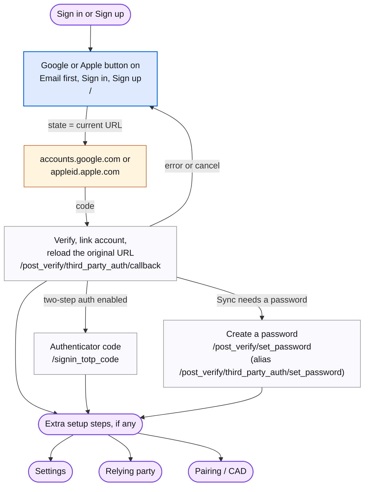

# Google / Apple

Signing in or up with a Google or Apple account. The buttons sit on the email-first, sign-in, and sign-up screens; the round trip returns to one callback route. Reference: [Third-party authentication](../reference/third-party-authentication.md).

## Map

## Screens

| Route | Screen | Purpose |
| --- | --- | --- |
| `/`, `/signin`, `/signup` | [ThirdPartyAuth](https://mozilla.github.io/fxa/storybooks/main/fxa-settings/?path=/story/components-thirdpartyauth--default) | The Google and Apple buttons. `state` carries the current accounts URL so the flow can resume. |
| `/post_verify/third_party_auth/callback` | ThirdPartyAuthCallback | Exchanges the provider code, links the account, then reloads the saved URL. No UI beyond a spinner. |
| `/post_verify/third_party_auth/set_password` | [SetPassword](https://mozilla.github.io/fxa/storybooks/main/fxa-settings/?path=/story/pages-postverify-setpassword--default) | The linked account has no password and Sync needs one. Alias of `/post_verify/set_password`. |
| `/settings/create_password` | [PageCreatePassword](https://mozilla.github.io/fxa/storybooks/main/fxa-settings/?path=/story/pages-settings-createpassword--default) | Add a password to a Google/Apple-only account. |

## Notes

- Apple returns by form POST; the content server turns it into a GET with `provider=apple`.
- The linked account appears in Settings under Linked accounts, with an unlink action.
