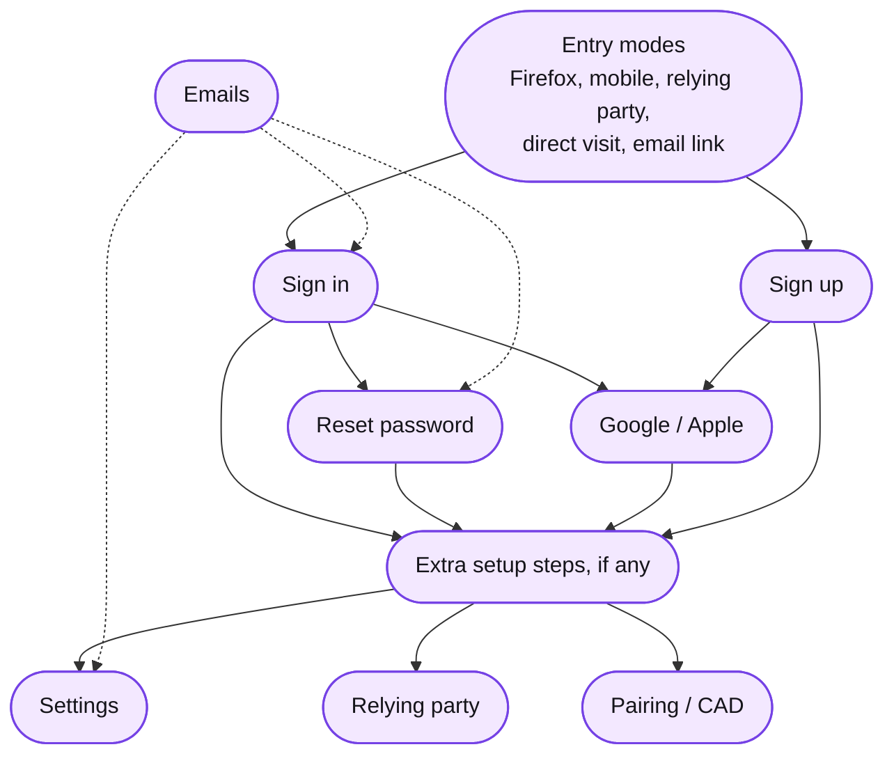

# FxA Sitemap

Every screen in the Mozilla accounts (FxA) web UI, grouped by flow, with how users arrive and where they leave. Hover a route or a box marked with the eye icon for a live Storybook preview. Click top-level flows to see map in detail.

<div data-fxa-route-drift data-ignore="update_firefox download_firefox .well-known/change-password metrics-flow"></div>

## Map



## Pages

| Page | Covers |
| --- | --- |
| [Entry modes](./entry-modes.md) | Who sends users here, and the URL parameters that decide how a screen behaves |
| [Sign in](./flow-signin.md) | Password, second factors, exceptions, email-link landings |
| [Sign up](./flow-signup.md) | Create account and confirm |
| [Reset password](./flow-reset-password.md) | Code, second factor, recovery key, new password |
| [OAuth relying party](./flow-oauth-relying-party.md) | `/authorization`, branding, exits |
| [Google / Apple](./flow-third-party-auth.md) | Third-party sign-in round trip |
| [Extra setup steps](./flow-post-signin-setup.md) | Two-step setup, recovery key, set password, welcome |
| [Pairing / CAD](./flow-pairing.md) | Connect another device, pairing v1 and v2 |
| [Settings](./flow-settings.md) | The account page and its sub-pages |
| [Emails](./emails.md) | Which email lands on which screen |

Scope: `packages/fxa-settings` plus the remaining legacy screens in `packages/fxa-content-server`, and the emails that link into them. Not covered: the Subscription Platform and the admin panel.

<details>
<summary>All routes</summary>

Every route the content server serves and the page that documents it. The freshness banner at the top checks this table against `mozilla/fxa` `main` in your browser.

| Route | Flow page | Notes |
| --- | --- | --- |
| `/` | [Sign in](./flow-signin.md) | Email-first entry |
| `/oauth` | [OAuth relying party](./flow-oauth-relying-party.md) | Email-first with RP context |
| `/authorization` | [OAuth relying party](./flow-oauth-relying-party.md) | |
| `/signin` | [Sign in](./flow-signin.md) | |
| `/oauth/signin` | [Sign in](./flow-signin.md) | |
| `/force_auth` | [Sign in](./flow-signin.md) | |
| `/oauth/force_auth` | [Sign in](./flow-signin.md) | |
| `/signin_passkey_fallback` | [Sign in](./flow-signin.md) | |
| `/signin_passwordless_code` | [Sign in](./flow-signin.md) | |
| `/oauth/signin_passwordless_code` | [Sign in](./flow-signin.md) | |
| `/signin_token_code` | [Sign in](./flow-signin.md) | |
| `/signin_totp_code` | [Sign in](./flow-signin.md) | |
| `/signin_recovery_choice` | [Sign in](./flow-signin.md) | |
| `/signin_recovery_code` | [Sign in](./flow-signin.md) | |
| `/signin_recovery_phone` | [Sign in](./flow-signin.md) | |
| `/signin_unblock` | [Sign in](./flow-signin.md) | |
| `/signin_bounced` | [Sign in](./flow-signin.md) | |
| `/complete_signin` | [Sign in](./flow-signin.md) | Email link |
| `/signin_confirmed` | [Sign in](./flow-signin.md) | |
| `/signin_verified` | [Sign in](./flow-signin.md) | |
| `/report_signin` | [Sign in](./flow-signin.md) | Email link |
| `/signin_reported` | [Sign in](./flow-signin.md) | |
| `/signin_permissions` | [OAuth relying party](./flow-oauth-relying-party.md) | Legacy Backbone |
| `/confirm_signin` | [Sign in](./flow-signin.md) | Legacy Backbone |
| `/confirm` | [Sign in](./flow-signin.md) | Legacy Backbone |
| `/signup` | [Sign up](./flow-signup.md) | |
| `/oauth/signup` | [Sign up](./flow-signup.md) | |
| `/confirm_signup_code` | [Sign up](./flow-signup.md) | |
| `/signup_confirmed` | [Sign up](./flow-signup.md) | |
| `/signup_verified` | [Sign up](./flow-signup.md) | |
| `/signup_confirmed_sync` | [Sign up](./flow-signup.md) | |
| `/primary_email_verified` | [Sign up](./flow-signup.md) | |
| `/signup_permissions` | [OAuth relying party](./flow-oauth-relying-party.md) | Legacy Backbone |
| `/verify_email` | [Sign up](./flow-signup.md) | Legacy Backbone, email link |
| `/verify_primary_email` | [Sign up](./flow-signup.md) | Legacy Backbone |
| `/verify_secondary_email` | [Settings](./flow-settings.md) | Legacy Backbone |
| `/secondary_email_verified` | [Settings](./flow-settings.md) | Legacy Backbone |
| `/choose_what_to_sync` | [Sign up](./flow-signup.md) | Legacy Backbone |
| `/would_you_like_to_sync` | [Sign up](./flow-signup.md) | Legacy Backbone |
| `/reset_password` | [Reset password](./flow-reset-password.md) | |
| `/confirm_reset_password` | [Reset password](./flow-reset-password.md) | |
| `/confirm_totp_reset_password` | [Reset password](./flow-reset-password.md) | |
| `/reset_password_totp_recovery_choice` | [Reset password](./flow-reset-password.md) | |
| `/confirm_backup_code_reset_password` | [Reset password](./flow-reset-password.md) | |
| `/reset_password_recovery_phone` | [Reset password](./flow-reset-password.md) | |
| `/account_recovery_confirm_key` | [Reset password](./flow-reset-password.md) | |
| `/complete_reset_password` | [Reset password](./flow-reset-password.md) | Email link |
| `/account_recovery_reset_password` | [Reset password](./flow-reset-password.md) | |
| `/reset_password_verified` | [Reset password](./flow-reset-password.md) | |
| `/reset_password_with_recovery_key_verified` | [Reset password](./flow-reset-password.md) | |
| `/post_verify/third_party_auth/callback` | [Google / Apple](./flow-third-party-auth.md) | |
| `/post_verify/third_party_auth/set_password` | [Google / Apple](./flow-third-party-auth.md) | |
| `/post_verify/set_password` | [Extra setup steps](./flow-post-signin-setup.md) | |
| `/post_verify/service_welcome` | [Extra setup steps](./flow-post-signin-setup.md) | |
| `/inline_totp_setup` | [Extra setup steps](./flow-post-signin-setup.md) | |
| `/inline_recovery_setup` | [Extra setup steps](./flow-post-signin-setup.md) | |
| `/inline_recovery_key_setup` | [Extra setup steps](./flow-post-signin-setup.md) | |
| `/post_verify/password/force_password_change` | [Extra setup steps](./flow-post-signin-setup.md) | Legacy Backbone |
| `/post_verify/newsletters/add_newsletters` | [Extra setup steps](./flow-post-signin-setup.md) | Legacy Backbone |
| `/post_verify/secondary_email/add_secondary_email` | [Extra setup steps](./flow-post-signin-setup.md) | Legacy Backbone |
| `/post_verify/secondary_email/confirm_secondary_email` | [Extra setup steps](./flow-post-signin-setup.md) | Legacy Backbone |
| `/post_verify/secondary_email/verified_secondary_email` | [Extra setup steps](./flow-post-signin-setup.md) | Legacy Backbone |
| `/connect_another_device` | [Pairing / CAD](./flow-pairing.md) | Email link |
| `/pair` | [Pairing / CAD](./flow-pairing.md) | |
| `/pair/unsupported` | [Pairing / CAD](./flow-pairing.md) | |
| `/pair/failure` | [Pairing / CAD](./flow-pairing.md) | |
| `/pair/success` | [Pairing / CAD](./flow-pairing.md) | |
| `/pair/auth/allow` | [Pairing / CAD](./flow-pairing.md) | v1 |
| `/pair/auth/totp` | [Pairing / CAD](./flow-pairing.md) | v1 |
| `/pair/auth/wait_for_supp` | [Pairing / CAD](./flow-pairing.md) | v1 |
| `/pair/auth/complete` | [Pairing / CAD](./flow-pairing.md) | v1 |
| `/pair/supp` | [Pairing / CAD](./flow-pairing.md) | v1 |
| `/pair/supp/allow` | [Pairing / CAD](./flow-pairing.md) | v1 |
| `/pair/supp/wait_for_auth` | [Pairing / CAD](./flow-pairing.md) | v1 |
| `/pair/supp/complete` | [Pairing / CAD](./flow-pairing.md) | v1 |
| `/pair/authority/scan_qr` | [Pairing / CAD](./flow-pairing.md) | v2 |
| `/pair/authority/continue_on_mobile` | [Pairing / CAD](./flow-pairing.md) | v2 |
| `/pair/authority/approve_signin` | [Pairing / CAD](./flow-pairing.md) | v2 |
| `/pair/authority/sync_success` | [Pairing / CAD](./flow-pairing.md) | v2 |
| `/pair/authority/timeout_and_cancel` | [Pairing / CAD](./flow-pairing.md) | v2 |
| `/pair/authority/download_firefox` | [Pairing / CAD](./flow-pairing.md) | v2 |
| `/pair/supplicant/ready_to_scan` | [Pairing / CAD](./flow-pairing.md) | v2 |
| `/pair/supplicant/connect_this_device` | [Pairing / CAD](./flow-pairing.md) | v2 |
| `/pair/supplicant/approve_signin` | [Pairing / CAD](./flow-pairing.md) | v2 |
| `/pair/supplicant/sync_success` | [Pairing / CAD](./flow-pairing.md) | v2 |
| `/pair/supplicant/timeout_and_cancel` | [Pairing / CAD](./flow-pairing.md) | v2 |
| `/pair/supplicant/download_firefox` | [Pairing / CAD](./flow-pairing.md) | v2 |
| `/oauth/success/:clientId` | [Pairing / CAD](./flow-pairing.md) | |
| `/post_verify/cad_qr/get_started` | [Pairing / CAD](./flow-pairing.md) | Legacy Backbone |
| `/post_verify/cad_qr/ready_to_scan` | [Pairing / CAD](./flow-pairing.md) | Legacy Backbone |
| `/post_verify/cad_qr/scan_code` | [Pairing / CAD](./flow-pairing.md) | Legacy Backbone |
| `/post_verify/cad_qr/connected` | [Pairing / CAD](./flow-pairing.md) | Legacy Backbone |
| `/poc_deep_link` | [Pairing / CAD](./flow-pairing.md) | Proof of concept |
| `/poc_pair_init` | [Pairing / CAD](./flow-pairing.md) | Proof of concept |
| `/poc_pair_start` | [Pairing / CAD](./flow-pairing.md) | Proof of concept |
| `/settings` | [Settings](./flow-settings.md) | |
| `/settings/display_name` | [Settings](./flow-settings.md) | |
| `/settings/avatar` | [Settings](./flow-settings.md) | |
| `/settings/avatar/change` | [Settings](./flow-settings.md) | |
| `/settings/emails` | [Settings](./flow-settings.md) | |
| `/settings/emails/verify` | [Settings](./flow-settings.md) | |
| `/settings/change_password` | [Settings](./flow-settings.md) | |
| `/settings/create_password` | [Settings](./flow-settings.md) | |
| `/settings/passkeys/add` | [Settings](./flow-settings.md) | |
| `/settings/account_recovery` | [Settings](./flow-settings.md) | |
| `/settings/two_step_authentication` | [Settings](./flow-settings.md) | |
| `/settings/two_step_authentication/change` | [Settings](./flow-settings.md) | |
| `/settings/two_step_authentication/replace_codes` | [Settings](./flow-settings.md) | |
| `/settings/recovery_phone/setup` | [Settings](./flow-settings.md) | |
| `/settings/recovery_phone/remove` | [Settings](./flow-settings.md) | |
| `/settings/recent_activity` | [Settings](./flow-settings.md) | |
| `/settings/clients` | [Settings](./flow-settings.md) | |
| `/settings/delete_account` | [Settings](./flow-settings.md) | |
| `/security_events` | [Settings](./flow-settings.md) | Legacy Backbone |
| `/subscriptions` | [OAuth relying party](./flow-oauth-relying-party.md) | Legacy redirect to Subscription Platform |
| `/clear` | [Entry modes](./entry-modes.md) | Utility |
| `/cookies_disabled` | [Entry modes](./entry-modes.md) | Utility |
| `/web_channel_example` | [Entry modes](./entry-modes.md) | Development only |
| `/update_firefox` | [Entry modes](./entry-modes.md) | Server-rendered |
| `/download_firefox` | [Entry modes](./entry-modes.md) | Server redirect |
| `/.well-known/change-password` | [Settings](./flow-settings.md) | Server redirect |

Not listed because the served route is a pattern: `/subscriptions/products/:productId`, a legacy redirect to the Subscription Platform.

</details>

## Keeping this current

The banner at the top compares the routes listed here with `mozilla/fxa` `main` on every visit. Green: in sync. Yellow: a route was added or removed in code, and the banner lists which. Gray: the check could not run.

When it's yellow, add or remove rows for the listed routes:

- one in the All routes table above
- one in the flow page's Screens table, with the screen name linked to its Storybook story
- a box on that page's map, if users see the screen as a step

Or hand it to an assistant:

<div className="fxa-wrap">

```text
The FxA Sitemap banner lists routes out of sync with fxa. Update docs/fxa-sitemap following the Keeping this current section of the overview, looking up each new screen in packages/fxa-settings in the fxa repo.
```

</div>

<details>
<summary>Where things live</summary>

Routes: `packages/fxa-content-server/server/lib/routes/react-app/content-server-routes.js` is the served list; `packages/fxa-settings/src/components/App/index.tsx` and `Settings/index.tsx` map routes to components. Screens: the [published Storybook](https://mozilla.github.io/fxa/storybooks/main/fxa-settings/), where story titles under `Pages/` match component names. Emails: `libs/accounts/email-renderer/src/renderer/email-link-builder.ts`.

The banner and previews are plain JavaScript in `src/js/fxa-sitemap-live.js`; `src/plugins/fxa-sitemap-screens.js` indexes the Storybook links from every page so previews work across pages. If the banner stays gray, the two fxa file paths in the client module have probably moved.

</details>
