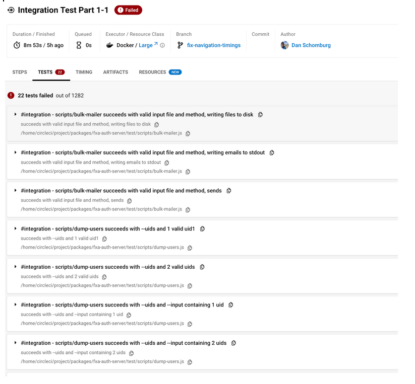

Our CI process is largely automatic. By simply pushing up a branch and opening a PR the CI system will kick in and start validating your changes. By landing a PR on the main branch, the system will also build and deploy docker images that keep the current state of the FxA fresh.

Even though this is all seamless, there are a few best practices to keep in mind. Following these will help pipelines run faster in the future and with fewer errors. Also, if unfamiliar with CI concepts, we have some more info [here](/ecosystem-platform/reference/tests-in-circleci#workflows).

## Rebase Off Main Before Pushing Code

This might just be the most important tip! Always try to rebase your code on main before pushing up a PR. This ensures a couple things. First it decreases the possibility of merge conflict or a ‘bad’ merge state occurring when the PR finally lands. Second, it ensures that your branch and the docker images we use to run our CI pipelines will be similar, and therefore have low start up time.

If there are no changes to npm packages in your PR and it has been rebased off main, we can skip the yarn install step in the CI, which leads to much faster execution times. If your branch meets these criteria, you’ll see a message saying something like ‘Congrats! No changes detected on yarn.lock’ in the base install step.

It’s possible that at some point in the future we will enforce that PRs have been rebased off of main. But for the time being this is the honors system.

## Be mindful when adding or updating packages
As discussed in the [Continuous Integration](/ecosystem-platform/reference/continuous-integration-for-monorepos) Reference. One of the challenges faced in mono repos is large sets dependencies. There are a few things we can do going forward to help ensure this doesn’t get worse:

- Before adding a new package, make sure it’s really needed. Ideally we consolidate / gravitate towards a fixed set of high level frameworks.
- Try to have a one in one out policy. If a new package is added, look to phase out an old package.
- If updating a package, try to update across all workspaces, so we don’t have different versions. This is much easier said than done; however, and oftentimes it’s not possible. Running `yarn dedupe -c $package_name` can give an idea of the extent of the problem.
- Be mindful of upstream dependencies. Run `yarn why` to see the dependency tree for any package. 

Also be aware that making changes to packages means a yarn install will be needed in each CI job to ensure the packages are up to date. It will also likely trigger a full rerun of all test suites. This adds unavoidable overhead to your CI pipeline. It isn’t all that big a deal, but it is something to be avoided when possible.

## Helpful yarnrc.yml configurations
There are two settings that result in a pretty drastic reduction in the size of the yarn cache needed to run FxA.

First, `nmMode: hardlinks-global` reduces the size of the internal yarn cache for FxA by about a third. This essentially uses hard links to reduce the amount of redundant packages held in the node_modules folder.  When enabled, if two modules both reference the same package, yarn will hardlink the package instead of copying it into both modules folders which can end up saving a lot of space on disk.

Second, `enableGlobalCache: true`, reduces the size of the internal yarn cache by 1/2 in the CI. When this is not enabled, all the packages will get stored as zips in the global cache located in the ~/.yarn/berry, as well as the project local cache located in fxa/.yarn/berry. This redundancy really isn’t helpful in most scenarios, and particularly unhelpful in the CI as it results in bloat.

## Tag tests as unit or integration tests
In order to provide better performance, and to fail bad PRs more quickly, break our tests up into unit tests and integration tests and run these tests in separate CI jobs.

In our system unit tests are tests that can:
- Run quickly, typically under 100ms, and definitely under 500ms.
- Run without any infrastructure, i.e. tests can run without any pm2 services running.

Integration tests are tests that:
- Take longer to run, typically over 500ms.
- Run with just infrastructure, i.e. we must execute a `yarn start infrastructure` prior to running tests)

In order to distinguish between these kinds of tests, we have created a tagging convention. Our tests names need to be tagged with either #unit or #integration. These tags can exist at the test level (i.e. the ‘it’ block) or at the suite level (i.e. the ‘describe’ block). 

In the future we may have better conventions for this such as file names or even folders, but for now, this was the least disruptive way to separate the two types of tests without disrupting the git history too much.

Important: For jest tests we need to be explicit and add the #unit and #integration tag to each top level 'describe’ block. This is due to the fact that jest does not support an [‘invert’ option like mocha does, so we have not way run all tests except those with #integration. Therefore we must explicitly tag all tests.

## Prioritize lightweight tests
Ideally we have a [pyramid](https://martinfowler.com/articles/practical-test-pyramid.html) distribution of test types. 

- Unit tests, which are the fastest and quickest to run, should be the bulk of the tests. And run first.
- Integration tests, which only require some infrastructure like databases or caches to be present or are inherently long running tests, should be run next.
- Backend services should be run last. They require a full stack as well as a headless browser to be running which adds significant overhead to the test suite.
- Finally manual black box testing that involves a human being should be conducted prior to release.. 

These tests increase almost exponentially in cost, and therefore we should be mindful of their distribution in our system. 

Unit and integration tests also have the ability to report coverage metrics, so we can actually see how many lines and logical branches we have covered in these test suites. Ideally we have about 80% or better code coverage for unit / integration tests.

There are always things that will be difficult to test purely with a unit or integration test, so keep that in mind as well. Functional tests, and manual testing will always be useful and are still necessary.

:::tip
If a scenario is encountered where a functional test fails, but there were not any unit or integration tests that also failed, this might be a good opportunity to go back and improve unit or integration test coverage. 
:::

## Keep NPM Scripts Consistent
If an operation is general enough to be targeted in the CI, then put it in an npm script and make sure the npm script name is consistent across packages. The reason this is useful is that we can then target these scripts with `yarn workspaces foreach run $script_name` commands. 

This is a very convenient way to execute various operations across packages in the mono repo. If scripts aren’t consistently named, then things get quite messy. Currently there are a few scripts we rely on heavily in the CI

- `yarn workspaces foreach run compile`- Should compile typescript
- `yarn workspaces foreach run test:unit` - Runs unit tests
- `yarn workspaces foreach run test:integration` - Runs integration tests
- `yarn workspaces foreach run postinstall` - Should prime the repo after running yarn install. We generally use this for pulling down and priming l10n content.

## Export Tests Reports
We have a lot of tests. No one really wants to dig through command line output to figure out what failed. So whenever possible, we will generate and export test reports. This  is especially important for unit and integration tests where many workspace packages are being tested in a single job. By exporting test reports, the errors will show up nicely formatted in the UI. For example:

Test reports are fairly easy to export. Most testing frameworks will export a json format, typically in the junit reporter format, which can be interpreted by CircleCI. Any test report that ultimately ends up in the artifacts/tests will be accessible in the tests tab in circle ci as depicted above.

## Review the CI Workflows
The CI workflows in FxA have been crafted to address some of the side effects that mono repos can have on CI. Checkout the [Continuous Integration](/ecosystem-platform/reference/continuous-integration) reference to learn more about how our CI design attempts to address some of these issues.

## Updating CI Runner Images
The day will come when it might be necessary to update the base images we use in our CI runners. A good example is upgrading a major version of node. When this happens we must update images to reference cimg/node:$VER and node:$VER. 

Because CI images are built as changes land on main, it may seem as though there is a chicken egg problem. In order to produce new CI images we must land the changes we need on main, but in order to land changes on main we must test them in branch using our CI runner images. This can definitely be a quandary, but here’s how to deal with it:

- In .circleci/config.yml, go to commands > create-ci-images > build-ci-image > target, and version those values. So the targets would become test-runner-v2, builder-v2, and functional-test-runner-v2.
- In .circleci/config.yml, update all references to these images in the executor section.
- In .circleci/config.yml, go to workflows > deploy_ci_images > jobs > filters > branches and add the name of the branch being worked on to the list.
- Open the _dev/docker/ci/Dockerfile and change cimg/node:16.3 to whatever cimg/node:$version needs to be targeted.
- Push changes.

This will end up triggering a new build. The tests will fail the first time. In fact you may as well cancel the `test_pull_request` workflow. The `deploy_ci_images` workflow will run (due to change in step 4) and push up the new image tags to docker hub that our CI runners use. On a rerun, or subsequent push, the image with node 18 should now be in place, and they will pass. And of course, it won’t break everyone else’s pipelines cause it’ll be using a different tag, and their configs still reference the original images.

