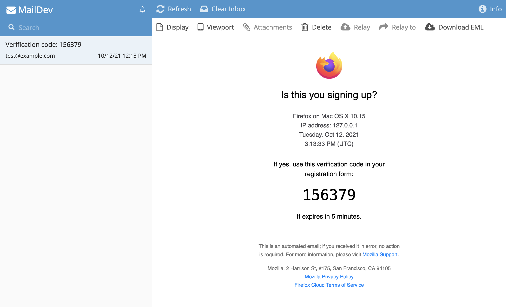

If you're interested in receiving emails locally you can use [MailDev](https://www.npmjs.com/package/maildev) to intercept emails and display them in a local inbox.

1. Install the MailDev CLI globally:

    ```shell
    npm i -g maildev
    ```

1. Assuming you have FxA running locally you'll need to stop the `inbox` service: 

    ```shell
    yarn pm2 stop inbox
    ```

1. Start MailDev on port 9999. You may need to start it with `sudo` permissions: 

    ```shell
    sudo maildev -s 9999
    ```

1. All emails will now be sent to the local inbox, which you can access at [http://localhost:1080](http://localhost:1080)


