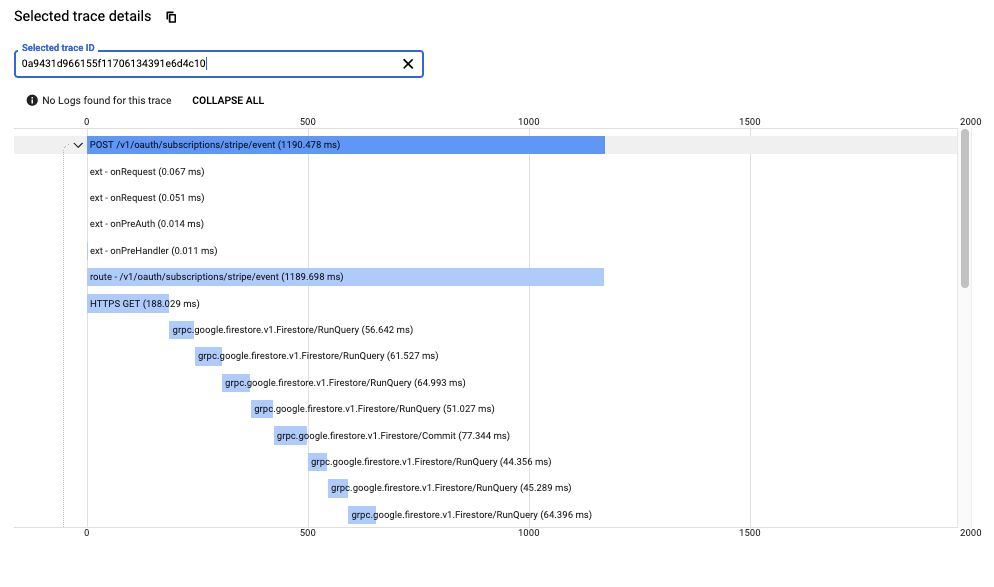
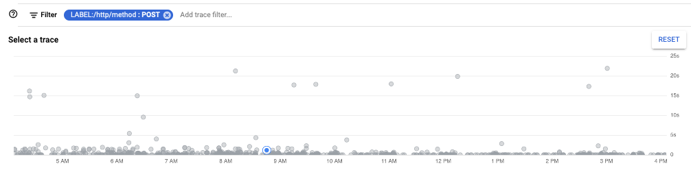
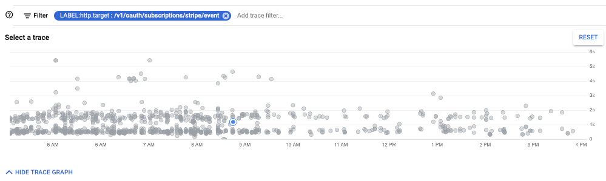
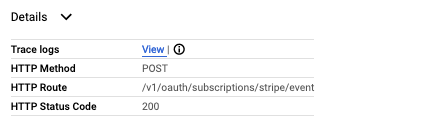

# Tracing on Stage / Prod

At the time of writing we are still applying the configurations to various services, but inevitably all services will be configured. Currently the auth server has been configured to work on staging. 

The primary difference between using tracing locally and on stage/production is that traces on stage/production will be viewed in [google cloud trace viewer](https://console.cloud.google.com/traces/list) instead of Jaeger. The other notable difference is that the sample rate will be much lower. 

This means you should not count on every request made to show up. Only a subset of requests will be captured. If you need tracing, and aren't seeing the trace you need, reach out to the team. We might need to adjust the sampling configuration, so the trace you need is more likely to come through.

## Viewing Traces in Google Cloud Trace

To start exploring traces go to the [google cloud trace viewer](https://console.cloud.google.com/traces/list).

Next try the following filters:

1. Search by trace id

1. Filter by http method

1. Filter by route / target

## Seeing performance statistics

Tracing also gives a rough idea of service performance. It's good to know that there are some automatically generated reports. These can be found under the [analysis reports tab](https://console.cloud.google.com/traces/tasks?project=moz-fx-fxa-nonprod-375e). At the time of writing, these reports still need quite a bit of work to be useful.

## Correlating Logs

One final thing that's nice to have with tracing is the ability to see related log messages. In google cloud trace, you'll notice a link to view logs. 

This will bring up a view of the time slice that the trace fills. 

_Note, that in the future, you should also be able to search for the traceId. For some reason this isn't coming through on log messages at the moment._

