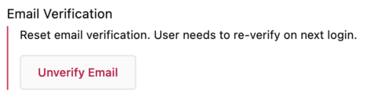

# Admin Panel Support User Documentation

The Firefox account admin panel provides access to key information about user accounts and allows administrative functions to be performed on these accounts. This document is broken down by UI component, and explains all the functionality afforded by the admin panel.

### Email Bounces

Occasionally, we will receive complaints that a user is blocked from accessing their account and never got a registration/verification/notification email. Generally this is due to an email bounce, or in other words, we sent out an email and it was rejected by the user’s email server.

In the event this happens, we generally clear the email bounces, which also unblocks their account. We then ask the user to add [accounts@firefox.com](mailto:accounts@firefox.com) to their address book and try again. Clearing the bounces is an important step, because the email cannot be delivered until the bounce is cleared. And a user can be locked out of their account until they have received a verification code in their inbox.

There are two basic types of email bounces: ‘hard bounces’ and ‘soft bounces’. Soft email bounces will automatically clear themselves in 24 hours, whereas hard email bounces will not automatically clear, and must therefore be manually cleared.

:::important
There is one bounce type we must pay special attention to. If the email is bouncing because it is ‘suppressed’, clearing it isn't going to help and will hurt our deliverability score if we keep trying to send it. In this case the account holder will need to reach out to the email provider and try to resolve the issue. Once resolved, we can then clear the bounce on our side and ask the user to try again.
:::

:::danger
If clearing bounces doesn’t seem to be working. Don’t keep trying it over and over again! There may be something specific going on with the bounceType that requires a special resolution path. For more details about bounces reference this [document](https://docs.aws.amazon.com/ses/latest/dg/notification-contents.html#bounce-types).  If all else fails talk to the engineering team.
:::

### TOTP (Time-Based One-Time Passwords)

TOTP, also often referred to as two step authentication, two factor authentication, 2FA, or MFA, is a secure way to validate a user on sign in. It requires that they have a secondary device or application they use for authentication. Upon logging in, they will be prompted for a code that could have only been generated by this secondary source. This code is then also required to access the account, thereby providing an extra layer of security.

:::important
Once TOTP is enabled, for security reasons, there is no way to disable it on a user’s behalf. If they have lost their TOTP device, they only have two avenues to restore access. The first option is to use a recovery code that was provided when they initially set up TOTP. This is different from the [Recovery Key](#recovery-key), and is a common source of confusion. A second option, might be logging into settings and disabling TOTP with a device that is currently connected; however, this only works if the user is lucky enough to still have an active session. See [Connected Services](#connected-services) for more info about this. 
:::

:::note
TOTP is time based. This means if the clock on the user’s TOTP device is off, it might say the code is invalid. If a user has appeared to successfully set up TOTP but they are still unable to verify the code with their TOTP device, asking them to verify the clock on their TOTP device is accurate may be a pathway to resolution.
:::

### Recovery Key

The recovery key is another security measure that allows a user to get back into their account in the event they lose their password. Oftentimes a user will report losing their password and being locked out of their account and have simply forgotten they created recovery codes. If they have recovery keys, reminding them of the date the recovery keys were created can be helpful and sometimes leads to a resolution. 

:::important
At the time of writing, the recovery key does not supersede TOTP. In other words, if the user has enabled TOTP, they will still be required to verify with TOTP even after using their recovery key.
:::

:::note
Some users will confuse the TOTP recovery codes with their recovery key. If they have both TOTP and a recovery key enabled, be sure they understand the difference.
:::

### Connected Services

This section shows all the active devices that have been authorized with Mozilla accounts. A connected device might be a browser, an app, or a third party product (also known as a relying party), that authenticates with Mozilla accounts. 

### Subscriptions

This section indicates products that the user has purchased subscriptions for. Subscriptions can be purchased through one of three sources, Stripe, the Apple App Store, or the Google Play Store.  

#### Stripe Subscription Status 

The status field for a Subscription purchased through Stripe can be one of several values. We don’t do any mappings on this field and display the raw subscription status for stripe accounts. More on the possible values of status and what these mean can be found [here](https://stripe.com/docs/api/subscriptions/object#subscription_object-status).

#### Google Play Store Subscription Status

The status field for the Google Play Store can be one of several values. We must look at the start and end dates of the subscription as well as its payment status to determine an overall status. Here are the possible values:

* **active** - The user has paid and has an active subscription.
* **canceled** - The user's subscription has expired or been replaced by another subscription.
* **trialing** - The user has an active trail subscription.
* **unpaid** - The user’s subscription is pending payment and/or payment is being retried.

#### Apple App Store Subscription Status

The status field for the Apple App Store can be one of X values. We must look at the start and end dates of the subscription, whether or not it auto renews, and the subscription’s payment status to determine an overall status. Here are the possible values:

* **active** - The user has paid and has an active subscription.
* **canceled** - The user’s subscription has expired.
* **past_due** - The user’s subscription needs to be paid, but is currently in a grace period where it has not been canceled yet.
* **trialing** - The user has an active trial subscription.
* **unpaid** - The user has an unpaid subscription, but the payment is pending and/or being retried. 

# The Danger Zone

:::danger
This section holds actions that potentially alter a user’s account state. Please take care, as actions here can affect a user’s ability to access their account. Note that some actions in this area require Admin Level permissions.
:::

### Email Verification

Executing the ‘Unverify Email’ action in this section will do a couple things. First, it will automatically sign out the user from their account. Second, it sets a flag on the account indicating that a verification code, which will be sent to the user’s primary email address, will also be required for their next login.

:::tip
This can be useful in the event that a user’s account password has been compromised by another malicious user. By ‘unverifying’ the email address, the malicious user would not be able to access the account with a password alone.
:::
