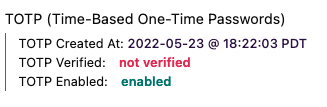
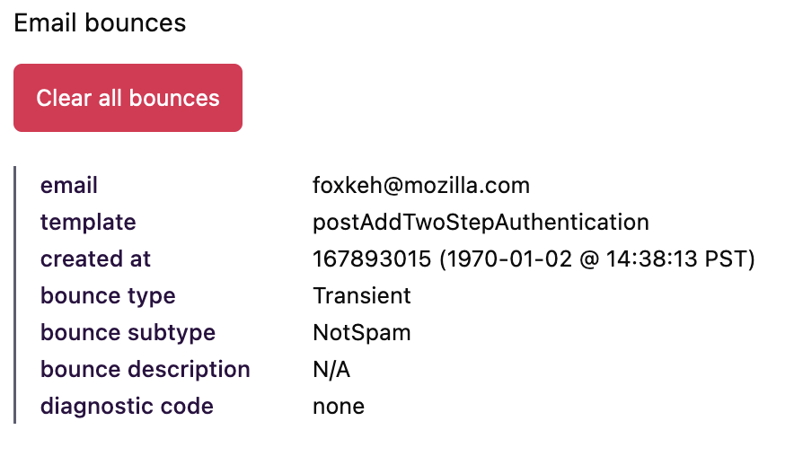
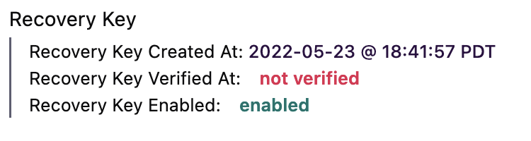
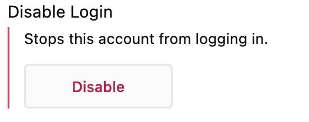
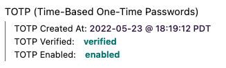
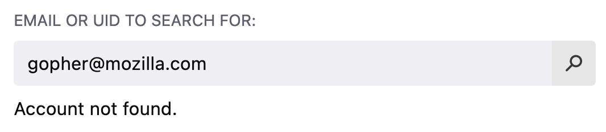
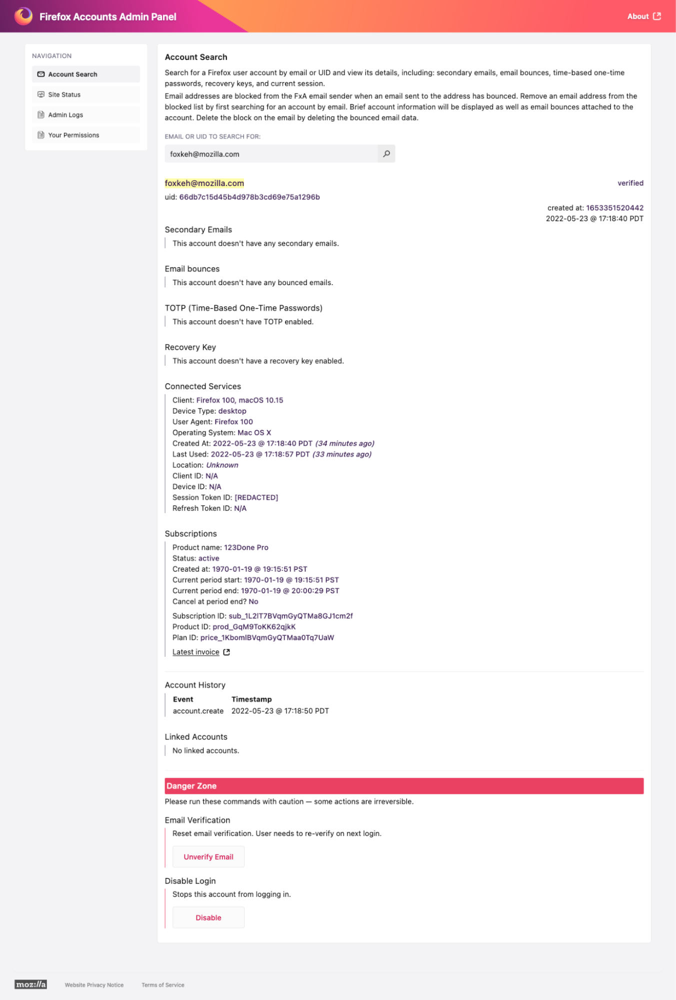
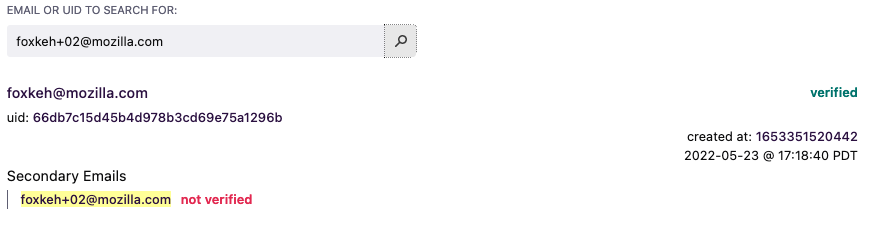
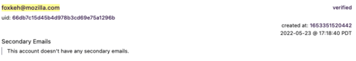
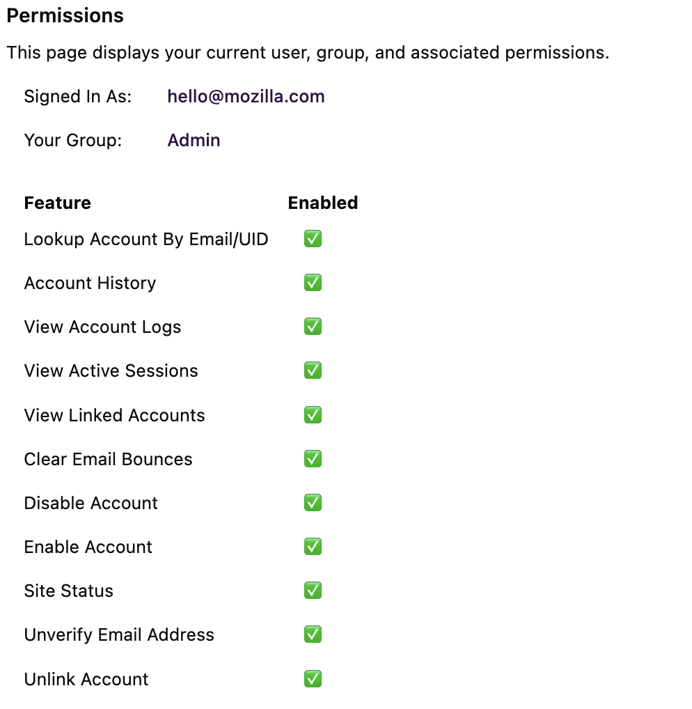

# Admin Panel Support User Documentation

The Firefox account admin panel provides access to key information about user accounts and allows administrative functions to be performed on these accounts. This document is broken down by UI component, and explains all the functionality afforded by the admin panel.

# Menu Bar

The menu bar located in the upper left provides two functions at the moment. [Account search ](#account-search) and [Permissions](#permissions). Clicking on a menu item will bring up the corresponding view.

# Account Search

The account search is the primary place for interactions in the admin panel. It allows looking up a customer by either email address or user id. In the vast majority of support situations, user email will be used for look up.

## Search Bar

Simply start by typing a user’s email address into the search bar. As you type, a list of possible email address matches will be displayed. Either select one of these auto completes, enter the exact email address, and click the search icon or press enter.

**Note:** This is a prefix match, meaning that it will match on the beginning of the email addresses. For example, if you are looking up [foxkeh@mozilla.com](mailto:foxkeh@mozilla.com) typing _foxke_, would present [foxkeh@mozilla.com](mailto:foxkeh@mozilla.com), but typing _oxkeh_ would not present a match.

## Account Search Results

If the user is found, a view with all the pertinent user information will be displayed. Here’s an example screenshot of what an account may look like. More detail about each section follows.

If the user is not found, a message below the search box will appear, indicating no account is found.

### **Primary Account Info**

This section holds the key identifying information for the retrieved account.

It includes:

* The user’s email address. 
* Whether or not the account has verified the email address by clicking on the verification link that was sent to their email during registration. 
* The user’s unique identifier, also known as their ‘uid’. 
* The time at which the account was created. The number shown is a timestamp in [epoch time](https://en.wikipedia.org/wiki/Unix_time), and the date below is value adjusted to your timezone.

### Secondary Email

Users are able to provide an optional secondary email address as a backup. If they have done so, this value can also be searched for.

**Note:** If the user has provided a secondary email address, but has not verified the code sent to their email address yet, the UI should note the email address is ‘not verified.’ Once they have verified the code sent to their email, the status will change to ‘verified.’

### Email Bounces

This is probably one of the most common uses of the admin panel. Occasionally, we will receive complaints that a user is blocked from accessing their account and never got a registration/verification/notification email. Generally this is due to an email bounce, or in other words, we sent out an email and it was rejected by the user’s email server.

In the event this happens, we generally clear the email bounces, which also unblocks their account. We then ask the user to add [accounts@firefox.com](mailto:accounts@firefox.com) to their address book and try again. Clearing the bounces is an important step, because the email cannot be delivered until the bounce is cleared. And a user can be locked out of their account until they have received a verification code in their inbox.

**Important!** There are essentially two basic types of email bounces. There are ‘hard bounces’ and ‘soft bounces’. Soft email bounces will automatically clear themselves in 24 hours, whereas hard email bounces will not automatically clear, and must therefore be manually cleared.

**Important!** There is one bounce type we must pay special attention to. If the email is bouncing because it is ‘suppressed’, clearing it isn't going to help and will hurt our deliverability score if we keep trying to send it. In this case, we should reach out to the email provider and try to resolve the issue. Once resolved, we can then clear the bounce on our side and ask the user to try again.

**Important!** In the event a user continues to have trouble even after bounces have been cleared and they have added [accounts@firefox.com](mailto:accounts@firefox.com) as a contact, the extra information below the ‘clear all  bounces’ button will be useful for the engineering team to further troubleshoot the issue. If clearing bounces doesn’t seem to be working. Don’t keep trying it over and over again! There may be something specific going on with the bounceType that requires a special resolution path. For more details about bounces reference this [document](https://docs.aws.amazon.com/ses/latest/dg/notification-contents.html#bounce-types).

### TOTP (Time-Based One-Time Passwords)

TOTP, also often referred to as two step authentication, two factor authentication, or 2FA, is a secure way to validate a user on sign in. It requires that they have a secondary device or application they use for authentication. Upon logging in, they will be prompted for a code that could have only been generated by this secondary source. This code is then also required to access the account, thereby providing an extra layer of security.

If the user has enabled TOTP this section will indicate this.

**Note:** When setting up TOTP the user is guided through a 3 step process. If they don’t successfully finish the process, then the state may look like something like the following, in which case the user should attempt to set up TOTP again or remove it.

**Important!** Once TOTP is enabled, for security reasons, there is no way to disable it on a user’s behalf. If they have lost their TOTP device, they only have two avenues to restore access. The first option is to use a recovery code that was provided when they initially set up TOTP. This is different from the [Recovery Key](#recovery-key), and is a common source of confusion. A second option, might be logging into settings and disabling TOTP with a device that is currently connected; however, this only works if the user is lucky enough to still have an active session. See [Connected Services](#connected-services) for more info about this. 

**Tip:** TOTP is time based. This means if the clock on the user’s TOTP device is off, it might say the code is invalid. If a user has appeared to successfully set up TOTP but they are still unable to verify the code with their TOTP device, asking them to verify the clock on their TOTP device is accurate may be a pathway to resolution.

### Recovery Key

The recovery key is another security measure that allows a user to get back into their account in the event they lose their password. 

Similar to other sections of the admin panel, this field will indicate if the recovery has been verified or not.  

Oftentimes a user will report losing their password and being locked out of their account and have simply forgotten they created recovery codes. If they have recovery keys, reminding them of the date the recovery keys were created can be helpful and sometimes leads to a resolution. 

**Important!** At the time of writing, the recovery key does not supersede TOTP. In other words, if the user has enabled TOTP, they will still be required to verify with TOTP even after using their recovery key.

**Tip:** Some users will confuse the TOTP recovery codes with their recovery key. If they have both TOTP and a recovery key enabled, be sure they understand the difference.

### Connected Services

This section shows all the active devices that have been authorized with Firefox accounts. A connected device might be a browser, an app, or a third party product (also known as a relying party), that authenticates with Firefox accounts. This section will give an overview of all the devices that are currently connected.

Here is summary of these fields:

* **Client** - A unique name for the connected device. The name is descriptive and provides some indication of what the client is.
* **Device Type** - The type of device connected. The most common types will be _mobile_ or _desktop_. A device type may also be marked as _unknown_ if it’s a session from a third party service.
* **User Agent** - This is a common value sent by all browsers. It should indicate the client’s browser type and version. This value may be set to _unknown_ if the session is coming from a third party service.
* **Operating System** - This is the device’s operating system. Again the value may be _unknown_ if it is a third party service.
* **Created At** - The time the device session was first initialized.
* **Last Used** - The time the session was last accessed. 
* **Location** - The location of the device. Note that this information is not always available.
* **Client ID** - If the client has a specific Client ID, this will be displayed here. This is an optional field, and is generally reserved for third party services. 
* **Device ID** - In the event a client is associated with more than one device, there may also be a unique device identifier. 
* **Session Token ID** - If the connected service/client utilizes a session token, this field will be marked as [REDACTED] for security reasons. If the device doesn’t have a known session token this field will be marked as N/A. 
* **Refresh Token ID** - Once a session has been brokered, a refresh token may be used to keep the session active. If a refresh token is present it will be marked as [REDACTED], otherwise it will be marked as N/A.

### Subscriptions

This section indicates products that the user has purchased subscriptions for. Subscriptions can be purchased through one of three sources, Stripe, the Apple App Store, or the Google Play Store.  A typical subscription will look something like this:

The fields are as follows:

* **Product Name** - The name of the product purchased. This should be self explanatory.
* **Status** - The status of the product. See [Stripe Subscription Status](#stripe-subscription-status), [Google Play Store Subscription Status](#google-play-store-subscription-status), or [Apple App Store Subscription Status](#apple-app-store-subscription-status) for more information.
* **Created at** - This is the date the subscription was created.
* **Current Period Start** - This is the start date of the current billing cycle.
* **Current Period End** - This is the end date of the current billing cycle.
* **Cancel at period end?** - Many subscriptions will automatically renew. If this is the case this value is false, otherwise this value will be true.
* **Subscription ID**- A unique identifier for the subscription.
* **Product ID** - A unique identifier for the product purchased.
* **Plan ID** - A unique identifier for the plan. Note that this corresponds to a plan that has been configured in Stripe. Even subscriptions in the Google Play Store and Apple App Store will have a corresponding plan configuration in Stripe.
* **Latest Invoice** - Only available for subscriptions purchased through Stripe. This will link directly to the last invoice issued for the subscription.
* **Manage Subscriptions** - Only available for subscriptions purchased through Stripe. This link will open up a session where a customer’s subscription can be managed. 

#### Stripe Subscription Status 

The status field for a Subscription purchased through Stripe can be one of several values. We don’t do any mappings on this field and display the raw subscription status for stripe accounts. More on the possible values of status and what these mean can be found [here](https://stripe.com/docs/api/subscriptions/object#subscription_object-status).

#### Google Play Store Subscription Status

The status field for the Google Play Store can be one of several values. We must look at the start and end dates of the subscription as well as its payment status to determine an overall status. Here are the possible values:

* **active** - The user has paid and has an active subscription.
* **canceled** - The user's subscription has expired or been replaced by another subscription.
* **trialing** - The user has an active trail subscription.
* **unpaid** - The user’s subscription is pending payment and/or payment is being retried.

#### Apple App Store Subscription Status

The status field for the Apple App Store can be one of X values. We must look at the start and end dates of the subscription, whether or not it auto renews, and the subscription’s payment status to determine an overall status. Here are the possible values:

* **active** - The user has paid and has an active subscription.
* **canceled** - The user’s subscription has expired.
* **past_due** - The user’s subscription needs to be paid, but is currently in a grace period where it has not been canceled yet.
* **trialing** - The user has an active trial subscription.
* **unpaid** - The user has an unpaid subscription, but the payment is pending and/or being retried.

### Account History

This section simply displays a history of recent key account events such as creation and login.

 

### Linked Accounts

This section shows accounts that have linked through OAuth. Firefox accounts support logging in with [OAuth](https://en.wikipedia.org/wiki/OAuth) from a google account or an apple account. When a user authenticates via OAuth, the third party account that they used for authorization will be considered linked and will  show up here.

The unlink button allows an admin to effectively remove the OAuth account tied to the user’s account. This may be necessary if the user has lost access to their firefox account, and they want to remove their linked OAuth account.

# The Danger Zone

This section holds actions that potentially alter a user’s account state. Please take care, as actions here can affect a user’s ability to access their account. Note that some actions in this area require Admin Level permissions.

### Email Verification

Executing the ‘Unverify Email’ action in this section will do a couple things. First, it will automatically sign out the user from their account. Second, it sets a flag on the account indicating that a verification code, which will be sent to the user’s primary email address, will also be required for their next login.

**Tip:** This can be useful in the event that a user’s account password has been compromised by another malicious user. By ‘unverifying’ the email address, the malicious user would not be able to access the account with a password alone.

### Disable Login 

Also fairly self explanatory, this section disables a users ability to log into an account. This might be necessary if a user's account has been compromised, or if we believe an account is being used for a malicious purpose.

Once the account login has been disabled, it can be reenabled by selecting the ‘Enable’ action.

# Permissions

This section indicates the features an admin panel user has access to. Admin panel access is controlled in two ways. First, the admin panel is only accessible via a Mozilla VPN connection. As a Mozilla employee, you should be able to access the VPN by following the instructions on our [mana pages](https://mana.mozilla.org/wiki/display/SD/VPN). Second, once VPN access has been granted, your account must be added to one of several LDAP groups. These groups ultimately control the admin panel features you have access to.

**Note:** It is likely that you are in multiple LDAP groups relating to admin panel permissions. If this is the case, you will operate under the group with the highest permission level. For example, if you are in the LDAP groups vpn_fxa_admin_panel_prod and vpn_fxa_support_agent_prod, you will operate under the _Admin_ group.

## Features Guarded by Permissions

There are numerous _guards_ that restrict access to features. Each feature is listed on the permissions view, and a checkbox indicates if permissions are granted to the feature. For example, here is what an Admin user would see:

And here is a summary of each feature:

* **Lookup Account By Email/UID** - This feature grants access to the search box on the _[Account Search](#account-search)_ page.
* **Account History** - This feature grants access to the [Account History](#account-history) section on the _Account Search_ page.
* **View Active Sessions** - This feature grants access to the [Connected Services](#connected-services) section on the A_ccount Search_ page..
* **View Account Logs** - This feature is currently not applicable.
* **View Linked Accounts** - This feature grants access to the [Linked Accounts](#linked-accounts) section on the _Account Search_ page.
* **Clear Email Bounces** - This feature grants access to the [Email Bounces](#email-bounces) section on the _Account Search_ page.
* **Disable Account** - This feature grants access to the [Disable Login](#disable-login) section on the _Account Search_ page.
* **Enable Account** - This feature grants access to the [Enable Login](#enable-login) section on the _Account Search_ page. Note that unless an account has been manually disabled, this section will not be visible.
* **Site Status** - This feature is currently not applicable.
* **Unverify Email Address** - This feature grants access to the Unverify Email button in the [Email Verification](#email-verification) section in the ‘Danger Zone’ area on the _Account Search_ page.
* **Unlink Account** - This feature grants access to the _Unlink Account_ button found in the [Linked Accounts](#linked-accounts) section on the _Account Search_ page.

## Requesting Access / More Permissions

In the event one of the features described above is not available, and you feel like you need to be in a different user group with more permissions, get in touch with the FxA team. 
