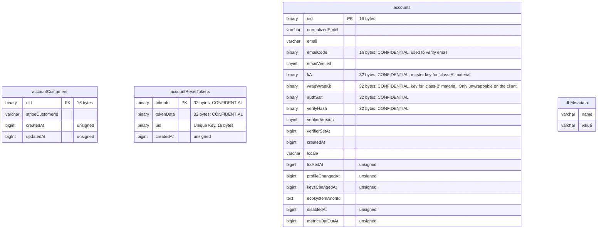
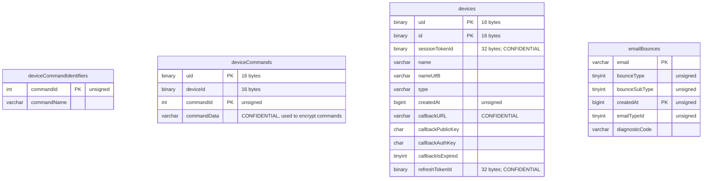
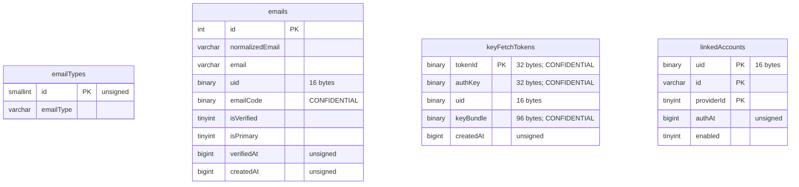
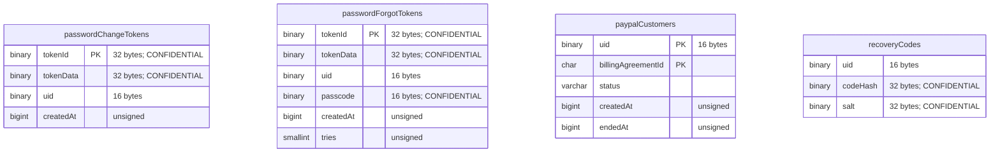
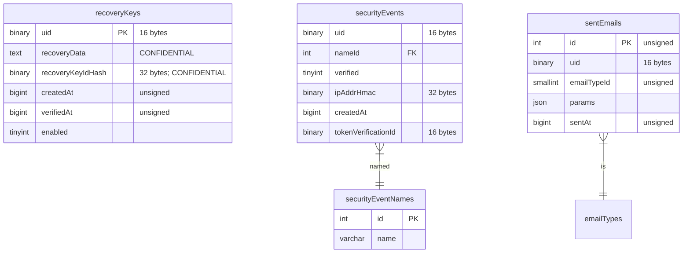
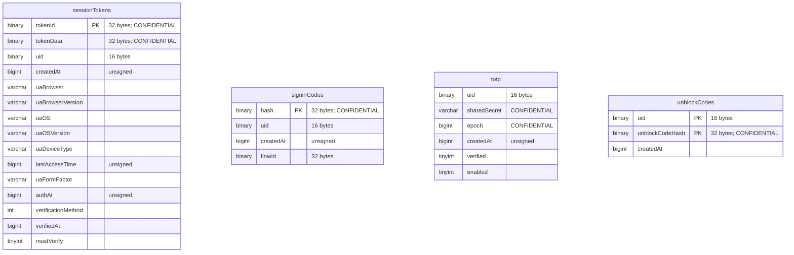
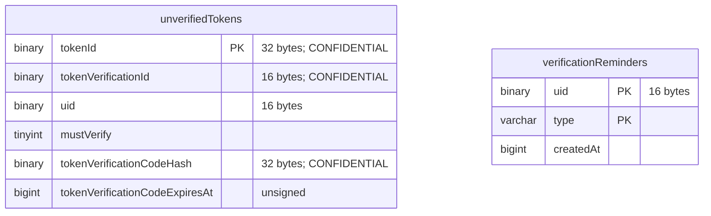
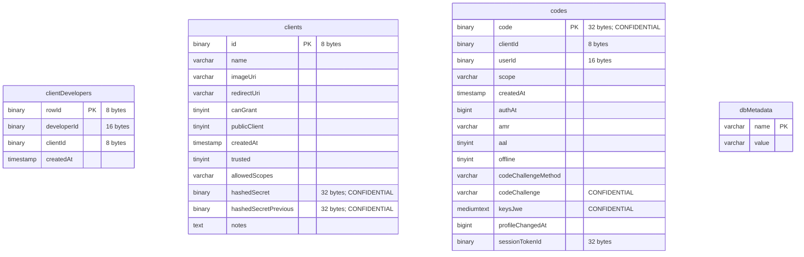
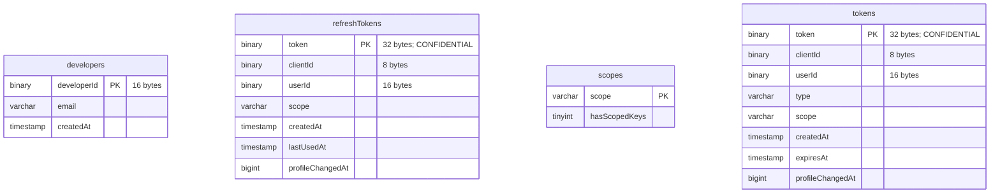
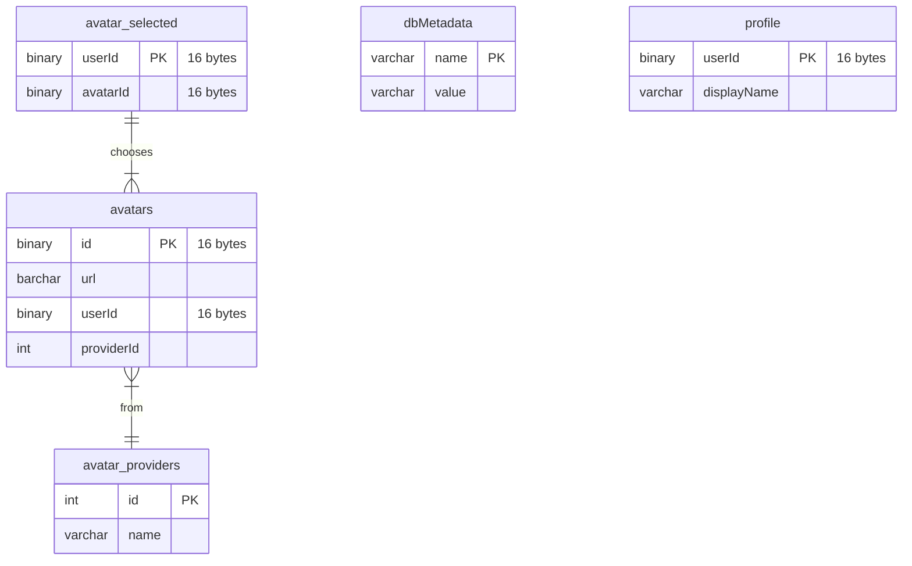

Current as of `February 2nd, 2023`

Below you'll find some ER diagrams of the Firefox Accounts and Subscription
Platform databases.  Some notes:

- You'll find very few enforced foreign keys.  This was a choice made a long
  time ago because of the tooling being used at the time.  We'd make a
  different choice now (and you can see newer tables do have foreign keys).
- Unless noted, all charsets are some form of `utf8`.

<!-- Author's note: The ER diagram below is broken up into several mermaid 
     declarations.  This is only for readability in docusaurus because 
     otherwise the final diagram's elements are too small to be readable.  
     If mermaid gets zoom sometime or if we add FKs which rearrange how 
     mermaid draws the diagram in the future we might be able to remove the 
     arbitrary divisions.
-->

## Database: `fxa`

## Database: `fxa_oauth`

## Database: `fxa_profile`

