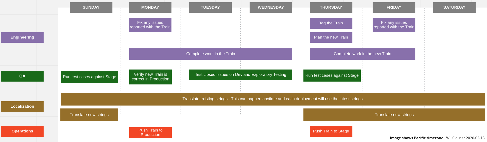
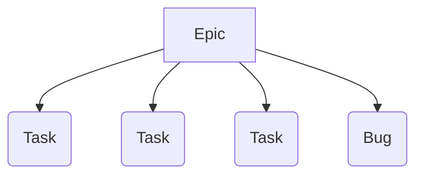

We develop and deploy on a two-week cycle. Every other Thursday we cut a release "Train" (ie. a Sprint) that goes through [deployment to stage and into production](release-process).

## Our weekly process



Above is a diagram illustrating the high level FxA development process.  It does not represent all the work each group does, nor does it show every group that is critical to shipping Firefox Accounts.  It's intention is to give an idea of timeframes:
* Sprints are offset from production pushes by a week.  This gives a finished sprint time to be tested in Staging before going live.
* Fixing regressions of the train on Stage is a higher priority than fixing new issues in the current train.  Depending on the regression's severity it may be picked to Stage, picked to Production, or just ride the train the following week.

## Product Planning

Product-level feature planning is managed via Epics in Jira.  Each feature goes through a comprehensive series of steps from defining and designing, to building and QA, to measuring changes and results, and finally closing the Epic.

We maintain roadmaps for what we're working on.  See what [Firefox Accounts][fxa-roadmap] or [Subscription Platform][subplat-roadmap] is working on now.


## Issue management

Most of our work takes place on [GitHub][fxa-repository] and [Jira][fxa-jira].

Issue status is reflected by the following:

* The issue itself will have updates indicating *what* the next action is.
* The assignee, if any, indicates *who* is responsible for that action.
* The Sprint (in Jira) indicates *when* we are working on the issue.
* The Points (in Jira) indicate roughly *how complex* the issue is.

Issues, labels, and assignee are synchronized automatically between GitHub and Jira (a delay of a minute or two).

We also have two relevant components in Bugzilla:
* [Firefox :: Firefox Accounts][bugzilla-fxa]
* [Cloud Services :: Server: Firefox Accounts][bugzilla-fxa-server]

These components are used to help coordinate between other projects using Bugzilla and for issues relating to security.

If you're wondering where to file a bug, unless it's a security bug, please file in Jira.

### New Features

New features are expected to be described thoroughly in an Epic with a description, acceptance criteria, and eventually supporting Tasks filed under it.


Generally, we can expect Epics to be written by the Product team.  Tasks will likely be written by the Product and Engineering teams as they need to be broken down small enough to fit inside of a sprint.  [Learn more about user stories][moz-user-stories].

As Tasks and Bugs pop up, they should be associated with open Epics as appropriate.

When a task is in the `Ready for Engineering` column, it's expected that:
* A [PI Ticket][pi-jira] has been filed
* If there are interesting security changes, the security team has been notified
* If there are significant string changes, the L10n team has been notified
* Appropriate metrics have been documented and will be implemented (ie. How will we know this is a success?)
* If there are legal or privacy implications, the legal and privacy teams have been consulted

### Sprints

Sprints are tracked in Jira.  There is a [detailed view of our current sprint][fxa-jira-sprint].

The amount of work we can accomplish in a sprint depends on how many people are on the team, how much time those people can devote to the work, and what type of work it is.  Our [historical velocity is tracked][fxa-jira-velocity], but past performance is no guarantee of future results.

When considering what you can accomplish in a sprint, remember:
* FxA is a complex project with a lot of moving parts.  If you're not familiar with the area, sometimes a simple patch can lead to a rabbit hole that soaks up your time.
* All patches are reviewed by another team member who also has their own obligations that sprint.  Leave room in your schedule to review patches and consider that others might not get to your patch immediately.
* Some patches may require additional review from, for example, the operations, security, localization, or data steward teams.  If that's the case it may not land in the same sprint it is written in.

### Labels we use

This isn't a comprehensive list but is a good selection to be aware of.  You should know the synchronization between Jira and Github is a little picky (eg. it won't sync spaces) so some labels will sync slightly differently.  For example, `good first issue` on Github is `good-first-issue` on Jira.

We should use these labels any time they apply.

* `qa+`: Critical flow or high chance of regression. QA should focus on testing this issue.  When you use this label *leave a comment in the issue with context about how to test it*.
* `qa-`: This is not something that should be tested by QA
* `regression`: This used to work and now it doesn't
* `good first issue` and `help wanted`: Use both of these labels at the same time when you come across an issue that would be good for a contributor.
* `skill:*`: We have some labels like `skill:css` that we use in conjunction with the `help wanted` and `good first issue` labels
* `maintenance`: This is work related to the quality of our code base.  This can often be overlooked if we're focusing on feature work but it's important to make time for improving and maintaining the code.
* `needs:*`: We need input from a team, for example, `needs:product` means we need a product manager.

#### How do we decide what to work on?

We take input from many sources including our Product Managers, our QA team, our customers (both relying parties and end users), and ourselves.  Usually this input is in the form of issues filed in Jira.  We triage this input (described in [Bug Triage](#bug-triage)) to determine what is the most important thing to work on in the next sprint.  There are often special cases and reasons to work on things which may find their way into a sprint but for the most part in each sprint we aim to close, in priority order:

* Blocking bugs that have been found in our production site
* Blocking bugs found in our staging site
* Any high priority work that we didn't finish in the previous sprint (including helping a team member finish their work)
* Any in-progress Epics
* Starting on the next Epic (Epics are in priority order in Jira)

In the midst of our regular process workflow bugs will be reported and found.  If they are important we'll add them to the sprint.  If they are part of an epic we're actively working on, we'll add them to that epic (and thus, they will be closed in short order).  If they aren't a high priority, they'll be put in the backlog.  Occasionally we may take a sprint and work on only bugs to help reduce our backlog.

We try to work on things as a team (vs individually).  Having more people work on fewer things means:

* It's easier to find a reviewer for code you write (and less context switching for everyone involved)
* It's easier to find someone with enough context to work through hard questions like architecture design
* More people will have experience with more areas of the code
* Epics will be closed out faster


### Bug Triage

:::caution
There is a new process being experimented with so this may not be 100% accurate.  Ask a team member for a link to the work in progress document.
:::

Triage owners rotate throughout the team and we assign new triage owners in our meetings.  The triage owner is responsible for:

* Triaging any new issues in Jira
* Triaging any new issues in Sentry

The goals of our triage rotation are:

* Triaging issues, watching Sentry, understanding general user
  sentiment/feedback is a shared team responsibility instead of a burden on 1 or 2 engineers
* Knowledge sharing of different areas - a triage owner may not be the expert on the topic and would reach out for help and learn from the process.
* Users stay top-of-mind
* 0 untriaged issues by the end of the triage cycle - before handover to the next person
  * But it’s OK to be untriaged before the meeting at the end of the cycle - those issues are discussed and triaged at that meeting.

#### Triage Process

* The triage owner updates the team on any significant issues or findings during our usual meetings
* The triage owner provides a short summary at our team meeting the week following their triage week

#### How to triage

In all cases, a call needs to be made about urgency. It’s fine to not be sure!  If it seems urgent, the issue should remain untriaged, which should force it to be raised in our team meetings.

Jira is the canonical source of truth for how we track our own work, but bugs may come in through several other systems that have their own requirements.

##### Errors/Issues/Work Requests/etc reported in Slack

* If someone reports something to our team in Slack the 1st person to see and respond should file a bug in Jira and add the link to the slack conversation so we know it will be addressed and not dropped.
* The item is then triaged as normal when you get to "Jira Issues" below.

##### Sentry
* Sentry issues which may be of concern should have corresponding issues opened in Jira, with a link to the Sentry report and a brief description. If you are unsure whether a report is of concern or not, assume it is (ie, open an issue
  anyway).
* We should monitor our production instances closely as well as keep an eye out on stage for new issues exposed by QA.  There are many projects in the #fxa group on Sentry.
* For reports that seem worth following up on, create a corresponding issue in Jira.
* In the right-hand sidebar of the sentry issue, there is a "Link to Github Issue" button. This can be an easy way to file an issue that will eventually be mirrored into Jira.  Otherwise make an issue manually.
  * Issues created from this process will then be triaged as normal in Jira.

##### Jira Issues:
All of the steps above should have produced issues that make their way into Jira, so now we can look at an overview of all the things that are our responsibility.

Triage [this Jira incoming issues query][fxa-jira-backlog] - only the issues under “Backlog” need triage.

* Some guidance for fields to change:
  * New issues default to Tasks, but is this a Bug instead (that is, a defect)?
    * If it’s a bug, change the `Type` to `Bug` and set:
      * The `Found In` field to an appropriate value
      * The `Severity` field to an appropriate value
  * Is it tied to one of the epics we have filed?
    * Update the `Epic Link` field
  * Does it require UX guidance?
    * Set `needsux` as a label
  * Does it require a Product Manager?
    * Set `needsproduct` as a label
  * If it is about improving our code quality add the `maintenance` label.
  * Consider adding a helpful comment!

As you triage the issues move them into "To Do" (or close them).  Repeat for the rest of the issues in the Backlog.

When you’re all finished, write a quick summary including any of the open issues you need help with and put a comment in #fxa-team.


## Estimation and Point Values
Points are assigned to issues in Jira (ideally before starting work 😉) so that we can track our velocity over time, which aids in planning.

The goal of estimation is for us to assess the issue in terms of its relative complexity, effort, and doubt. When applying an estimate, we should consider all the steps in getting the particular work to a completed (ready for production) state for our consumer. The should include effort required for code reviews, security reviews, testing, integration and build/deploy.

| Points | Relative Size | Description                                                                | Review Time | Examples |
| ------ | ------------- | -------------------------------------------------------------------------- | ----------- | -------- |
| 1      | xs            | This is a trivial change with clearly defined parameters.                  | 1 engineer needs ~10 minutes | |
| 2      | s             | A simple change (minimal code changes), where we understand all of the requirements. | 1 engineer needs <1 hour | |
| 3      | m             | A simple change, but the code footprint is bigger (e.g. lots of different files, or tests affected). The requirements are clear.<br /><br />or<br /><br />This could also represent a 2 point project but there is less certainty about how to achieve it effectively.  [Note: what we are achieving should not be in question.] | 1 engineer needs <2 hours | |
| 5      | l             | A more complex change that will impact multiple areas of the codebase, there may also be some refactoring involved. Requirements are understood but you feel there are likely to be some gaps along the way. | 1 engineer needs <3 hours | |
| 8      | xl            | A complex change. It will significantly change the codebase and/or business logic. It may require input from others to assure the requirements and impacts are well understood.  It may require coordination with additional teams.<br /><br />or<br /><br />This could also represent a 5 point project but there is less certainty about how to achieve it effectively.  [Note: what we are achieving should not be in question.] | 1 engineer needs 1/2 day.  This may require data review or an external team sign-off | |
| 13     | xxl           | A significant change that may have dependencies (other teams or third-parties) and we likely still don't understand all of the requirements. It's unlikely we would commit to this in a milestone, and the preference would be to further clarify requirements and/or break in to smaller Issues.  | 2 engineers need a few 1/2 days each.  This may require security review or external team sign-offs | |
| 21     | ∞             | Meta issue or We do not have clear scope. (This issue must be broken down).  This is possibly a whole quarter sized epic. | | |


## Checkin Meetings

The team meets regularly to stay in sync about development status and ensure nothing is falling through the cracks.  During meetings we take notes in a central document that anyone in the meeting can reference.

Please see our [project calendar][fxa-calendar] for details.

## Developing on a long running branch

:::caution
You should probably be using a feature flag instead of a branch.
:::

If a branch will survive beyond a couple of days its important to have a bit of strategy so as to avoid merging frustrations for yourself and your team.  If possible you should use other options like feature flags, but sometimes a branch is the best way to go.  Ask your team if you're unsure.  If you need to use a branch, please keep in mind:
* Your team won't be keeping up with what is landing on the branch.  Regular communication and/or demos of where you are at and where you are going can help keep your changes in peoples' minds.
* You should rebase against main often to avoid a giant headache when you eventually merge
* Consider creating new components instead of editing old ones if you have extensive enough changes.  This way it's a very small change to flip from one to the other instead of trying to merge.

## Code Review

This project is production Mozilla code and subject to our [engineering practices and quality standards][moz-standards].  Every patch must be [reviewed][moz-code-review] by an owner or peer of the [Firefox Accounts module][fxa-module].

### Review Checklist

Here are some handy questions and things to consider when reviewing code for Firefox Accounts:

* Did test coverage increase, or at least stay the same?
* Does it introduce new user-facing strings?
  * Ensure the strings are finalized and approved.  Double check for any typos.  It's hard to change strings once they get localized.
  * Ensure they will be extracted by being consistent with the code in the package you're working on.
* Does it store user-provided data?
    * The validation rules should be explicit, documented, and clearly enforced before storage.
    * Ensure new stored data has been approved by a data steward.
* Does it display user-controlled data?
    * It must be appropriately escaped, e.g. htmlescaped before being inserted into web content.
* Does it involve a database schema migration?
    * The changes must be backwards-compatible with the previous deployed version.  This means that you can't do something like `ALTER TABLE CHANGE COLUMN` in a single deployment, but must split it into two: one to add the new column and start using it, and second to drop the now-unused old column.
    * Does it contain any long-running statements that might lock tables during deployment?
    * Can the changes be rolled back without data loss or a service outage?
    * Has the canonical db schema been kept in sync with the patch files?
    * Once merged, please update the [deployment doc][fxa-deploy-doc] with details.
* Does it alter the public API of a service?
    * Ensure that the change is backwards compatible.
    * Ensure that it's documented appropriately in the API description.
    * Ensure validation functions are tested thoroughly.
    * Note whether we should announce it on one or more developer mailing lists.
* Does it add appropriate new metrics or logging?
* Does it consider accessibility?

## Deployment Documentation
We maintain a [private deployment document][fxa-deploy-doc] to keep track of any configuration changes, any database changes, etc.  **Anything that needs to be done aside from deploying updated code should be tracked in this document.**
If your patch needs any additional changes or config you are responsible for putting those notes in this document before the train ends.

Additionally, we should notify our relying parties if we're going to change APIs or configuration details if we can (ie. it may not be prudent if we're changing a configuration variable in response to a security incident).  These notifications should be sent to the [firefox-accounts-notices group][firefox-accounts-notices] with enough time for relying parties to adjust their code or reply with any concerns.

## Security issues

Since most of our work happens in the open, we need special procedures for dealing with security-sensitive issues that must be fixed in production before being made visible to the public.

We use private bugzilla bugs for tracking security-related issues, because this allows us to manage visibility for other stakeholders at Mozilla while maintaining confidentiality.

We use private github repos for developing security fixes and tagging security-related releases.

### Filing security issues

If you believe you have found a security-sensitive issue with any part of the Firefox Accounts service, please file it as confidential security bug in Bugzilla via this link:

* [File a security-sensitive FxA bug][fxa-security-bug]

The Firefox Accounts service is part of Mozilla's [bug bounty program][moz-bug-bounty], which provides additional guidelines on [reporting security bugs][moz-sec-bugs].

### Making a private point-release

We maintain the following private github repo that can be used for making security-related point-releases

* https://github.com/mozilla/fxa-private

The recommended procedure for doing so is:

1. Check out the private repo, independently from your normal working repo:

  ```shell
  git clone git@github.com:mozilla/fxa-private
  cd fxa-private
  ```

  :::tip
    Do not add it as a remote on your normal working repo,
    because this increases the risk of pushing a private fix to the public repo by mistake.
  :::

1. Add the corresponding public repo as a remote named `public`,
  and ensure it's up-to-date:
  
  ```shell
  git remote add public git@github.com:mozilla/fxa
  git fetch public
  ```

1. Check out the latest release branch and push it to the private repo:

  ```shell
  git checkout public/train-XYZ
  git push origin train-XYZ
  ```

1. Develop your fix against this as a new branch in the private repo:

  ```shell
  git checkout -b train-XYZ-my-security-fix
  git commit -a
  git push -u origin train-XYZ-my-security-fix
  ```

1. Submit and review the fix as a PR in the private repo,
  targetting the `train-XYZ` branch.

1. Tag a point release in the private repo, following the release steps

  ```shell
  git checkout train-XYZ; git pull  # ensure we have the merged PR
  grunt version:patch
  git push
  ```

1. Push the tag in order to trigger a CircleCI build:
  
  ```shell
  git push origin v1.XYZ.N
  ```

  :::caution
  Do not use `git push --tags` as this will not correctly trigger
  the CircleCI build.
  :::

1. File an issue on the public repo as a reminder to uplift the fix
  once it has been deployed to production.

Once the fix has been deployed and is safe to reveal publicly, it can be merged back into the public repo by doing the following:

1. Push the private train branch to the public repo,
  as a new branch:
  
  ```shell
  git push public train-XYZ:train-XYZ-uplift
  ```
1. Open a PR in the public repo, targeting the public `train-XYZ` branch, for review and merge.

1. Push the tag to the public repo:
  
  ```shell
  git push public v1.XYZ.N
  ```

1. Merge the `train-XYZ` branch to main following the usual steps to release

[bugzilla-triage-process]: https://mozilla.github.io/bug-handling/triage-bugzilla
[bugzilla-fxa]: https://bugzilla.mozilla.org/buglist.cgi?list_id=15068002&resolution=---&classification=Client%20Software&classification=Developer%20Infrastructure&classification=Components&classification=Server%20Software&classification=Other&query_based_on=Firefox%3A%3AFirefoxAccounts&query_format=advanced&component=Firefox%20Accounts&product=Firefox&known_name=Firefox%3A%3AFirefoxAccounts
[bugzilla-fxa-server]: https://bugzilla.mozilla.org/buglist.cgi?list_id=15067999&resolution=---&classification=Client%20Software&classification=Developer%20Infrastructure&classification=Components&classification=Server%20Software&classification=Other&query_based_on=CloudServices%3A%3AServer%3AFirefoxAccounts&query_format=advanced&component=Server%3A%20Firefox%20Accounts&product=Cloud%20Services&known_name=CloudServices%3A%3AServer%3AFirefoxAccounts
[fxa-calendar]: https://www.google.com/calendar/embed?src=mozilla.com_urbkla6jvphpk1t8adi5c12kic%40group.calendar.google.com
[fxa-deploy-doc]: https://docs.google.com/document/d/1lc5T1ZvQZlhXY6j1l_VMeQT9rs1mN7yYIcHbRPR2IbQ/edit
[fxa-milestones]: https://github.com/mozilla/fxa/milestones
[fxa-module]: https://wiki.mozilla.org/Modules/Other#Firefox_Accounts
[fxa-security-bug]: https://bugzilla.mozilla.org/enter_bug.cgi?product=Cloud%20Services&component=Server:%20Firefox%20Accounts&groups=cloud-services-security
[fxa-repository]: https://github.com/mozilla/fxa
[fxa-jira]: https://mozilla-hub.atlassian.net/browse/FXA
[fxa-jira-sprint]: https://mozilla-hub.atlassian.net/jira/software/c/projects/FXA/boards/225
[fxa-jira-backlog]: https://mozilla-hub.atlassian.net/jira/software/c/projects/FXA/boards/227/backlog?issueLimit=100
[fxa-jira-velocity]: https://mozilla-hub.atlassian.net/jira/software/c/projects/FXA/boards/225/reports/velocity-chart
[firefox-accounts-notices]: https://groups.google.com/a/mozilla.com/g/firefox-accounts-notices
[moz-bug-bounty]: https://www.mozilla.org/security/bug-bounty/
[moz-code-review]: https://developer.mozilla.org/docs/Code_Review_FAQ
[moz-sec-bugs]: https://www.mozilla.org/security/bug-bounty/faq-webapp/#bug-reporting
[moz-standards]: https://developer.mozilla.org/docs/Mozilla/Developer_guide/Committing_Rules_and_Responsibilities
[moz-user-stories]: https://docs.google.com/presentation/d/1zepsrOiHINBMS3TJ8nFDJ4gf8u6kRONe1hdMDnlyZvI/edit

[fxa-roadmap]: https://mozilla-hub.atlassian.net/jira/plans/36/scenarios/36?vid=145#plan/backlog
[subplat-roadmap]: https://mozilla-hub.atlassian.net/jira/plans/34/scenarios/34?vid=136#plan/backlog
[pi-jira]: https://mozilla-hub.atlassian.net/jira/software/c/projects/QA/issues/
