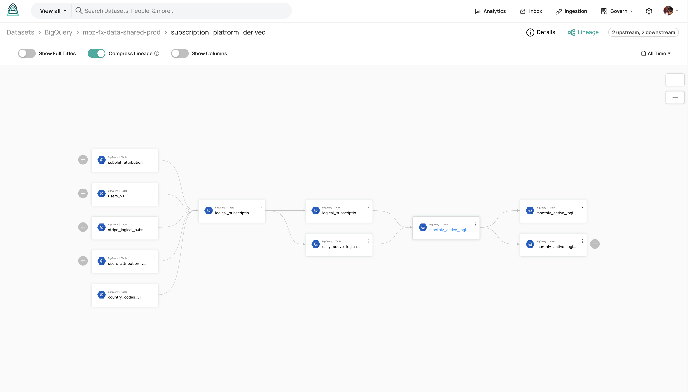

Last updated: `Oct 2025`

Mozilla accounts collects metrics from servers running our code and clients accessing our services.  Mozilla takes data collection seriously so our policies and processes around it may seem more complex than most organizations but it is in an effort to grant agency to users over their own data.

Note that the [Mozilla Data Collection policies](https://wiki.mozilla.org/Data_Collection) apply to Mozilla accounts.

Our code is deployed to a staging environment before it goes to production so the metrics detailed below are available for both environments.  The details below will focus on production.

Keep in mind that Mozilla accounts allows users to opt-out of data collection via a toggle on the account settings page.

## Application metrics

These are logs from Mozilla accounts code.  These are probably the most useful logs for product decision making as they were written by hand by engineers.  They are also the most complex.

* Example data recorded
  * See the [taxonomies in the Mozilla Data Docs](https://docs.telemetry.mozilla.org/datasets/fxa.html).
  * As we move to Glean the dictionaries here will remain up to date automatically:  [Frontend](https://dictionary.telemetry.mozilla.org/apps/accounts_frontend) and [Backend](https://dictionary.telemetry.mozilla.org/apps/accounts_backend)
* Recorded with
  * These are logged via [mozlog](https://github.com/mozilla/mozlog/) as regular server logs.
  * The logs are immediately ingested into [GCP Cloud Logging](https://cloud.google.com/logging)
  * From there they are passed and stored in BigQuery in the `moz-fx-fxa-prod.gke_fxa_prod_log` dataset.
  * Every 24 hours, [some ETL jobs](https://github.com/mozilla/bigquery-etl/tree/main/sql/moz-fx-data-shared-prod/firefox_accounts_derived) run which create derived tables from the original logs and store them in the `mozdata` project in BigQuery.  `mozdata` is accessible by anyone at Mozilla.  Please note: *Derived tables do not include all the events or details in the original logs.  You can read the queries that create the derived tables to see what is included.*

  * Additionally, there are some [user-facing datasets](https://github.com/mozilla/bigquery-etl/tree/main/sql/moz-fx-data-shared-prod/firefox_accounts) of that same data, and also in `mozdata`, which are designed to be easier to use.
* Accessible via
  * [BigQuery](https://console.cloud.google.com/bigquery?).  Look for the `firefox_accounts` dataset in the `mozdata` project.  *Be aware that there are large amounts of data in BigQuery and you can spend a lot of money if you don't restrict your queries.*
  * Looker is backed by BigQuery and there is a [Mozilla accounts folder](https://mozilla.cloud.looker.com/folders/374) there.
    * Subscription Platform dashboards are located in the [Subscription Platform folder](https://mozilla.cloud.looker.com/folders/1355). See also [Subscription product metrics](#subscription-product-metrics).
  * There are [several dashboards in grafana](https://yardstick.mozilla.org/dashboards/f/ee3c7w31w1qf4e/firefox-accounts-fxa) with a mix of these metrics on them
  * See the section below about raw logs also

### Submitting a Data Review request
Before new metrics can be collected with Glean, they must pass the Data Review process.
* Create a github issue with the data review request with the Data Review template
* Directly contact [a member of the Data Review stewards](https://wiki.mozilla.org/Data_Collection), or request a review in the #data-stewardship-help channel.
* Create a PR containing the changes that will record the data. Do not merge the PR until the Data Review request has been approved.

### Working with Raw Logs

If you need real-time data you need to be looking at the raw logs in `moz-fx-fxa-prod.gke_fxa_prod_log` or `moz-fx-fxa-nonprod.gke_fxa_stage_log`.  Otherwise there will be a 24 hour delay.

## Crashes

* Example data recorded:
  * `t is undefined` and a link to the JS that failed to run
  * `An internal validation check failed.` and details about what the software expected to see and what it actually saw
* Recorded with
  * Sentry
* Accessible via
  * [Sentry](https://sentry.prod.mozaws.net/operations/)
  * Look for any project starting with `fxa-`.  Eg. `fxa-auth-prod` and `fxa-content-client-prod`

## Server Health

* Example data recorded
  * There are 30 healthy pods running
  * A pod is running at 100% cpu
* Recorded with
  * The reporting tools built into the clouds we use
* Accessible via
  * In their most detailed form, you'd need access to the cloud consoles themselves, but most of the data is also available in our Grafana instance.  [Here is one of our dashboards reporting system health](https://yardstick.mozilla.org/d/feht7f4wub5s0e/overall-infrastructure-health)

## Front-end Performance 

* Example data recorded
  * It took 400ms to load `/settings`
* Recorded with
  * [Sentry Performance](https://sentry.io/for/performance/)
* Accessible via
  * Here is the [content server](https://mozilla.sentry.io/insights/frontend/?project=6231069)

## Subscription product metrics

These are a combination of [application metrics](#application-metrics) and metrics more directly from subscription providers like Stripe, Apple and Google to answer product questions as initially specified by the [PRD](https://docs.google.com/document/d/1AL8BSlHuxABypDdQSoaiMuo6H1pmintj1Loh6oesxZU/edit?usp=sharing) and [Technical Specification](https://docs.google.com/document/d/1-KdXzZbn3Utw2aekJbcc1lrMV9tNb19tzifPbdtQaso/edit?usp=sharing) for [FXA-6556](https://mozilla-hub.atlassian.net/browse/FXA-6556).

For high level information from the RP perspective, see [Metrics for Relying Parties](/ecosystem-platform/relying-parties/how-tos/product-metrics).

### Looker

[Looker](https://mozilla.cloud.looker.com) is the business intelligence tool Mozilla uses to report on product metrics, and we have SubPlat dashboards there based on Logical Subscription(s) and All Event Counts explores created and maintained by our data engineering team.

#### Dashboards

Anyone at Mozilla can view the SubPlat Looker dashboards, which are in the [Subscription Platform](https://mozilla.cloud.looker.com/folders/1355) folder and include:

* [SubPlat Subscriptions](https://mozilla.cloud.looker.com/dashboards/1329)
* [SubPlat Checkout](https://mozilla.cloud.looker.com/dashboards/1371)

To obtain edit access, ask SubPlat's engineering manager to request it in the [`#data-help` Slack channel](https://app.slack.com/client/T027LFU12/C4D5ZA91B).

Grafana dashboards have been moved to [Yardstick](https://yardstick.mozilla.org)

To obtain edit access for Yardstick dashboards, [see the instructions on the Prometheus and Grafana Confluence page](https://mozilla-hub.atlassian.net/wiki/spaces/CS1/pages/886866077/Prometheus+and+Grafana+Yardstick#How-to%3A-Requesting-editor-access)

#### Subscription Platform > Logical Subscription(s) explores

There are currently four Logical Subscription(s) explores:
* [Daily Active Logical Subscriptions](https://mozilla.cloud.looker.com/explore/subscription_platform/daily_active_logical_subscriptions)
  * Represents all the subscriptions that were active at any point on a certain date.
* [Monthly Active Logical Subscriptions](https://mozilla.cloud.looker.com/explore/subscription_platform/monthly_active_logical_subscriptions)
  * Represents all the subscriptions that were active at any point during a certain month.
* [Logical Subscription Events](https://mozilla.cloud.looker.com/explore/subscription_platform/logical_subscription_events)
  * Represents changes we see to a subscription over time, i.e. lifecycle events such as start, end, cancel or plan change.
* [Logical Subscriptions](https://mozilla.cloud.looker.com/explore/subscription_platform/logical_subscriptions)
  * Represents the current state of subscriptions, including all subscriptions that have ended.

Data sources for these explores are described in [Metrics for Relying Parties](/ecosystem-platform/relying-parties/reference/metrics-for-relying-parties).

More information can be found in the [SubPlat consolidated reporting ETL design document](https://docs.google.com/document/d/13TgTN7UJ_89dhh0S64eh0oDsYNHPdeJyEmLk0uScoGI/edit?usp=sharing) and from these [walkthrough notes](https://docs.google.com/document/d/1-K9TtkKHezL-Xo6LcGxd866TkAaeRzQqdXNx9PJQnNE/edit#bookmark=id.7eo8irobcj0k).

:::note
Logical subscriptions reflect one subscription per Stripe subscription item. So if a single Stripe subscription has two subscription items, this would be two separate logical subscriptions in these explores. This is in anticipation of potential support in the future for consolidated billing where each subscription item is effectively a separate subscription billed with a single invoice.
:::

#### Mozilla accounts > All Event Counts explores

These data are events pulled out of FxA application logs (see [Application metrics](#application-metrics)). There is currently one explore that we use for the SubPlat dashboard: [All Event Counts](https://mozilla.cloud.looker.com/explore/firefox_accounts/all_event_counts).

#### How to inspect the underlying data from an explore or look

As explained in [Application metrics](#application-metrics), the data for these explores comes from ETL jobs where data exists in various tables in BigQuery. Here's how you can find out more information about a particular dimension in a Looker Look or Explore.

1. Find the Look or Explore you want to inspect in Looker. For a Look in a dashboard, click "Explore from here" from the Look's overflow menu. E.g. navigate to the [Monthly Active Logical Subscriptions](https://mozilla.cloud.looker.com/explore/subscription_platform/monthly_active_logical_subscriptions) explore.
2. In the Explore view in Looker, in the left sidebar, hover over the dimension of interest (e.g. Monthly Active Logical Subscriptions > Subscription > Auto Renew) and click the Info icon, then click "Go to LookML".
3. You'll be brought to a new page displaying the `view` file. Here you can inspect which table the data came from in the `mozdata` GCP project. Often this can be found by searching for `sql_table_name`. E.g. `mozdata.subscription_platform.monthly_active_logical_subscriptions`.
4. Now you have one of two choices, though the easiest is likely to search the data catalog ([Acryl](https://mozilla.acryl.io/)) for this dataset by name. The dot notation indicates the namespaces you'll find the table under, with the last value being the table name (e.g. `monthly_active_logical_subscriptions`).
    - Search for the table name in Acryl.
      - Select the Datasets > BigQuery > `mozdata` > `subscription_platform` result. `mozdata` is a GCP project in BigQuery with metrics for lots of Mozilla products and services.
    - Click the "Lineage" tab
    - Click "Visualize Lineage"
    - Continue to click the `+` icons to the left of the table in question to find upstream tables, until you reach the origin table.
5. As we can see from the diagram below, we may find how this dimension is set from the `stripe_logical_subscriptions_history_v1` table. Looking [that table up in the `bigquery-etl` repo](https://github.com/mozilla/bigquery-etl/blob/de71eac14d195c5abaf62abd485f2e0a0ca9c75a/sql/moz-fx-data-shared-prod/subscription_platform_derived/stripe_logical_subscriptions_history_v1/query.sql#L185), we can confirm this.

  

The other option is to search for the queries (i.e. `query.sql` files) that create these tables in the [`bigquery-etl` repo](https://github.com/mozilla/bigquery-etl/) with a series of reverse look-ups.
  1. Search for the table name (e.g. `monthly_active_logical_subscriptions`)
  2. `moz-fx-data-shared-prod.subscription_platform.monthly_active_logical_subscriptions` pulls from:
  3. `moz-fx-data-shared-prod.subscription_platform_derived.monthly_active_logical_subscriptions_v1` pulls from:
  4. `moz-fx-data-shared-prod.subscription_platform_derived.daily_active_logical_subscriptions_v1` pulls from:
  5. `moz-fx-data-shared-prod.subscription_platform_derived.logical_subscriptions_history_v1` pulls from:
  6. `moz-fx-data-shared-prod.subscription_platform_derived.stripe_logical_subscriptions_history_v1` pulls from:
  7. Finally! [We've found how this dimension is set](https://github.com/mozilla/bigquery-etl/blob/de71eac14d195c5abaf62abd485f2e0a0ca9c75a/sql/moz-fx-data-shared-prod/subscription_platform_derived/stripe_logical_subscriptions_history_v1/query.sql#L185) from the table in the previous step.

:::note
A given query can pull from multiple tables, so the lineage for a given table is not necessarily linear and more likely branches. See example lineage from the data catalog image above.
:::