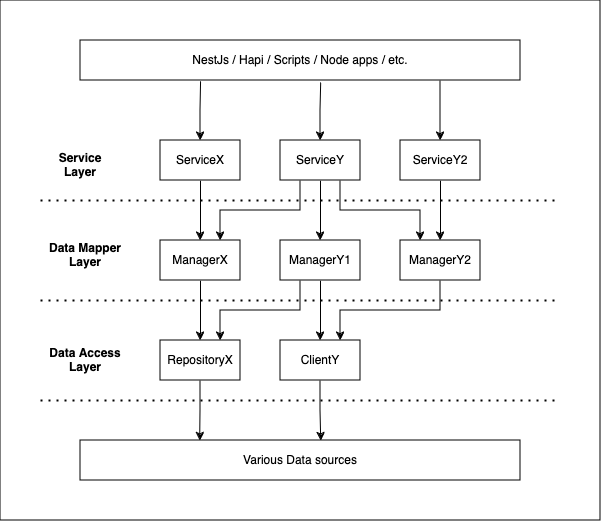

Current as of `April 16, 2024`

## Introduction
### Motivation

The layered software architecture was introduced to the team in August last year, with some literature explaining the concepts. 

The primary motivation behind this document is to help better understand those concepts, by providing some practical examples, a list of do’s and don’ts and an FAQ section with common questions that came up when first implementing the concepts.

### Required Reading

Before continuing in this document, please make sure to read and consume the following resources. (~15min)

* [Ecosystem Platform Docs - Node Style Guide - Software Architecture](https://mozilla.github.io/ecosystem-platform/reference/style-guides/node-style-guide#software-architecture)
* [Martin Fowler - Presentation Domain Data Layering](https://martinfowler.com/bliki/PresentationDomainDataLayering.html)
* [Martin Fowler - Repository](https://martinfowler.com/eaaCatalog/repository.html)

## Guidelines

This section documents the guidelines that should be followed when adopting the layered architecture.

Although these aren’t hard guidelines that can't be deviated from, breaking the guidelines does carry some risks. Therefore, it is  recommended that you take a second look at your implementation and consider if breaking the rules is necessary.

### List of guidelines

1. Layers may not be skipped
2. Don't go up layers
3. Services may depend on multiple managers
4. Managers may not depend on other managers
5. Managers may depend on multiple repositories or clients
6. Clients may be dependents of multiple managers

### Risks of deviating from the guidelines

1. Circular dependencies may occur if multiple instance on a layer become dependent on each other

### Diagram of Guidelines

## Reference examples

Some good examples of a Repository, Client, Manager, Service hierarchy are listed below.

### End to end - libs/payments/stripe/*

* Client => StripeClient ([code](https://github.com/mozilla/fxa/blob/main/libs/payments/stripe/src/lib/stripe.client.ts))
* Manager => StripeManager ([code](https://github.com/mozilla/fxa/blob/main/libs/payments/stripe/src/lib/stripe.manager.ts))
* Service => StripeService ([code](https://github.com/mozilla/fxa/blob/main/libs/payments/stripe/src/lib/stripe.service.ts))

### Repository style pattern - libs/payments/cart

* Repository => cart.repository ([code](https://github.com/mozilla/fxa/blob/main/libs/payments/cart/src/lib/cart.repository.ts))
* Manager => CartManager ([code](https://github.com/mozilla/fxa/blob/main/libs/payments/cart/src/lib/cart.manager.ts))
* Service => CartService ([code](https://github.com/mozilla/fxa/blob/main/libs/payments/cart/src/lib/cart.service.ts))

## Do's and Don'ts

### Do's

* Do make use of the layered architecture whenever possible
* Do add your new or refactored implementations into the integrated repo `libs/*` or `apps/*` directories.
* Do create more, and smaller logical modules of work.
* Do make use of dependency injection.
* Do make use of the *Client, *Repository, *Manager, *Service naming convention.

### Don'ts

* Don’t skip a layer. Services should not call Clients directly.
* Don’t go up the layers. I.e. Client’s should not call Managers, etc.

## FAQ section

### General

  
Q: Where do I put my business logic?

  

    Managers should be used for business logic.
  

  
Q: Is this only relevant for NestJS implementations?

  
Nope, this can be used anywhere. Dependency injection is strongly encouraged, but classes can also be imported just like any ol’POJO.

  
Q: My Client/Manager/Service is getting really big. What should I do?

  

    
Are there logical and realistic places where the module can be broken up into multiple Client/Manager/Services?

    
For example say the StripeManager is getting too large, consider breaking it up into StripeSubscriptionManager and StripeManager?

  

### Client / Repository

  
Q: The library I’m using provides an SDK, do I still need a client implementation?

  
No, it’s not required. If the SDK already provides the necessary queries, the Manager can call the SDK directly.

  
Q: But why does Stripe Client exist?

  
See the Stripe typings ADR. [ADR link](https://github.com/mozilla/fxa/blob/main/docs/adr/0040-stripe-typings.md)

  
Q: When should I use a Repository

  
A typical use case will be for database access.

### Manager

  
Q: Can my Manager call a Service?

  
No. Dependencies should not go up a layer.

  
Q: Can my Manager call other Managers?

  

  
No. Only Services should call Managers.

  
Typically, if the feature requires you to import a manager from another manager, it’s a good tell that the feature you are busy implementing requires some other refactoring.

  

  
Q: Should I catch and handle errors in my Manager?

  
Typically, no. Errors should bubble up, so that they can be properly handled by consumers of Managers.

### Service

  
Q: Can my service call a Client directly?

  

    
No. A service should only have Managers and other Services as dependencies.

    
Even if no additional logic is needed from the client/repository, simply wrap the client/repository call in a manager method. This might feel unnecessary at the time, but it allows for easy expansion in future if necessary.

  

## Success stories

### Client migration - Contentful to Strapi

Because of layered Software architecture implementation, the transition from Contentful to Strapi is estimated to be relatively painless. Why is that? 
* The Contentful Client will be replaced by a Strapi client
* The ContentfulManager will remain unchanged
* Therefore all consumers of the ContentfulManager will also not require any changes.

