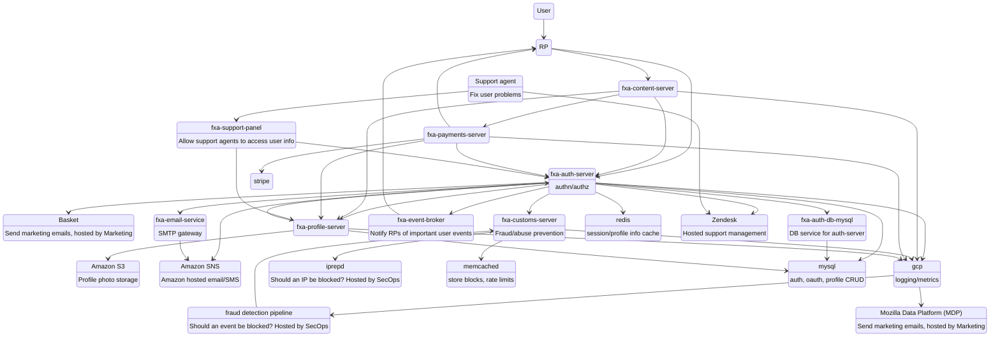
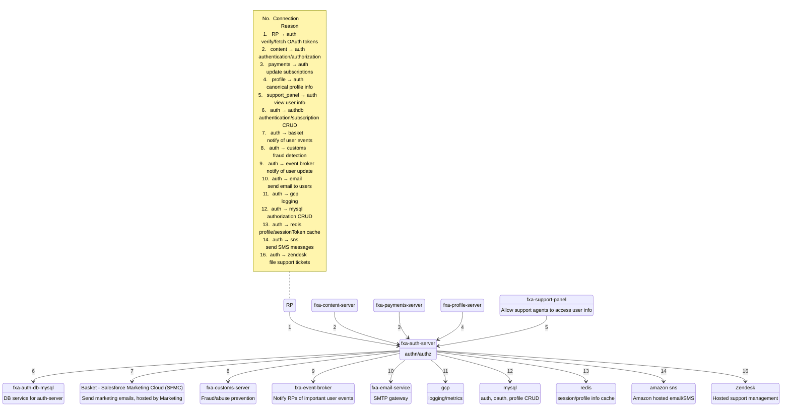
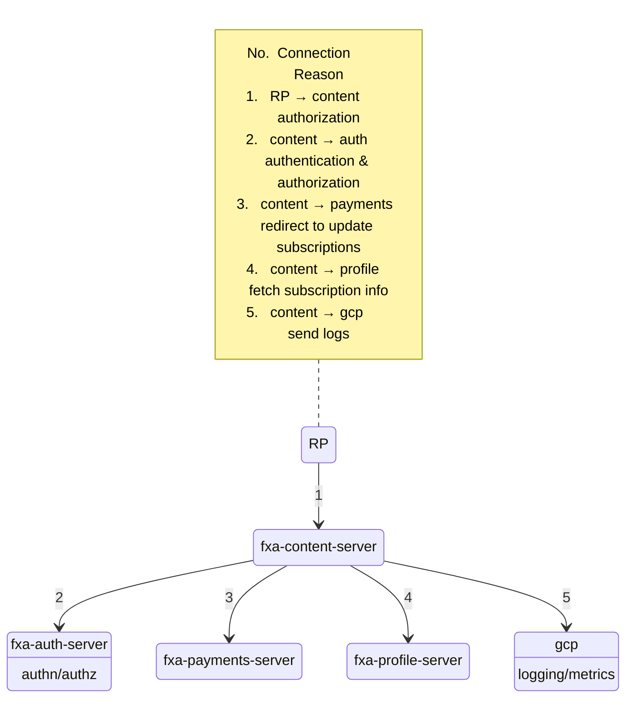
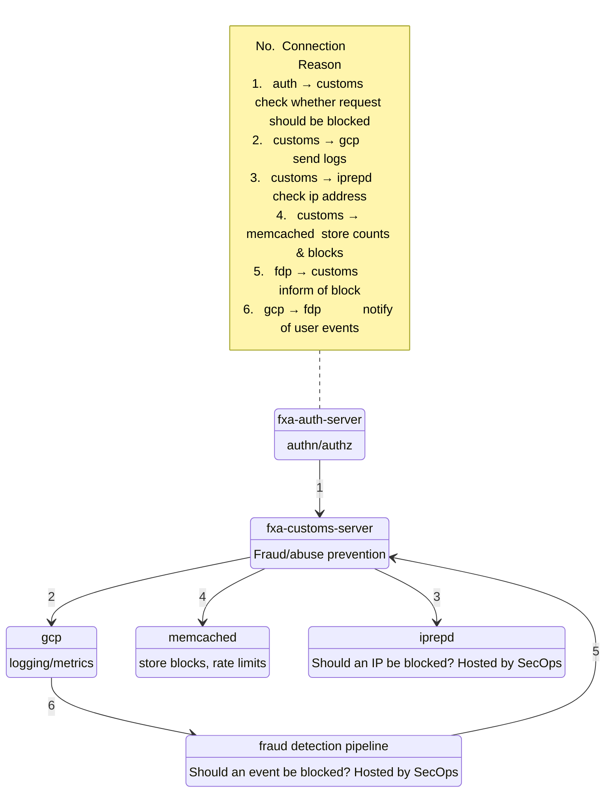
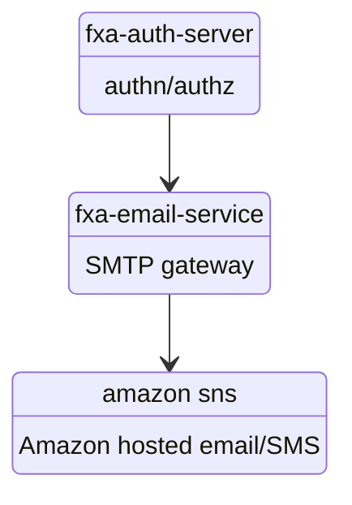
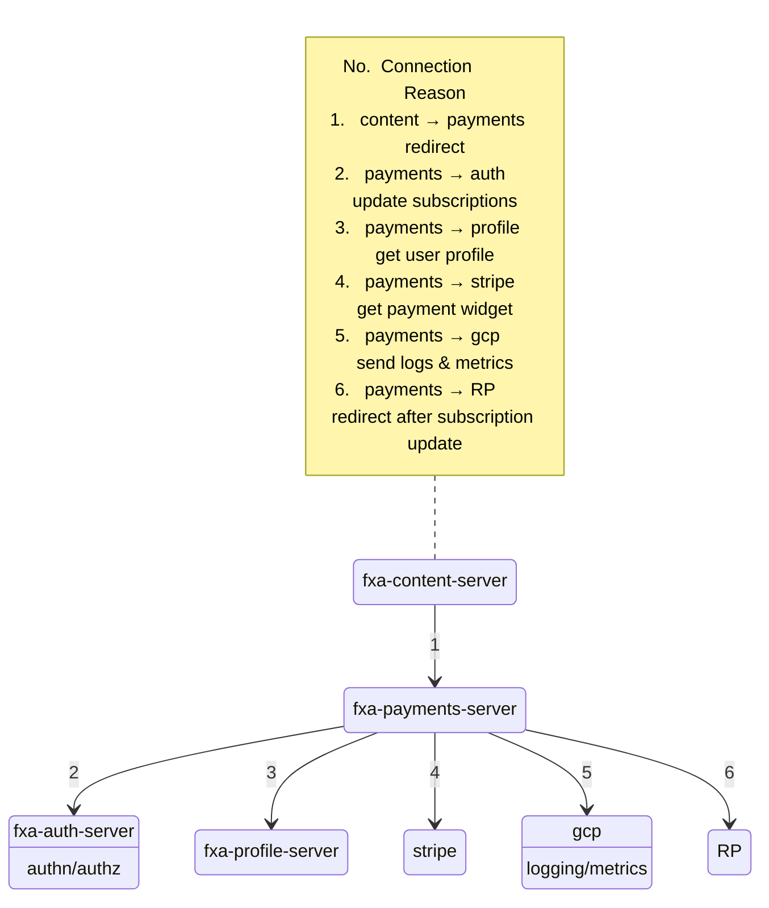
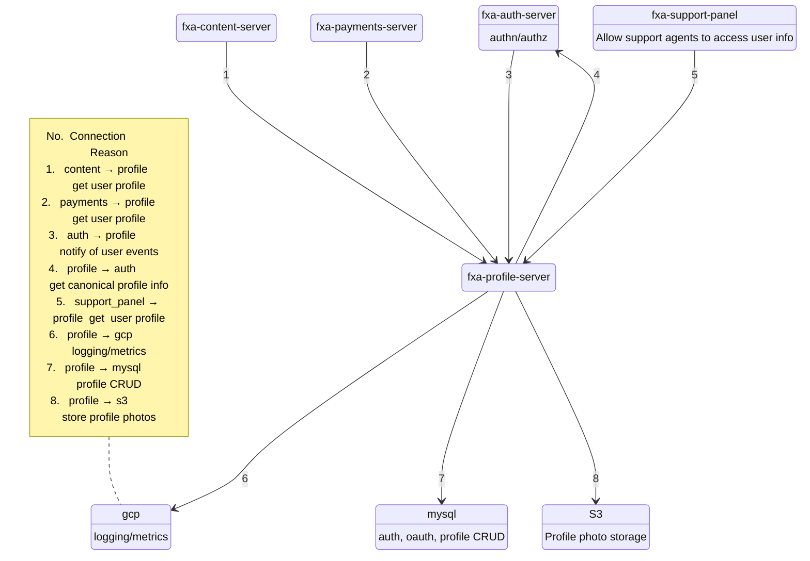
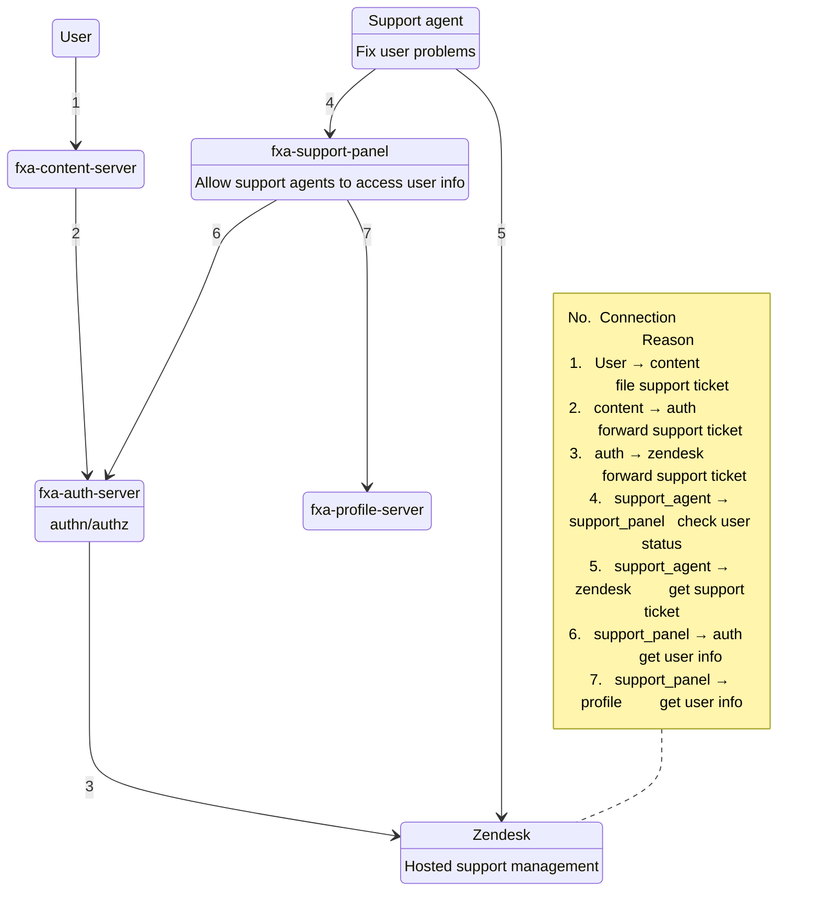

Current as of `November 15th, 2019`

## FxA universe

## fxa-auth-server

## fxa-content-server

## fxa-customs-server

## fxa-email-service

## fxa-payments-server

## fxa-profile-server

## fxa-support-panel

# A few additional diagrams

There are a few more private diagrams maintained by the operations group about
how we have our cloud services set up.  If you're an employee, you can see
them here:

* [Firefox Accounts Auth Server Logical Diagram][fxa_auth_diagram]
* [Firefox Accounts Content Server Logical Diagram][fxa_content_diagram]
* [Firefox Accounts Profile Server Logical Diagram][fxa_profile_diagram]

[fxa_auth_diagram]: https://mana.mozilla.org/wiki/display/SVCOPS/FxA+Auth+Server+Logical+Diagram
[fxa_content_diagram]: https://mana.mozilla.org/wiki/display/SVCOPS/FxA+Content+Server+Logical+Diagram
[fxa_profile_diagram]: https://mana.mozilla.org/wiki/display/SVCOPS/FxA+Profile+Server+Logical+Diagram
