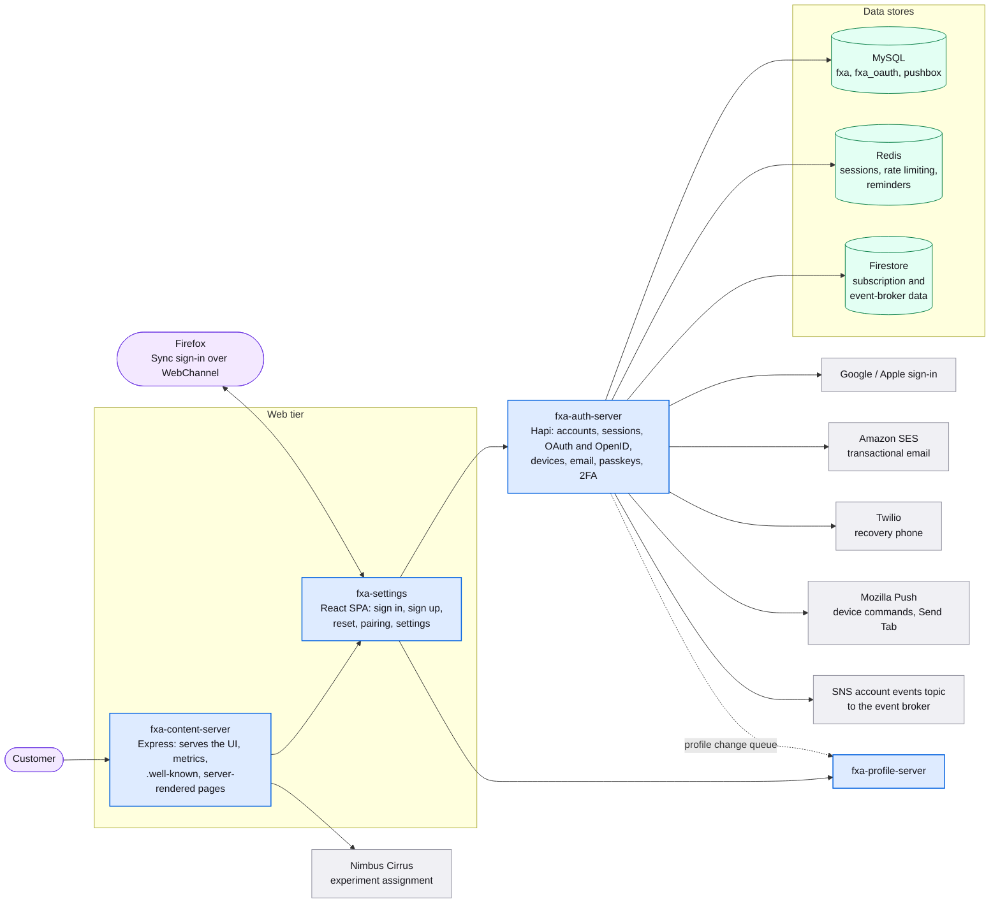
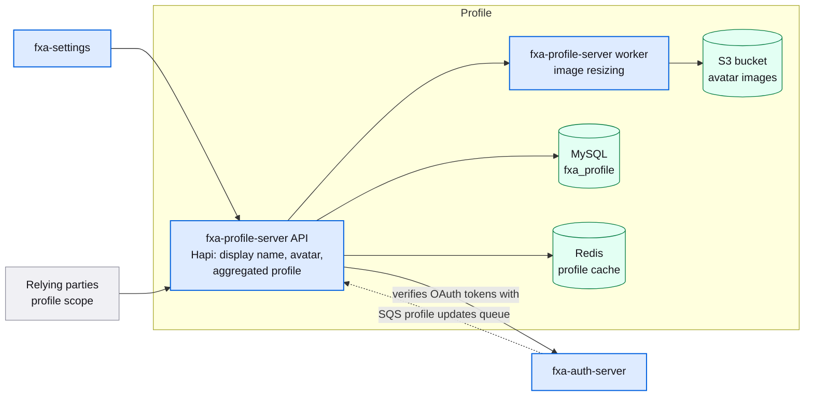
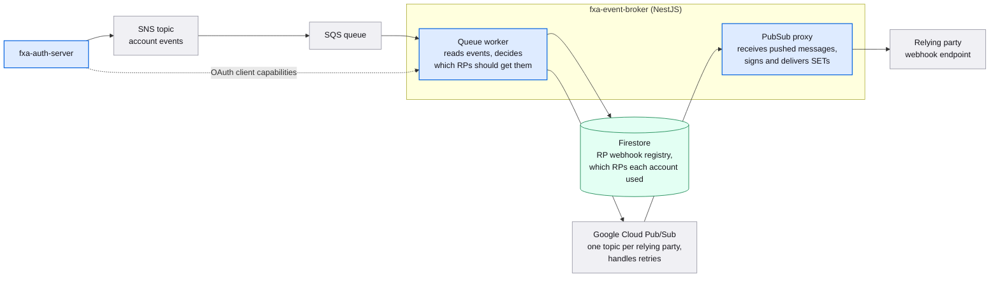
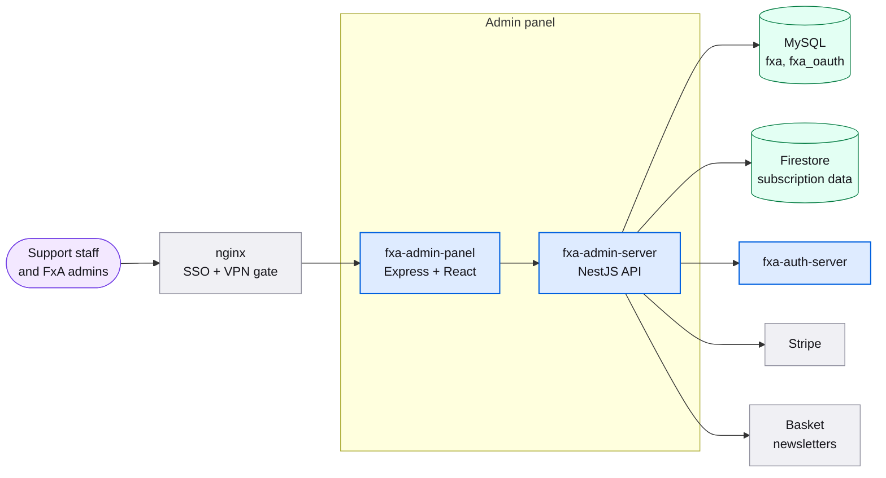
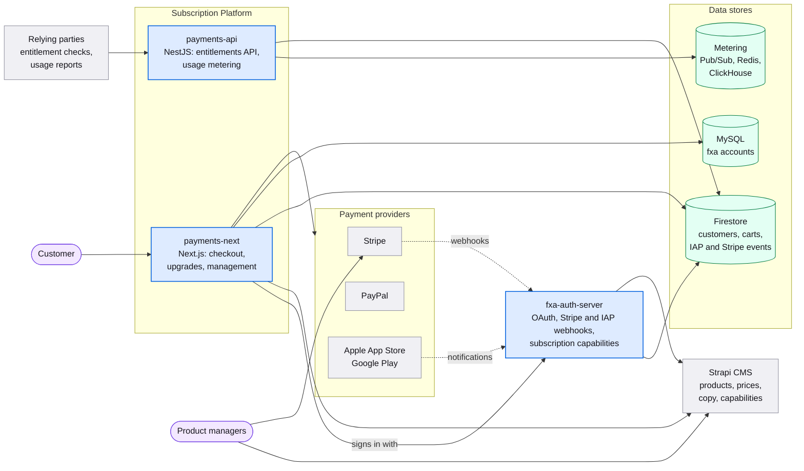
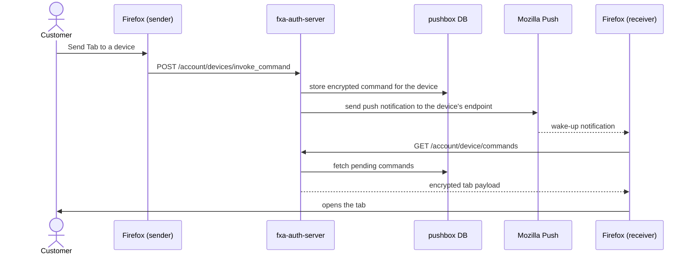
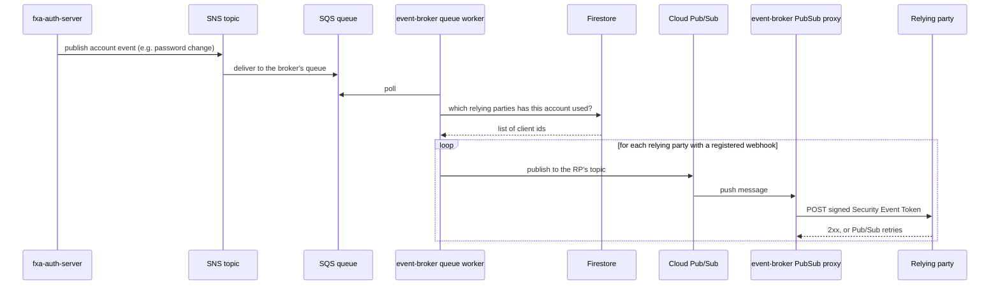

Current as of `October 2026`

These diagrams follow the [C4 model](https://c4model.com): one **system landscape** showing who and what
Mozilla accounts talks to, then one **container diagram** per part of the platform showing the
deployable pieces inside it, then a couple of **sequence diagrams** for flows that cross several
containers. They are plain [Mermaid](https://mermaid.js.org/) in this Markdown file, so editing a
diagram is editing this page. Keep each one small: a container diagram that needs more than a dozen
boxes wants to be two diagrams.

Each box names the service as it appears in [mozilla/fxa](https://github.com/mozilla/fxa) and the
external systems come from each service's configuration, so when a service gains or loses a dependency
the matching diagram should change in the same PR.

## System landscape

Everything inside the dashed "Mozilla accounts / Subscription Platform" box is one deployable platform
from the outside world's point of view. The container diagrams below open it up.

```mermaid
flowchart LR
  customer(["Customer<br/>signs in, manages their account,<br/>buys subscriptions"])
  staff(["Support staff,<br/>FxA admins"])

  subgraph rps["Relying parties"]
    direction TB
    fxdesktop["Firefox Desktop"]
    fxandroid["Firefox for Android"]
    fxios["Firefox for iOS"]
    tb["Thunderbird"]
    monitor["Mozilla Monitor"]
    relay["Firefox Relay"]
    vpn["Mozilla VPN"]
    amo["addons.mozilla.org"]
  end

  subgraph platform["Mozilla accounts / Subscription Platform"]
    direction TB
    fxa["Mozilla accounts<br/>sign in, OAuth, account settings,<br/>profile, account events"]
    subplat["Subscription Platform<br/>checkout, subscription management,<br/>entitlements"]
  end

  subgraph ext["External services"]
    direction LR
    subgraph acctext["Used by accounts"]
      direction TB
      idp["Google and Apple sign-in"]
      push["Mozilla Push (autopush)"]
      email["Amazon SES email"]
      sms["Twilio SMS"]
      nimbus["Nimbus / Cirrus experiments"]
      zendesk["Zendesk"]
      basket["Basket newsletters"]
    end
    subgraph payext["Used by payments"]
      direction TB
      stripe["Stripe"]
      paypal["PayPal"]
      iap["Apple App Store, Google Play"]
      cms["Strapi CMS<br/>product and pricing config"]
    end
  end

  customer --> rps
  customer --> platform
  staff --> fxa
  rps -- OAuth, profile,<br/>entitlements --> platform
  fxa -. account events<br/>via webhooks .-> rps
  fxa --> acctext
  subplat --> payext

  classDef person fill:#f3e8ff,stroke:#7542e5,color:#15141a
  classDef ours fill:#deebff,stroke:#0060df,stroke-width:1.5px,color:#15141a
  classDef ext fill:#f0f0f4,stroke:#8f8f9d,color:#15141a
  class customer,staff person
  class fxa,subplat ours
  class fxdesktop,fxandroid,fxios,tb,monitor,relay,vpn,amo,stripe,paypal,iap,idp,push,email,sms,cms,zendesk,nimbus,basket ext
```

## Containers: accounts and authentication

The core of Mozilla accounts. The content server is an Express app that serves the React UI and a few
server-rendered routes; the UI lives in `fxa-settings` and talks to the auth server directly. See the
[content-server architecture](../explanation/content-server-architecture) page for the client side.

```mermaid
flowchart LR
  customer(["Customer"])
  firefox(["Firefox<br/>Sync sign-in over WebChannel"])

  subgraph web["Web tier"]
    content["fxa-content-server<br/>Express: serves the UI, metrics,<br/>.well-known, server-rendered pages"]
    settings["fxa-settings<br/>React SPA: sign in, sign up,<br/>reset, pairing, settings"]
  end

  auth["fxa-auth-server<br/>Hapi: accounts, sessions, OAuth and OpenID,<br/>devices, email, passkeys, 2FA"]

  subgraph stores["Data stores"]
    mysql[("MySQL<br/>fxa, fxa_oauth, pushbox")]
    redis[("Redis<br/>sessions, rate limiting,<br/>reminders")]
    firestore[("Firestore<br/>subscription and<br/>event-broker data")]
  end

  idp["Google / Apple sign-in"]
  ses["Amazon SES<br/>transactional email"]
  twilio["Twilio<br/>recovery phone"]
  push["Mozilla Push<br/>device commands, Send Tab"]
  cirrus["Nimbus Cirrus<br/>experiment assignment"]
  sns["SNS account events topic<br/>to the event broker"]
  profile["fxa-profile-server"]

  customer --> content
  content --> settings
  firefox <--> settings
  settings --> auth
  settings --> profile
  content --> cirrus
  auth --> mysql
  auth --> redis
  auth --> firestore
  auth --> idp
  auth --> ses
  auth --> twilio
  auth --> push
  auth --> sns
  auth -. profile change queue .-> profile

  classDef person fill:#f3e8ff,stroke:#7542e5,color:#15141a
  classDef ours fill:#deebff,stroke:#0060df,stroke-width:1.5px,color:#15141a
  classDef store fill:#e3fff3,stroke:#017a40,color:#15141a
  classDef ext fill:#f0f0f4,stroke:#8f8f9d,color:#15141a
  class customer,firefox person
  class content,settings,auth,profile ours
  class mysql,redis,firestore store
  class idp,ses,twilio,push,cirrus,sns ext
```

Notes:

- The three logical MySQL databases live in one cluster. `fxa` holds accounts, sessions, devices and
  keys; `fxa_oauth` holds OAuth clients, codes and tokens; `pushbox` holds queued device commands.
  Their schemas are drawn on the [Database Structure](./database-structure) page.
- Rate limiting is in process, in the `@fxa/accounts/rate-limit` library backed by Redis. See
  [Rate limiting](./rate-limiting).
- Email is rendered and sent from the auth server over SMTP to SES. SES bounces and complaints come
  back through an SQS queue consumed by the auth server's `email_notifications` process.

## Containers: profile

```mermaid
flowchart LR
  settings["fxa-settings"]
  rps["Relying parties<br/>profile scope"]
  auth["fxa-auth-server"]

  subgraph profilesys["Profile"]
    api["fxa-profile-server API<br/>Hapi: display name, avatar,<br/>aggregated profile"]
    worker["fxa-profile-server worker<br/>image resizing"]
    mysql[("MySQL<br/>fxa_profile")]
    redis[("Redis<br/>profile cache")]
    s3[("S3 bucket<br/>avatar images")]
  end

  settings --> api
  rps --> api
  api -- verifies OAuth tokens with --> auth
  auth -. SQS profile updates queue .-> api
  api --> worker
  api --> mysql
  api --> redis
  worker --> s3

  classDef ours fill:#deebff,stroke:#0060df,stroke-width:1.5px,color:#15141a
  classDef store fill:#e3fff3,stroke:#017a40,color:#15141a
  classDef ext fill:#f0f0f4,stroke:#8f8f9d,color:#15141a
  class settings,auth,api,worker ours
  class mysql,redis,s3 store
  class rps ext
```

The profile server answers `GET /v1/profile` by combining its own data with account data fetched from
the auth server, then caches the result in Redis. The auth server invalidates that cache by posting to
the SQS queue whenever an email or other profile-relevant field changes.

## Containers: event broker

Account events (password change, account deletion, subscription state change, and so on) are fanned out
to relying parties as [Security Event Tokens](https://datatracker.ietf.org/doc/html/rfc8417). The
event formats are documented on the [Account Events](./account-events) page.

```mermaid
flowchart LR
  auth["fxa-auth-server"]
  sns["SNS topic<br/>account events"]
  sqs["SQS queue"]

  subgraph broker["fxa-event-broker (NestJS)"]
    qw["Queue worker<br/>reads events, decides<br/>which RPs should get them"]
    proxy["PubSub proxy<br/>receives pushed messages,<br/>signs and delivers SETs"]
  end

  firestore[("Firestore<br/>RP webhook registry,<br/>which RPs each account used")]
  pubsub["Google Cloud Pub/Sub<br/>one topic per relying party,<br/>handles retries"]
  rp["Relying party<br/>webhook endpoint"]

  auth --> sns --> sqs --> qw
  auth -. OAuth client capabilities .-> qw
  qw --> firestore
  qw --> pubsub
  pubsub --> proxy
  proxy --> rp

  classDef ours fill:#deebff,stroke:#0060df,stroke-width:1.5px,color:#15141a
  classDef store fill:#e3fff3,stroke:#017a40,color:#15141a
  classDef ext fill:#f0f0f4,stroke:#8f8f9d,color:#15141a
  class auth,qw,proxy ours
  class firestore store
  class sns,sqs,pubsub,rp ext
```

## Containers: admin panel

An internal tool for support staff and FxA admins. It is reachable only over VPN with SSO; nginx
verifies the login and passes the user's email and LDAP groups to the admin server as headers, which
decide what each user may do.

```mermaid
flowchart LR
  staff(["Support staff<br/>and FxA admins"])
  nginx["nginx<br/>SSO + VPN gate"]

  subgraph adminsys["Admin panel"]
    panel["fxa-admin-panel<br/>Express + React"]
    server["fxa-admin-server<br/>NestJS API"]
  end

  mysql[("MySQL<br/>fxa, fxa_oauth")]
  firestore[("Firestore<br/>subscription data")]
  auth["fxa-auth-server"]
  stripe["Stripe"]
  basket["Basket<br/>newsletters"]

  staff --> nginx --> panel --> server
  server --> mysql
  server --> firestore
  server --> auth
  server --> stripe
  server --> basket

  classDef person fill:#f3e8ff,stroke:#7542e5,color:#15141a
  classDef ours fill:#deebff,stroke:#0060df,stroke-width:1.5px,color:#15141a
  classDef store fill:#e3fff3,stroke:#017a40,color:#15141a
  classDef ext fill:#f0f0f4,stroke:#8f8f9d,color:#15141a
  class staff person
  class panel,server,auth ours
  class mysql,firestore store
  class nginx,stripe,basket ext
```

## Containers: Subscription Platform

Checkout and subscription management are a Next.js app under `apps/payments/next`, with the business
logic in the `libs/payments/*` libraries. A separate NestJS API under `apps/payments/api` serves
relying parties and the usage-metering pipeline. The auth server still owns the Stripe and in-app
purchase webhooks and attaches subscription capabilities to OAuth tokens.

```mermaid
flowchart LR
  customer(["Customer"])
  rps["Relying parties<br/>entitlement checks,<br/>usage reports"]
  pm(["Product managers"])

  subgraph subplat["Subscription Platform"]
    next["payments-next<br/>Next.js: checkout,<br/>upgrades, management"]
    api["payments-api<br/>NestJS: entitlements API,<br/>usage metering"]
  end

  auth["fxa-auth-server<br/>OAuth, Stripe and IAP webhooks,<br/>subscription capabilities"]

  subgraph providers["Payment providers"]
    stripe["Stripe"]
    paypal["PayPal"]
    iap["Apple App Store<br/>Google Play"]
  end

  cms["Strapi CMS<br/>products, prices,<br/>copy, capabilities"]

  subgraph stores["Data stores"]
    firestore[("Firestore<br/>customers, carts,<br/>IAP and Stripe events")]
    mysql[("MySQL<br/>fxa accounts")]
    metering[("Metering<br/>Pub/Sub, Redis,<br/>ClickHouse")]
  end

  customer --> next
  pm --> cms
  pm --> stripe
  next -- signs in with --> auth
  next --> providers
  next --> cms
  next --> firestore
  next --> mysql
  rps --> api
  api --> metering
  api --> firestore
  stripe -. webhooks .-> auth
  iap -. notifications .-> auth
  auth --> firestore
  auth --> cms

  classDef person fill:#f3e8ff,stroke:#7542e5,color:#15141a
  classDef ours fill:#deebff,stroke:#0060df,stroke-width:1.5px,color:#15141a
  classDef store fill:#e3fff3,stroke:#017a40,color:#15141a
  classDef ext fill:#f0f0f4,stroke:#8f8f9d,color:#15141a
  class customer,pm person
  class next,api,auth ours
  class firestore,mysql,metering store
  class rps,stripe,paypal,iap,cms ext
```

## Flow: Send Tab

How a tab sent from one Firefox reaches another. The auth server stores the encrypted command in the
`pushbox` database and uses Mozilla's push service to wake the target device.

```mermaid
sequenceDiagram
  actor user as Customer
  participant desktop as Firefox (sender)
  participant auth as fxa-auth-server
  participant pushbox as pushbox DB
  participant push as Mozilla Push
  participant mobile as Firefox (receiver)

  user->>desktop: Send Tab to a device
  desktop->>auth: POST /account/devices/invoke_command
  auth->>pushbox: store encrypted command for the device
  auth->>push: send push notification to the device's endpoint
  push-->>mobile: wake-up notification
  mobile->>auth: GET /account/device/commands
  auth->>pushbox: fetch pending commands
  auth-->>mobile: encrypted tab payload
  mobile->>user: opens the tab
```

## Flow: account event to a relying party

```mermaid
sequenceDiagram
  participant auth as fxa-auth-server
  participant sns as SNS topic
  participant sqs as SQS queue
  participant worker as event-broker queue worker
  participant fs as Firestore
  participant pubsub as Cloud Pub/Sub
  participant proxy as event-broker PubSub proxy
  participant rp as Relying party

  auth->>sns: publish account event (e.g. password change)
  sns->>sqs: deliver to the broker's queue
  worker->>sqs: poll
  worker->>fs: which relying parties has this account used?
  fs-->>worker: list of client ids
  loop for each relying party with a registered webhook
    worker->>pubsub: publish to the RP's topic
    pubsub->>proxy: push message
    proxy->>rp: POST signed Security Event Token
    rp-->>proxy: 2xx, or Pub/Sub retries
  end
```

## Editing these diagrams

Edit the Mermaid blocks on this page and check them with `yarn start`, or paste a block into
[mermaid.live](https://mermaid.live) for a quicker loop. Mermaid lays diagrams out automatically, so the
lever you have is scope: if a diagram gets crowded, split it rather than fighting the layout.
