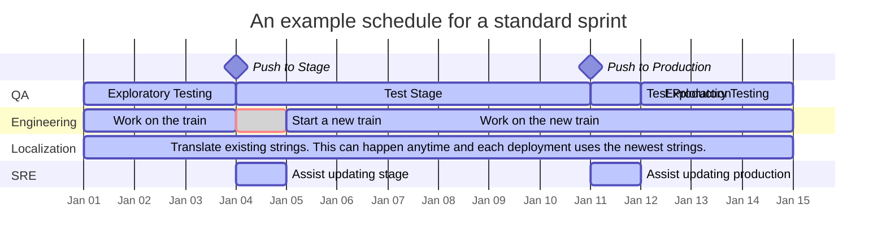
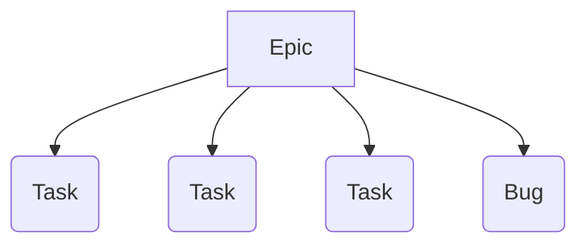

_Last update Dec 5, 2025_

We develop and deploy on a two-week cycle. Every other Wednesday we cut a release "Train" (ie. a Sprint) that goes through [deployment to stage and into production](release-process).

## Our weekly process



Above is a chart illustrating the high level FxA development process.  It does not represent all the work each group does, nor does it show every group that is critical to shipping Mozilla accounts.  Its intention is to give an idea of timeframes:
* Sprint starts are offset from production pushes by a week.  This gives a finished sprint time to be tested in Staging before going live.
* Fixing regressions of the train on Stage is a higher priority than fixing new issues in the current train.  Depending on the regression's severity it may be picked to Stage, picked to Production, or just ride the train the following week.
* The chart includes weekends because not everyone is in the same timezone.  People are not expected to work on weekends.


## Issue management

Most of our work takes place on [GitHub][fxa-repository] and [Jira][fxa-jira].

Issue status is reflected by the following:

* The issue itself will have updates indicating *what* the next action is.
* The assignee, if any, indicates *who* is responsible for that action.
* The Sprint (in Jira) indicates *when* we are working on the issue.
* The Points (in Jira) indicate roughly *how complex* the issue is.
* The Type (in Jira) indicates whether the issue is a task, bug, or spike (research task). These are oftentimes housed in epics for feature work which may live in meta-epics of differing types.
* The Severity (in Jira) for *bugs only* indicates the impact of the bug. ([more details][bug-severity])

Issues filed in GitHub (and comments on those issues) will sync to Jira automatically.  *This is a one-way sync and changes to the issues in Jira will not be reflected in GitHub.*

We also have a component in Bugzilla: [Cloud Services :: Server: Firefox Accounts][bugzilla-fxa-server] .  This component is generally no longer used except by teams who aren't using Jira yet.  For related info, see our [Bugzilla triage docs][bugzilla-triage].

**If you're wondering where to file a bug, please file it in Jira.**  

### Labels we use

This isn't a comprehensive list but is a good selection to be aware of.  We should use these labels any time they apply.

* `qa+`: Critical flow or high chance of regression. QA should focus on testing this issue.  When you use this label *leave a comment in the issue with context about how to test it*.
* `qa-`: This is not something that should be tested by QA
* `regression`: This used to work and now it doesn't
* `needs:*`: We need input from a team, for example, `needs:product` means we need a product manager.

## Product Planning

Product-level feature planning is managed via Epics in Jira.  Each feature goes through a comprehensive series of steps from defining and designing, to building and QA, to measuring changes and results, and finally closing the Epic.

We maintain roadmaps for what we're working on.  See what [Mozilla accounts][fxa-roadmap] or [Subscription Platform][subplat-roadmap] is working on now.

### New Features

New features are expected to be described thoroughly in an Epic with a description, acceptance criteria, risks, measures of success, and eventually supporting Tasks filed under it.


Often epics will be filed by the Product team for new Feature Engineering work and Engineers for new Engineering Excellence work.  Tasks will likely be written by the Engineering teams as they need to be broken down small enough to fit inside of a sprint.  [Learn more about user stories][moz-user-stories].  [Learn more about Feature Engineering and Engineering Excellence][FE_EE_OE].

As Tasks and Bugs pop up, they should be associated with open Epics as appropriate.

When a task is `Ready for Engineering` it's expected that:
* A [QA Ticket][pi-jira] has been filed
* If there are interesting security changes, the security team has been notified
* If there are significant string changes, the L10n team has been notified
* Appropriate metrics have been documented and will be implemented (ie. How will we know this is a success?)
* If there are legal or privacy implications, the legal and privacy teams have been consulted

## Sprints

Sprints are tracked in Jira.  There is a [detailed view of our current sprint][fxa-jira-sprint].

The amount of work we can accomplish in a sprint depends on how many people are on the team, how much time those people can devote to the work, and what type of work it is.  Our [historical velocity is tracked][fxa-jira-velocity], but past performance is no guarantee of future results.

When considering what you can accomplish in a sprint, remember:
* FxA is a complex project with a lot of moving parts.  If you're not familiar with the area, sometimes a simple patch can lead to a rabbit hole that soaks up your time.
* All patches are reviewed by another team member who also have their own obligations that sprint.  Leave room in your schedule to review patches and consider that others might not get to your patch immediately.
* Some patches may require additional review from, for example, the operations, security, localization, or data steward teams.  If that's the case it may not land in the same sprint it is written in.

### How do we decide what to work on?

We take input from many sources including our Product Managers, our QA team, our customers (both relying parties and end users), and ourselves.  Usually this input is in the form of issues filed in Jira.  We triage this input (described in [Triage Process](triage-process.md)) to determine what is the most important thing to work on in the next sprint.  There are often special cases and reasons to work on things which may find their way into a sprint but for the most part in each sprint we aim to close, in priority order:

* Blocking bugs that have been found in our production site
* Blocking bugs found in our staging site
* Any high priority work that we didn't finish in the previous sprint (including helping a team member finish their work)
* Any in-progress Epics
* Starting on the next Epic

In the midst of our regular process workflow bugs will be reported and found.  If they are important we'll add them to the sprint.  If they are part of an epic we're actively working on, we'll add them to that epic (and thus, they will be closed in short order).  If they aren't a high priority, they'll be put in the backlog.  Occasionally we may take a sprint and work on only bugs to help reduce our backlog.

We try to work on things as a team (vs individually).  Having more people work on fewer things means:

* It's easier to find a reviewer for code you write (and less context switching for everyone involved)
* It's easier to find someone with enough context to work through hard questions like architecture design
* More people will have experience with more areas of the code
* Epics will be closed out faster

## Polish / Quick-Fix Pull Requests

Developers are encouraged to make quick-fixes or polish existing code (re-naming a variable, moving a class to a more logical location, etc) to address nit's or as they find clean-ups/refactors that can be addressed expediently. These Pull Requests do not need Jira issues filed nor need to go through the Triage process and should be small in scope and time spent.

Some examples of polish / quick-fix requests:

* Variable rename to match style guide-lines
* Addressing multiple nits from a recent PR
* Refactor of a class/method/module

Assigned issues during the sprint always take priority over these types of PR's.

## Estimation and Point Values
Points are assigned to issues in Jira (ideally before starting work 😉) so that we can track our velocity over time, which aids in planning.

The goal of estimation is for us to assess the issue in terms of its relative complexity, effort, and doubt. When applying an estimate, we should consider all the steps in getting the particular work to a completed (ready for production) state for our consumer. The should include effort required for code reviews, security reviews, testing, integration and build/deploy.

| Points | Relative Size | Description                                                                | Review Time | Examples |
| ------ | ------------- | -------------------------------------------------------------------------- | ----------- | -------- |
| 1      | xs            | This is a trivial change with clearly defined parameters.                  | 1 engineer needs ~10 minutes | |
| 2      | s             | A simple change (minimal code changes), where we understand all of the requirements. | 1 engineer needs &lt;1 hour | |
| 3      | m             | A simple change, but the code footprint is bigger (e.g. lots of different files, or tests affected). The requirements are clear.<br /><br />or<br /><br />This could also represent a 2 point project but there is less certainty about how to achieve it effectively.  [Note: what we are achieving should not be in question.] | 1 engineer needs &lt;2 hours | |
| 5      | l             | A more complex change that will impact multiple areas of the codebase, there may also be some refactoring involved. Requirements are understood but you feel there are likely to be some gaps along the way. | 1 engineer needs &lt;3 hours | |
| 8      | xl            | A complex change. It will significantly change the codebase and/or business logic. It may require input from others to assure the requirements and impacts are well understood.  It may require coordination with additional teams.<br /><br />or<br /><br />This could also represent a 5 point project but there is less certainty about how to achieve it effectively.  [Note: what we are achieving should not be in question.] | 1 engineer needs 1/2 day.  This may require data review or an external team sign-off | |
| 13     | xxl           | A significant change that may have dependencies (other teams or third-parties) and we likely still don't understand all of the requirements. It's unlikely we would commit to this in a milestone, and the preference would be to further clarify requirements and/or break in to smaller Issues.  | 2 engineers need a few 1/2 days each.  This may require security review or external team sign-offs | |
| 21     | ∞             | Meta issue or We do not have clear scope. (This issue must be broken down).  This is possibly a whole quarter sized epic. | | |


## Check-in Meetings

The team meets regularly to stay in sync about development status and ensure nothing is falling through the cracks.  During meetings we take notes in a central document that anyone in the meeting can reference.

Please see our [team calendar][fxa-calendar] for details.

## Project Leads

Each project (epic or group of epics) will have a project lead.  Project leads rotate among the team.  If you are a project lead the epic will be assigned to you and you'll have additional responsibilities regarding the project:

- Feedback on the project (e.g. in a requirements document or early discussions)
- [Breaking a project down into issues](work-breakdown-process), including [writing and maintaining a tech spec](work-breakdown-process#using-a-technical-specification-document)
- [Filing an issue in the QA project](https://docs.google.com/document/d/1oz1YyaaBI-oHUDsktWA-dLtX7WzhYqs7C121yOPKo2w/edit?tab=t.0) with the `WAITING FOR DEVELOPERS` status and updating to the `TEST DEV` status when ready for QA
- Coordination among teams (e.g. UX, QA, L10n, Security, etc.)
- Representing the project in meetings, including meetings outside of our team (e.g. org-wide product reviews)
- Ensuring the issues in the backlog represent the work to be done, are in the proper order, and the Jira fields are up to date
- Reporting project status routinely in the epic(s)
- Ensuring code related to the project is being reviewed & landing

Not everything in the list needs to be done by one person, but the lead is responsible for keeping the ball rolling.

## Pull requests

At the time of writing, FxA engineers push their branches to `mozilla/fxa` directly; we have [an issue we closed as a won't fix][issue-forked-prs] detailing why we currently don't use forks, see [merging a contributor's PR](#merging-a-contributors-pr) for how to handle PRs from forks. Try to delete your stale or already merged branches on a regular basis.

See [CONTRIBUTING.md][contributing-md] to see FxA's contributing guidelines, including commit message guidelines. Because we prefer one commit per issue or PR closed, depending on the task at hand engineers may need to interactively rebase against `main`, consolidate their commits, and force push to their branch. [See the ADR][adr-squash-and-merge] around disabling squash and merge for related additional details. Note that we have branch protection against force pushing to `main` or `train-*` branches.

To perform a rebase, fixup your commits, and force push:

1. While not always required, you may want to have latest `main` locally with `git fetch <remote> main:main`
1. Run `git rebase -i main`
1. You'll see a list of your commits containing a command (like `pick`), their hashes, and messages
    1. Change `pick` on the message(s) you want to fix up to `f` or `fixup`¹
    1. You may want to `r` or `reword` the first commit to fill out the message per our guidelines or to add to your existing message if what you're fixing up isn't captured in the original commit (if so, you may also want to edit your original PR message to reflect the reworded commit message)
1. Exit Vim, and your rebase will begin
1. If no one else is working in your branch, you may force push with `git push <remote> <branch name> -f`. If you're pairing with someone, do this carefully by communicating with the collaborator and be sure to use the `--force-with-lease` option rather than `-f`

¹We generally prefer fixing up (`f`) over squashing (`s`) because squashing appends the commit message to the previous one while fixing up discards it. If you squash instead, your commit message may follow the guidelines but display your other messages at the bottom which might look like extra cruft, like "WIP" or "Address review comments".

:::tip
If you're not used to force pushing, it can feel a little scary at first. You can always fork the repo and push to your fork before rebasing and force pushing to `mozilla/fxa` if you want to preserve a copy of history, or after rebasing and before force pushing, run a `git diff` against your locally fixed up branch and what's been pushed. You can exit rebasing and get to your previous state by running `git rebase --abort` if you need to.
:::

### Example PR scenarios for commit strategies

These are not hard rules, but here are some various scenarios and strategies you might use:

**Scenario (r+ or r+ with nits)**: You have a fix ready and you commit it per the guidelines. If you get review approval without requested changes, you may merge it. If you get review approval with nits (nitpicks) you'd like to address, you can commit the changes, follow the fixup/force push steps above, and once CI passes again, you may merge the PR.

It's generally too much overhead to re-review approved PRs with nitpick fixes just to make sure the fixup was done properly. We have "Dismiss stale pull request approvals when new commits are pushed" disabled in our branch protections for this reason.

**Scenario (changes requested)**: A reviewer asks for changes on your PR. Depending on the breadth of changes required, you may want to commit those changes separately and regular push to your branch and when the reviewer approves, follow the fixup/force push steps above, and once CI passes again, you may merge the PR. Alternatively, you may rather go ahead fixup/force push to your branch so the reviewer can also see the final commit.

**Scenario (draft PR)**: You have a branch containing several commits that you'd like to open as a draft for early feedback. You may fixup your commits at this stage if you wish which wouldn't require a force push, but it's fine for a PR to have multiple commits until you feel it's ready for review and merge. You might fill out the pull request title and template to help early reviewers and to give you something to copy and paste when you're ready to write the commit message. When your PR is ready for a review and potentially merge, follow the steps above to fixup your commits and force push.

**Scenario (large PR)**: You've been working on a large task, which probably should have been broken down better, with many commits that may actually make the review process easier to keep them separate because they're loosely organized. It's fine to open a PR like this for review, but it's best to fill out the pull request title and template to help reviewers and to give you something to copy and paste when you're ready to write the commit message. Handle this how you and the reviewer feel is best, just be sure to fixup your commits before the PR is merged.

### Merging a contributor's PR

If someone outside of the fxa-devs group on Github makes a contribution, they will have to use their fork since they won't have write access to `mozilla/fxa`, see why this won't pass CI [on this issue][issue-forked-prs].

Review the pull request per our "code review" guidelines below. When the PR appears ready, we will need to grab the contributor's commit and place it in a PR temporarily into `mozilla/fxa` marked as a draft and/or with a "do not merge" label or title. Circle CI will run the full suite based on that _commit_, meaning CI will appear to run on the contributor's branch.

If you expect to only need to do this once, run:

```bash
git fetch git@github.com:<username>/fxa.git <commit hash>
git checkout -b <whatever-branch-name> <commit hash> # you can also use FETCH_HEAD instead of <commit hash>, as they're the same
git push <remote> <whatever-branch-name>
```

By using this method instead of cherry-picking, the commit is not co-authored by the team member.

If you expect to do this more than once, add the contributor's fork as a `remote` so you can pull from their branch more easily.

```bash
git remote add <username> git@github.com:<username>/git.git
git fetch <username>
git checkout --track <username>/<contributor‘s branch name>
```

When CI passes, merge the contributor's PR and close your temporary PR.

## Code Review

This project is production Mozilla code and subject to our [engineering practices and quality standards][moz-standards].  Every patch must be [reviewed][moz-code-review] by an owner or peer of the [Mozilla accounts module][fxa-module].

### Review Checklist

Here are some handy questions and things to consider when reviewing code for Mozilla accounts:

* Did test coverage increase, or at least stay the same?
* Does it introduce new user-facing strings or does it change any existing ones?
  * Ensure the strings are finalized and approved.  Double check for any typos.  It's hard to change strings once they get localized.
  * Ensure they will be extracted by being consistent with the code in the package you're working on.
  * If string changes exist in a package that uses Fluent, ensure the FTL ID for the string is also updated
* Does it store user-provided data?
    * The validation rules should be explicit, documented, and clearly enforced before storage.
    * Ensure new stored data has been approved by a data steward.
* Does it display user-controlled data?
    * It must be appropriately escaped, e.g. htmlescaped before being inserted into web content.
* Does it involve a database schema migration?
    * The changes must be backwards-compatible with the previous deployed version.  This means that you can't do something like `ALTER TABLE CHANGE COLUMN` in a single deployment, but must split it into two: one to add the new column and start using it, and second to drop the now-unused old column.
    * Does it contain any long-running statements that might lock tables during deployment?
    * Can the changes be rolled back without data loss or a service outage?
    * Has the canonical db schema been kept in sync with the patch files?
    * Once merged, please update the [deployment doc][fxa-deploy-doc] with details.
* Does it alter the public API of a service?
    * Ensure that the change is backwards compatible.
    * Ensure that it's documented appropriately in the API description.
    * Ensure validation functions are tested thoroughly.
    * Note whether we should announce it on one or more developer mailing lists.
* Does it add appropriate new metrics or logging?
* Does it consider accessibility?
* If styling changes are made, does it consider RTL languages?
* Does it warrant any documentation updates?
* Does the commit message match our guidelines? If you are approving a PR with multiple commits, consider leaving a comment reminding them to consolidate their commits before hitting the merge button.

## Deployment Documentation
We maintain a [private deployment document][fxa-deploy-doc] to keep track of any configuration changes, any database changes, etc.  **Anything that needs to be done aside from deploying updated code should be tracked in this document.**
If your patch needs any additional changes or config you are responsible for putting those notes in this document before the train ends.

Additionally, we should notify our relying parties if we're going to change APIs or configuration details if we can (ie. it may not be prudent if we're changing a configuration variable in response to a security incident).  These notifications should be sent to the [firefox-accounts-notices group][firefox-accounts-notices] with enough time for relying parties to adjust their code or reply with any concerns.

## Security issues

Since most of our work happens in the open, we need special procedures for dealing with security-sensitive issues that must be fixed in production before being made visible to the public.

Security issues in Jira have the `Security Level` field set to `Accounts Security Access`.  This allows us to manage visibility for other stakeholders at Mozilla while maintaining confidentiality.

We use private github repos for developing security fixes and tagging security-related releases. See the [Security Releases](release-process#security-releases) section on the release process page for more information on how to handle releasing this code.

### Filing security issues

As only employees have access to Jira, if you believe you have found a security-sensitive issue with any part of the Mozilla accounts service, please file it as confidential security bug in Bugzilla via this link:

* [File a security-sensitive FxA bug][fxa-security-bug]

The Mozilla accounts service is part of Mozilla's [bug bounty program][moz-bug-bounty], which provides additional guidelines on [reporting security bugs][moz-sec-bugs].


[bugzilla-triage-process]: https://firefox-source-docs.mozilla.org/bug-mgmt/policies/triage-bugzilla.html
[bugzilla-fxa-server]: https://bugzilla.mozilla.org/buglist.cgi?list_id=15067999&resolution=---&classification=Client%20Software&classification=Developer%20Infrastructure&classification=Components&classification=Server%20Software&classification=Other&query_based_on=CloudServices%3A%3AServer%3AFirefoxAccounts&query_format=advanced&component=Server%3A%20Firefox%20Accounts&product=Cloud%20Services&known_name=CloudServices%3A%3AServer%3AFirefoxAccounts
[fxa-calendar]: https://www.google.com/calendar/embed?src=mozilla.com_urbkla6jvphpk1t8adi5c12kic%40group.calendar.google.com
[fxa-deploy-doc]: https://docs.google.com/document/d/1lc5T1ZvQZlhXY6j1l_VMeQT9rs1mN7yYIcHbRPR2IbQ/edit
[fxa-milestones]: https://github.com/mozilla/fxa/milestones
[fxa-module]: https://wiki.mozilla.org/Modules/Other#Firefox_Accounts
[fxa-security-bug]: https://bugzilla.mozilla.org/enter_bug.cgi?product=Cloud%20Services&component=Server:%20Firefox%20Accounts&groups=cloud-services-security
[fxa-repository]: https://github.com/mozilla/fxa
[fxa-jira]: https://mozilla-hub.atlassian.net/browse/FXA
[fxa-jira-sprint]: https://mozilla-hub.atlassian.net/jira/software/c/projects/FXA/boards/225
[fxa-jira-backlog]: https://mozilla-hub.atlassian.net/jira/software/c/projects/FXA/boards/227/backlog?issueLimit=100
[fxa-jira-velocity]: https://mozilla-hub.atlassian.net/jira/software/c/projects/FXA/boards/225/reports/velocity-chart
[firefox-accounts-notices]: https://groups.google.com/a/mozilla.com/g/firefox-accounts-notices
[moz-bug-bounty]: https://www.mozilla.org/security/bug-bounty/
[moz-code-review]: https://developer.mozilla.org/docs/Code_Review_FAQ
[moz-sec-bugs]: https://www.mozilla.org/security/bug-bounty/faq-webapp/#bug-reporting
[moz-standards]: https://developer.mozilla.org/docs/Mozilla/Developer_guide/Committing_Rules_and_Responsibilities
[moz-user-stories]: https://docs.google.com/presentation/d/1zepsrOiHINBMS3TJ8nFDJ4gf8u6kRONe1hdMDnlyZvI/edit

[fxa-roadmap]: https://mozilla-hub.atlassian.net/jira/plans/36/scenarios/36?vid=145#plan/backlog
[subplat-roadmap]: https://mozilla-hub.atlassian.net/jira/plans/34/scenarios/34?vid=136#plan/backlog
[pi-jira]: https://mozilla-hub.atlassian.net/jira/software/c/projects/QA/issues/
[bug-severity]: https://wiki.mozilla.org/BMO/UserGuide/BugFields#bug_severity
[bugzilla-triage]: ./triage-process.md#bugzilla-fxa-only

[contributing-md]: https://github.com/mozilla/fxa/blob/main/CONTRIBUTING.md
[issue-forked-prs]: https://github.com/mozilla/fxa/issues/12261
[adr-squash-and-merge]: https://github.com/mozilla/fxa/blob/main/docs/adr/0030-disable-squash-and-merge.md

[FE_EE_OE]: https://mozilla-hub.atlassian.net/wiki/spaces/IP/pages/1397817345/Feature+Engineering+Engineering+Excellence+and+Operational+Excellence
