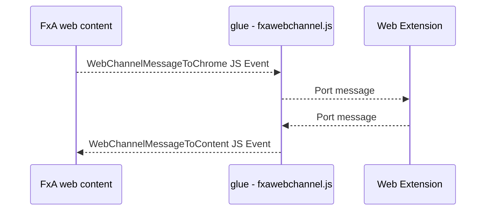
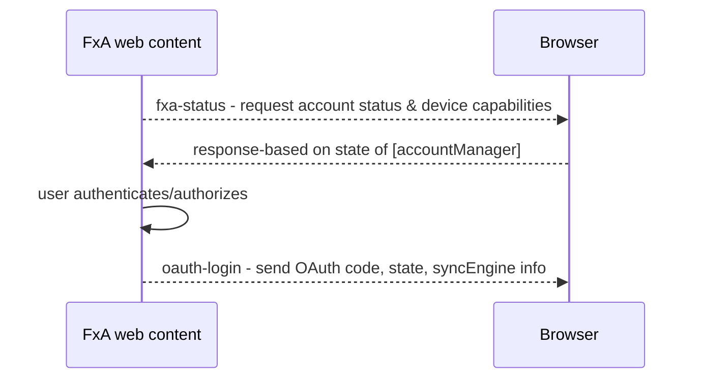

Current as of `December 2nd, 2019`

# Communication with OAuth WebChannels

OAuth WebChannels is an extension of the [FxA WebChannel Desktop Flow](./fxa-webchannel-protocol).
It consists of similar messages as the Desktop Sync flow, however is more generic because of the use
of OAuth in the background. Some behaviours in the OAuth flow are different.

This flow currently supports the following messages:

-   `fxaccounts:fxa_status`
-   `fxaccounts:oauth_login`

The `fxaccounts:fxa_status` message in the OAuth flow supports specifying a custom list of Sync engines that the app supports.
See [FxA WebChannel Desktop Flow](./fxa-webchannel-protocol) for details of engine capabilities.

## Communication with GeckoView applications

To enable this feature in applications with GeckoView we ship a WebExtension
as part of the [firefox-accounts](https://github.com/mozilla-mobile/android-components/blob/master/components/service/firefox-accounts/README.md) Android component.

Communication channel is established from web content to this class via webextension, as follows:






## Commands

### fxaccounts:fxa_status

See the [fxaccounts:fxa_status section](./fxa-webchannel-protocol#fxaccounts-fxa_status) of the WebChannel Protocol document.

#### `engines` capability

Unlike the Desktop WebChannel integration, the OAuth WebChannel integration expects all supported
engines to be enumerated within the `engines` capability. Possible values are:

- `addons`
- `addresses`
- `bookmarks`
- `creditcards`
- `history`
- `passwords`
- `preferences`
- `tabs`

### fxaccounts:oauth_login

Sent when a user successfully authenticates via a WebChannel OAuth flow.

#### data

```json
{
  "code": "02f3cfea84ac4c143662b38d6c7f0c82c6f91eb041befc7cecda446b1b4887c1",
  "state": "vHao1p6OizzwReCkQMSpZA",
  "redirect": "urn:ietf:wg:oauth:2.0:oob:oauth-redirect-webchannel",
  "action": "signin",
  "declinedSyncEngines": ["history"],
  "offeredSyncEngines": ["history"]
}
```

#### support

Supported by `oauth_webchannel_v1` context.

## See also

- [FxA WebChannel Desktop Flow](./fxa-webchannel-protocol)
