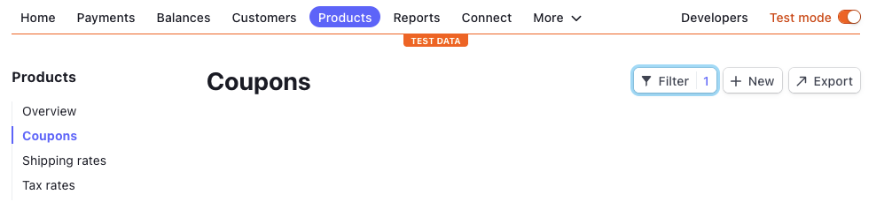
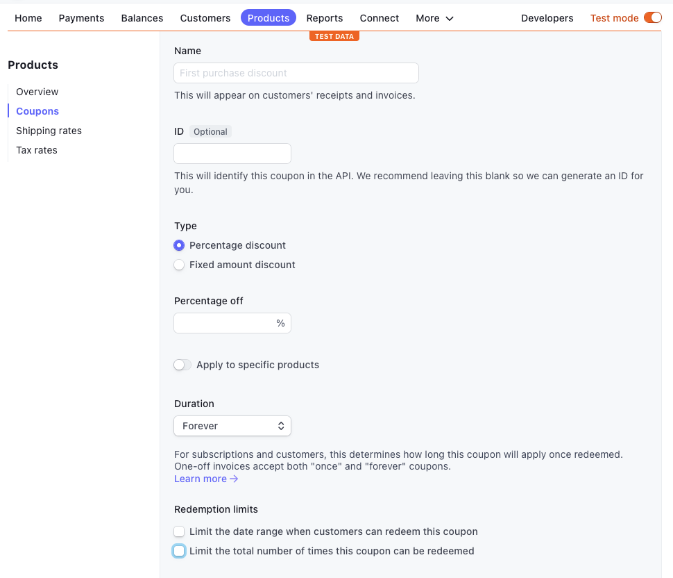
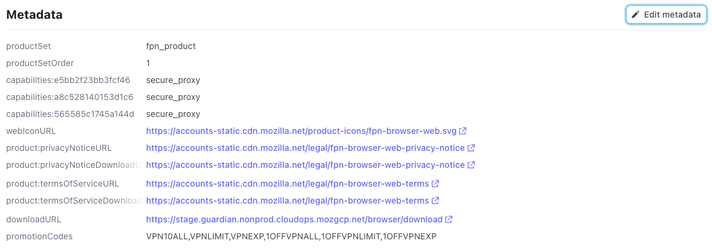

## Introduction

You can now reduce the amount charged to a customer by discounting their subscription with a coupon. A coupon can reduce a subscription by a flat amount or a percentage. Coupon configuration is done in Stripe.

## Required preparation

Any plans to create a new coupons should be verified by the Relying Party Product Manager, Finance, and any additional stakeholders as identified by the RP PM. Subscription Platform should be notified of new coupons via email including plan deck to subscription-services@mozilla.com.

## Creating coupons

Coupons can be created in Stripe and assigned to different Product Subscriptions or Price plans using the metadata section. Contact SubPlat leads to discuss access if needed.

### Navigation

Coupons can be found under Products -> Coupons

### Creating the coupon

After you land on the coupon page press the +New button to create a coupon. This will open up the coupon creation screen. Enter the mandatory information:

- **Name** - This is the name of the coupon that will be displayed on the invoice, as well as the customer's Subscription Management page (`/subscriptions`). This should be user friendly.
- **Type** - Choose the type of coupon you are creating ( % off or, fixed amount).
- **Percent off** - If you have chosen a percentage discount, fill in the % box.
- **Currency & Discount amount** - If you have chosen a fixed amount discount choose your currency and the discount amount.
- **Apply to a specific products** - _Do not use this field._ Leave in the default off position
- **Duration** - Select the duration of the coupon. This ties directly to the invoice. Forever means the coupon will be used for the first subscription and all renewals. Once means the coupon will only be valid for the initial subscritpion. Multiple months means that the coupon will be valid multiple times for a monthly subscription but only once for a yearly subscription unless the number of months is greater than 12.
- **Redemption limits** - _Do not use this field._ Leave both options unchecked.
- **Codes** - This allows us to set short codes that the user will enter into the Discount field during checkout. Turn this toggle on.

### Creating coupon codes

Once you turned on the codes toggle you will see a new section appear. You can make as many codes per coupon as you like, but keep in mind that the discount you set cannot be changed.

- **Code** - Set a code for the coupon. This code will be used during the subscription checkout flow.
- **Eligible for first-time orders only** - _Do not use this field._ This will prohibit customers that already have a subscription to another product from using the coupon on a new product (Ex: has VPN but wants Relay)
- **Limit to a specific customer** - _Do not use this field._
- **Limit the number of times this code can be redeemed** - Select this option and put in a limit if you want to limit the number of times this coupon can be used. (Ex: only the first 300 people who read our blog can use the coupon)
- **Add an expiry date** - Select this option and enter a date time if you want this coupon to expire. (Ex: if the expiry of the coupon is Jan 1, 2022 9:00 PST users attempting to use this coupon on Jan 1, 2022 9:01 PST will see an error. )
- **Require minimum order value** - _Do not use this field._ Instead be mindful of which Products/ Prices you assign each coupon. (Ex: do not assign a $1USD off coupon to a $0.99USD subscription)

### Saving the coupon

Once you have filled in, and double checked all of your information, press the Create coupon button. Please note that once you create the coupon you are limited to what you can edit. Only the Name of the coupon can be edited. Already existing codes cannot be edited, only archived. However new codes can be added.

## Linking coupons to Products

In order for our customers to be able to use the coupons during the subscription checkout flow we must tie the promotion code(s) to a specific product or price. We do this via the metadata section in Stripe. Add a new metadata item. Name it promotionCodes and provide it with a comma separated list of coupon codes.

Each product most likely has multiple prices in different currencies/locales. If you want a coupon to apply to all of the prices add the coupon the the metadata at the product level. If however you only want the coupon to apply to a locale or a specific price apply the metadata at that price level.

Please note that coupons have limitations. A fixed amount coupon of a certain currency can only be applied to a subscription in that currency. So if you add a $1USD coupon to a product that has Euro pricing this coupon will not work for customers paying in Euro.

## Testing coupons

In order for coupons to work on local or staging, you need to ensure they are added to the correct Stripe Account:

- **SUB_PLAT_DEV** - Use this account in test mode to configure coupons that can be used on localhost.
- **SUB_PLAT_STAGE** - Use this account in test mode to configure coupons that can be used on staging.
- **Subscription Platform** - Use this account to configure coupons for production use.

### Applying coupons to Checkout

There are two ways to apply a coupon:

1. **Coupon form** - Entering a coupon will produce one of two actions: success or fail. If a coupon is successfully validated, it will be applied and update payment details and total. The coupon form will then be updated to show the name of the applied coupon and a button with the option to remove it. If a coupon is unsuccessful, it will not be applied and an error message will appear below the form describing the reason for failing (e.g. expired, not valid, not applicable, etc.).
2. **Optional query param** - You can add the `coupon` parameter to the URL to automatically apply the coupon on page load. For example: `coupon={code}` (see [Creating Coupon Codes](#creating-coupon-codes) for more information). If a valid coupon is applied to the URL, it will automatically be applied on page load, including update to the form as described above. If the coupon is included in the query, but invalid, it will be ignored and nothing will be updated on the page.

## Coupon validation

- **$0 Invoices** - The system will allow a user to use a 100% off coupon whether it is a percentage or currency based discount.
- **Invoice Minimums** - Stripe has a list of minimum and maximum charge amounts. This means that a discount coupon that goes below/above the minimum/maximums allowed will not allow the user to complete the subscription process. [Stripe documentation](https://stripe.com/docs/currencies#minimum-and-maximum-charge-amounts)
- **Monthly Repeating Coupons** - Monthly repeating coupons can only be applied to subscriptions that are billed monthly or daily. This will ensure that the user has an accurate representation of future billings. Since the discount is applied to the invoice, monthly repeating coupons will not alter a yearly subscription unless they repeat for 13+ months. This is the same for 6 month subscriptions.

## Coupons API

To apply an existing, valid promotion code to an active customer subscription, see [Coupons API documentation](https://mozilla.github.io/ecosystem-platform/api#tag/Subscriptions/operation/putOauthSubscriptionsCouponApply).

[team page]: /ecosystem-platform/docs/process/integration-with-subscription-platform
[jira board]: https://jira.mozilla.com/secure/RapidBoard.jspa?rapidView=360&projectKey=FXA&view=detail&quickFilter=1923#
