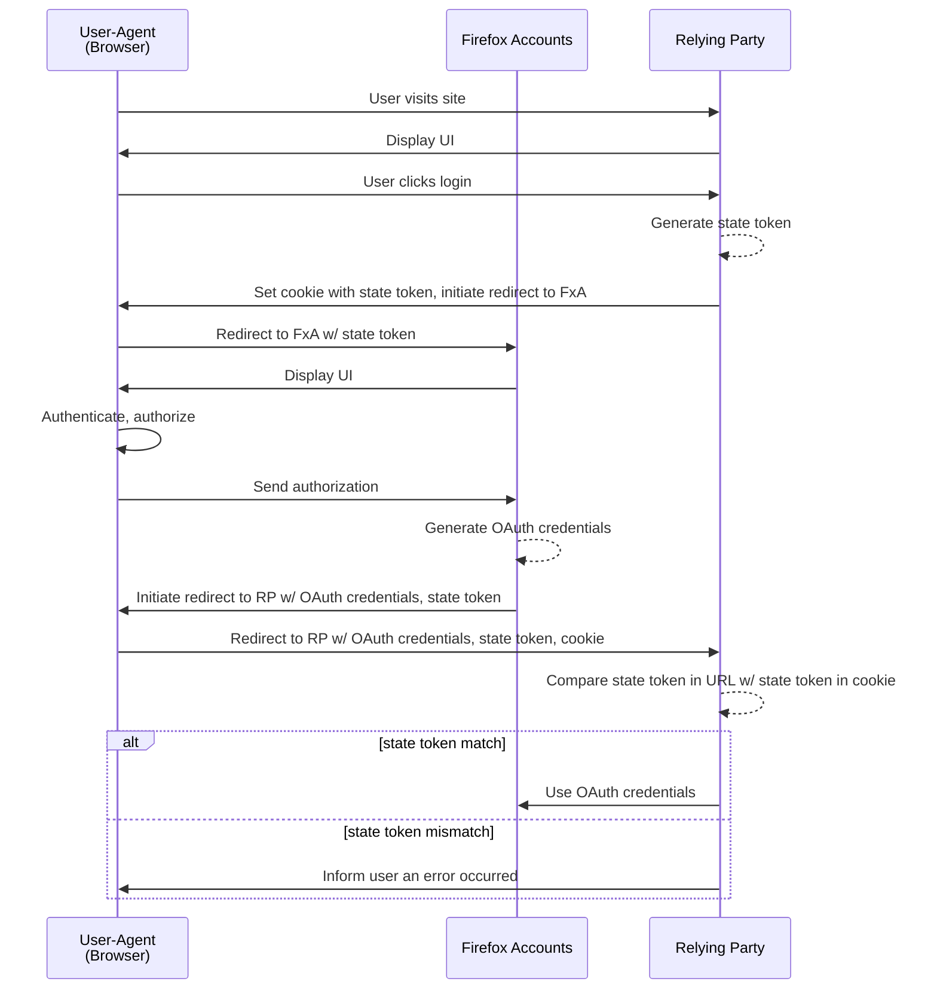

## Overview

Firefox Accounts integration is available for Mozilla groups on request. This integration is handled using [OAuth 2.0][oauth], [OpenID Connect][openidconnect], and [webhooks][webhook] for authentication, authorization, and receiving events regarding FxA users. Integrations with FxA assume the role of a [**Relying Party (RP)**][relying-party].

## Pre-Development

Before starting integration, please send a request to fxa-staff[at]mozilla.com to request a short meeting so we can all document our expectations and timelines.  Please include answers to the following questions in the email:

0. **What type of Relying Party are you integrating?**
    Examples would be, a web site, a native app, a browser, or an extension in
    the browser.

0. **Do you know how to implement OAuth?**

0. **Will you need read access to a user’s profile data?**
    See [available profile data](#profile-data).

0. **Will you need *ongoing* read access to a user’s profile data?**
    If necessary, a relying party can use a _refresh token_ to query
    for a user's profile data, whether or not that user is logged in to the
    relying party.  For example, if a user changes their email address and
    the relying party wants to update their local database with the changes.

    A refresh token is given out if `access_type=offline` when making the
    authorization request.

0. **Will you need *write* access to a user’s profile data?**
    Only the `avatar` and `displayname` can be changed remotely.  See the [API
    documentation][api-docs].

0. **Will you need to access Sync data?**
    This is likely only needed for browser integrations.  Most relying parties
    will not need this.

0. **Will you need encryption keys to encrypt user data?**
    Optionally, when a relying party gets their access token they can also get
    a stable encryption key back (this is a _scoped key_).  This key is derived
    from the user's password and **if the user changes or forgets their
    password this key will change**.

0. **Will your application display its own “enter your email” form?**
    Providing your own form can give users a tight knit experience, but you'll
    need to send your own [top of funnel
    metrics](#self-hosted-email-first-flow) if you do.

0. **Who are the stakeholders?**

0. **Who can be contacted for important updates, e.g., API changes?**

0. **What is the schedule and key dates?**
    At a minimum, when will QA start, when do you want to be live?

0. **Roughly, what amount of traffic do you expect?**

0. **Will your integration provide a subscription service?**
    If it will, please describe the products your integration will provide
    service for.

0. **Will your integration include subscription lead pages?**
    These are generally marketing pages that include a link to start the
    subscription flow.

0. **Will you utilize JWT tokens?**
    This is rare.  [Learn more](../../reference/tokens#jwt-access-tokens).

We communicate with our relying parties via the [firefox-accounts-notices group][firefox-accounts-notices].  Please join this list to avoid any surprises.

## OAuth Integration

### Development

:::note
You are encouraged to use [our staging servers](https://accounts.stage.mozaws.net/) to develop against.  Our staging server has a persistent database and changes made there are saved.  Spot testing and some new accounts are fine but you are expected to clean up any significant amount of data (eg. accounts made from automated testing).  If you're using PyFxA [here is an example](https://pypi.org/project/PyFxA/#testing-email-addresses) using `destroy_account()`.
:::

0. Review the [OAuth 2.0][oauth] documentation.
0. Register for staging OAuth credentials by filing a [deployment bug][deployment-bug]. See [OAuth credentials](#oauth-credentials).
0. Your development servers should point to: `https://oauth.stage.mozaws.net`.
0. User authentication follows the [OAuth 2.0][oauth] protocol.
0. [Query parameters](#authorization-query-parameters) are set and validate when redirecting to Firefox Accounts.
0. If you are [hosting your own login form](#self-hosted-email-first-flow) initialize and propagate the top of funnel metrics.
0. [User data and account notifications are properly](#user-data-hygiene) handled and compliant with Firefox Account requirements.
0. An icon suitable to display in Firefox Account’s [Devices & apps][devices-and-apps] list has been sent to Firefox Account developers.  Please confirm with Firefox Accounts what the current requirements are.
0. If multiple [Resource Servers][resource server] are accessed, create a distinct token for communicating with each server, limited to only the scopes required by that server.  This may mean dropping your initial access token and using a refresh token to get additional, less privileged access tokens.

### Preparing for Production

0. Update your deployment bug asking for production OAuth credentials
0. Production servers point to `https://oauth.accounts.firefox.com/`.  Additional endpoints can be discovered dynamically at `https://accounts.firefox.com/.well-known/openid-configuration`.
0. Someone from the FxA team has reviewed the integration code and tested the flow.

### User Authentication with OAuth 2.0 / OpenID Connect in a nutshell

0. Create a state token (randomly generated and unguessable) and associate it with a local session.
0. Send [/authentication request](#authorization-query-parameters) to Firefox Accounts. Upon completion, Firefox Accounts redirects back to your app with state and code.
0. Confirm the returned state token by comparing it with the state token associated with the local session.
0. Exchange the code for an access token and possibly a refresh token.
0. If you asked for `scope=profile` you can fetch user profile information, using the access token, from the FxA Profile Server.
0. Associate the profile information with the local session and create an account in the local application database as needed.

### OAuth Credentials

0. client_id - a public identifier that is used to identify your service. Can be public.
0. client_secret - a private secret that is sent from the backend when interacting with the OAuth server. Must not be shared publicly, checked into a public repository, or bundled with compiled code.

### Self Hosted Email-first Flow

0. Initialize top of funnel metrics by calling [/metrics-flow request][metrics-flow-request] with the required query parameters:
   0. `entrypoint` This is a string identifying the source of the request and
      should be agreed upon by the Firefox Accounts team.
   0. `form_type` This is either `email` or `button` depending on if you're
[self hosted email-first flow](#self-hosted-email-first-flow)
   0. `utm_source`
   0. `utm_campaign`
0. Propagate the `email`, `flow_id` and `flow_begin_time` query parameters, which are returned from the [/metrics-flow request][metrics-flow-request], in the request to `/authentication`.

To test without CORS errors using `https://stable.dev.lcip.org/`, your test application must have one of the following URLs:

- http://127.0.0.1:8001
- http://localhost:8000
- http://127.0.0.1:8000
- Or be in the [`ALLOWED_METRICS_FLOW_ORIGINS` list][allowed-metrics-flow-origins]

### Profile Data
Firefox Accounts only stores core identity data and associated profile information about users. Firefox Accounts does not store user data specific to relying services. Core identity data stored in Firefox Accounts includes:

* a stable user identifier (uid)
* the user provided email address
* the user's locale provided by the browser during account creation
* an optional display name
* an optional profile image


### /authorization query parameters

0. `client_id` (required)
0. `scope` (required). This is a space separated string. Review the list of [scopes](#scopes).
0. `state` (required).  This must be a randomly generated unguessable string.
0. `entrypoint` (required).  This is for metrics purposes and should represent
   the service making the request.  This should be agreed upon by the Firefox
   Accounts team.
0. `email` (required for [self hosted email-first flow](#self-hosted-email-first-flow))
0. `flow_begin_time` (required for [self hosted email-first flow](#self-hosted-email-first-flow))
0. `flow_id` (required for [self hosted email-first flow](#self-hosted-email-first-flow))
0. `code_challenge` (required for PKCE) This is a hash of a randomly generated
   string.
0. `code_challenge_method` (required for PKCE) As of this writing only `s256`
   is supported.
0. `action` (suggested).  This should be either `email` or `force_auth`.
0. `access_type` (suggested).  This should be either `online` or `offline`.
0. `utm_campaign` (suggested)
0. `utm_source` (suggested)
0. `utm_medium` (optional)
0. `utm_term` (optional)

### Scopes

This will probably just be `scope=profile` for most relying parties, but there is
[further documentation][fxa-scope-documentation].

### User Data Hygiene

0. Accounts should use uid rather than email address as the primary key. An account’s primary email address can change.
0. [Primary email changed notifications](https://github.com/mozilla/fxa-auth-server/blob/master/docs/service_notifications.md#change-of-primary-email-address-event) should update the contact email stored with the account.
0. If profile information is stored, register for [#webhook-events] events or periodically refresh the profile information by using refresh token to create a fresh access token that can fetch profile information.
0. [Account deletion notifications](https://github.com/mozilla/fxa-auth-server/blob/master/docs/service_notifications.md#account-deletion-event) should remove any server side data related to the user.
0. Profile information should not be shared with 3rd parties without explicit consent.
0. [Destroy any outstanding access tokens and refresh tokens](https://github.com/mozilla/fxa-auth-server/blob/master/fxa-oauth-server/docs/api.md#post-v1destroy) whenever a user signals their session or account should be terminated, e.g., the user signs out of your site, closes their account on your site, or unsubscribes from all functionality.

### Webhook Events

If your integration includes an application service that stores profile information, you should create a [webhook] URL handler to handle [Security Event Tokens (SET)][set] for [Relying Party events][rp events]. These events will need to be verified using the FxA JWT keys that can be found from following the `jwks_uri` in the FxA well-known open-id configuration. For production, this URL is `https://accounts.firefox.com/.well-known/openid-configuration`.

The FxA JWT public keys should be retrieved from this URL at start-up, and used to verify the webhook JWT. The [documentation on verifying a JWT](https://docs.aws.amazon.com/cognito/latest/developerguide/amazon-cognito-user-pools-using-tokens-verifying-a-jwt.html) for Step 1/2 are applicable to FxA JWT events.

If you're using TypeScript, an example of verifying a JWT is shown here:

```typescript
import http from 'http';
import jwt from 'jsonwebtoken';
import jwkToPem from 'jwk-to-pem';


function authenticate(request: http.IncomingMessage): object {
    // Assuming this is how you retrieve your auth header.
    const authHeader = request.headers.authorization;

    // Require an auth header
    if (!authHeader) {
        throw Error('No auth header found');
    }

    // Extract the first portion which should be 'Bearer'
    const headerType = authHeader.substr(0, authHeader.indexOf(' '));
    if (headerType !== 'Bearer') {
        throw Error('Invalid auth type');
    }

    // The remaining portion, which should be the token
    const headerToken = authHeader.substr(authHeader.indexOf(' ') + 1);

    // Decode the token, require it to come out ok as an object
    const token = jwt.decode(headerToken, { complete: true });
    if (!token || typeof token === 'string') {
        throw Error('Invalid token type');
    }

    // Verify we have a key for this kid, this assumes that you have fetched
    // the publicJwks from FxA and put both them in an Array.
    const jwk = publicJwks.find(j => j.kid === token.header.kid);
    if (!jwk) {
        throw Error('No jwk found for this kid: ' + token.header.kid);
    }
    const jwkPem = jwkToPem(jwk);

    // Verify the token is valid
    const decoded: string | object = jwt.verify(headerToken, jwkPem, {
        algorithms: ['RS256'],
    });
    if (!isIdToken(decoded)) {
        throw Error('Invalid token format: ' + decoded);
    }
    // This is the JWT data itself.
    return decoded;
}
```

Webhooks are processed from our event broker service. Currently, we emit events for password change, profile change, subscription change and delete account.

For additional documentation please reference the [readme](https://github.com/mozilla/fxa/blob/main/packages/fxa-event-broker/README.md).

### Register for webhooks

Once you have setup a service to receive webhook events, you can then register the webhook url by creating a pull request in [cloudops-infra](https://github.com/mozilla-services/cloudops-infra). To edit webhooks coming from FxA stage, you'll need to edit [projects/fxa/tf/nonprod/envs/stage/resources/eventbroker.tf](https://github.com/mozilla-services/cloudops-infra/blob/master/projects/fxa/tf/nonprod/envs/stage/resources/eventbroker.tf#L16-L77). To edit webhooks coming from FxA prod you'll need to edit [projects/fxa/tf/prod/envs/prod/resources/eventbroker.tf](https://github.com/mozilla-services/cloudops-infra/blob/master/projects/fxa/tf/prod/envs/prod/resources/eventbroker.tf#L16-L82). You'll need to add your client id to `endpoint_topic_config`, and your webhook url to `endpoint_subscription_config`. See an [example PR](https://github.com/mozilla-services/cloudops-infra/pull/3727).

## Some flow diagrams

### A full oauth flow



[allowed-metrics-flow-origins]: https://github.com/mozilla/fxa-dev/blob/docker/roles/content/tasks/main.yml#L56
[api-docs]: https://github.com/mozilla/fxa/blob/main/packages/fxa-profile-server/docs/API.md#api-endpoints
[deployment-bug]: https://bugzilla.mozilla.org/enter_bug.cgi?assigned_to=nobody%40mozilla.org&bug_ignored=0&bug_severity=normal&bug_status=NEW&cf_fx_iteration=---&cf_fx_points=---&cf_status_firefox65=---&cf_status_firefox66=---&cf_status_firefox67=---&cf_status_firefox_esr60=---&cf_tracking_firefox65=---&cf_tracking_firefox66=---&cf_tracking_firefox67=---&cf_tracking_firefox_esr60=---&cf_tracking_firefox_relnote=---&component=Operations%3A%20Deployment%20Requests&contenttypemethod=list&contenttypeselection=text%2Fplain&defined_groups=1&flag_type-37=X&flag_type-5=X&flag_type-607=X&flag_type-708=X&flag_type-721=X&flag_type-737=X&flag_type-748=X&flag_type-787=X&flag_type-800=X&flag_type-803=X&flag_type-846=X&flag_type-864=X&flag_type-929=X&flag_type-935=X&form_name=enter_bug&groups=mozilla-employee-confidential&maketemplate=Remember%20values%20as%20bookmarkable%20template&op_sys=Unspecified&priority=--&product=Cloud%20Services&rep_platform=Unspecified&target_milestone=---&version=unspecified
[devices-and-apps]: https://accounts.firefox.com/settings/clients
[fxa-scope-documentation]: https://github.com/mozilla/fxa/blob/main/packages/fxa-auth-server/docs/oauth/scopes.md
[firefox-accounts-notices]: https://groups.google.com/a/mozilla.com/g/firefox-accounts-notices
[metrics-flow-request]: https://mozilla.github.io/application-services/docs/accounts/metrics.html#self-hosted-email-forms-and-metrics-tracking-aka-the-fxa-email-first-flow
[oauth]: https://auth0.com/docs/protocols/oauth2
[openidconnect]: https://openid.net/connect/
[profile-data]: https://mozilla.github.io/application-services/docs/accounts/faq.html#what-information-does-firefox-accounts-store-about-the-user
[resource server]: https://www.oauth.com/oauth2-servers/the-resource-server/
[relying-party]: https://en.wikipedia.org/wiki/Relying_party
[rp events]: https://github.com/mozilla/fxa/tree/main/packages/fxa-event-broker#relying-party-event-format
[set]: https://tools.ietf.org/html/rfc8417
[webhook]: https://en.wikipedia.org/wiki/Webhook
