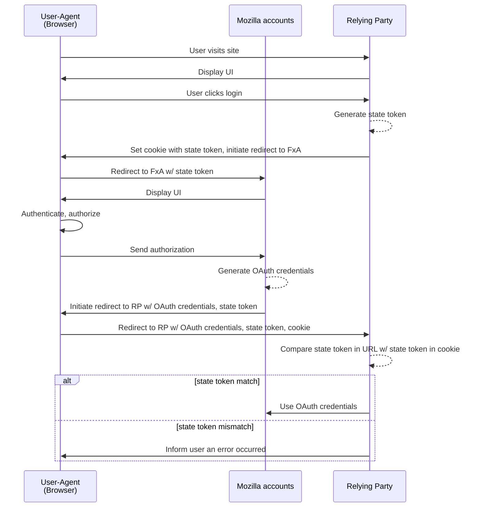

Last updated: `March 18th, 2026`

## Overview

Mozilla accounts integration is available for Mozilla groups on request using [OpenID Connect (OIDC)][openidconnect] and [OAuth 2.0][oauth]. Your service becomes a [Relying Party (RP)][relying-party] that authenticates users through Mozilla accounts.

:::note
This tutorial covers integration steps. You must also meet [ongoing integration requirements](/relying-parties/reference/integration-requirements) to maintain uninterrupted service.
:::

## What You Need to Provide

Before you can integrate, gather the following information:

| Item | Description | Required |
|------|-------------|----------|
| **OAuth Redirect URLs** | Where FxA redirects after authentication (one for stage, one for production) | Yes |
| **Webhook URLs** | Endpoint to [receive account events](#step-3-set-up-webhook-handler) (password changes, deletions, etc.) | Yes |
| **Service Icon** | Displayed in users' [Connected Services][connected-services] list. Confirm current specs with the FxA team. | No |
| **Technical Contact** | Email for API changes and critical updates | Yes |
| **Expected Traffic** | Rough estimate of authentication volume | Yes |
| **Integration Type** | Web app, native app, browser, API, or extension | Yes |

## Quick Start (for experienced OAuth/OIDC developers)

If you're familiar with OAuth 2.0 and OIDC:

1. File a Jira issue in the FXA project requesting OAuth credentials (include info from the table above)
2. Join the [firefox-accounts-notices group][firefox-accounts-notices] for updates
3. Use staging endpoints for development:
   - Authorization: `https://accounts.stage.mozaws.net/authorization`
   - Token: `https://oauth.stage.mozaws.net/v1/token`
   - Profile: `https://profile.stage.mozaws.net/v1/profile`
4. Implement standard OIDC authorization code flow
5. Set up webhook handler for account events
6. Request production credentials when ready

Discovery document: `https://accounts.stage.mozaws.net/.well-known/openid-configuration`

## How the Flow Works


```mermaid
sequenceDiagram
participant UA as User-Agent<br>(Browser)
participant FxA as Mozilla accounts
participant RP as Relying Party

UA->>RP: User visits site
RP->>UA: Display UI
UA->>RP: User clicks login
RP-->>RP: Generate state token
RP->>UA: Set cookie with state token, initiate redirect to FxA
UA->>FxA: Redirect to FxA w/ state token
FxA->>UA: Display UI
UA->>UA: Authenticate, authorize
UA->>FxA: Send authorization
FxA-->>FxA: Generate OAuth credentials
FxA->>UA: Initiate redirect to RP w/ OAuth credentials, state token
UA->>RP: Redirect to RP w/ OAuth credentials, state token, cookie
RP-->>RP: Compare state token in URL w/ state token in cookie
alt state token match
  RP->>FxA: Use OAuth credentials
else state token mismatch
  RP->>UA: Inform user an error occurred
end
```

## Step-by-Step Integration Guide

### Step 1: Request OAuth Credentials

File an issue in the FXA project in [Mozilla's Jira](https://mozilla-hub.atlassian.net) with:

**Required Information:**
- OAuth redirect URLs (stage and production)
- Webhook notification URL
- Integration type (web app, native app, etc.)
- Technical contact email
- Expected traffic estimate
- Service icon

**Tell Us About Your Needs:**
- Do you need ongoing access to profile data when users aren't logged in? (requires refresh tokens with `access_type=offline`)
- Do you need to write profile data? (only `avatar` and `displayName` are writable via the [API][api-docs])
- Do you need encryption keys derived from the user's password? (scoped keys - note these change if the user changes their password)
- Will this be a subscription/paid service?
- Will you have subscription lead/marketing pages?

Most integrations are **Relying Parties** (user-facing apps where users log in). If you're building an API that other services call using tokens, you may be a **Resource Server** - [see the distinction below](#relying-party-vs-resource-server).

You'll receive:
- `client_id` - public identifier for your service
- `client_secret` - private secret for backend token exchanges (never expose publicly or commit to repositories)

**Note:** Request separate credentials for each platform (e.g., web, iOS, Android).

### Step 2: Implement the Authorization Flow

Build the authorization URL with these parameters:

| Parameter | Required | Description |
|-----------|----------|-------------|
| `client_id` | Yes | Your OAuth client ID |
| `scope` | Yes | Space-separated scopes (usually `profile`) |
| `state` | Yes | Your random state token |
| `redirect_uri` | Yes | Must match registered redirect URL |
| `response_type` | Yes | Use `code` |
| `code_challenge` | No | Only needed if using PKCE. (SHA256 hash of verifier) |
| `code_challenge_method` | No | Only needed if using PKCE. Only `S256` is supported |
| `access_type` | Recommended | `online` or `offline` (offline gives refresh tokens) |
| `action` | Recommended | `email` or `force_auth` |
| `entrypoint` | Recommended | Metrics identifier (coordinate with FxA team) |
| `utm_campaign` | No | |
| `utm_source` | No | |
| `utm_medium` | No | |
| `utm_term` | No | |


### Step 3: Set Up Webhook Handler

FxA sends [Security Event Tokens (SET)][set] via webhooks when users change passwords, update profiles, change subscriptions, or delete accounts. You must handle these events.

#### Register Your Webhook

Create a pull request in [cloudops-infra](https://github.com/mozilla-services/cloudops-infra) (FxA can help with this if needed):
- **Stage:** Edit [projects/fxa/tf/nonprod/envs/stage/resources/eventbroker.tf](https://github.com/mozilla-services/cloudops-infra/blob/master/projects/fxa/tf/nonprod/envs/stage/resources/eventbroker.tf)
- **Production:** Edit [projects/fxa/tf/prod/envs/prod/resources/eventbroker.tf](https://github.com/mozilla-services/cloudops-infra/blob/master/projects/fxa/tf/prod/envs/prod/resources/eventbroker.tf)

Add your `client_id` to `endpoint_topic_config` and webhook URL to `endpoint_subscription_config`. See [example PR](https://github.com/mozilla-services/cloudops-infra/pull/3727).

#### Verify and Handle Events

Webhooks are JWTs signed by FxA. Verify them using FxA's public keys from the JWKS endpoint (found via `jwks_uri` in the [discovery document](https://accounts.firefox.com/.well-known/openid-configuration)).  Here is an example in typescript:

```typescript
import jwt from 'jsonwebtoken';
import jwkToPem from 'jwk-to-pem';

// Fetch and cache these at startup from the jwks_uri
let publicJwks: Array<{ kid: string; [key: string]: any }>;

// Your client_id, provided when you registered your OAuth credentials
const CLIENT_ID = 'your_client_id';

async function verifyWebhook(authHeader: string): Promise<object> {
  if (!authHeader?.startsWith('Bearer ')) {
    throw new Error('Invalid authorization header');
  }

  const token = authHeader.slice(7);
  const decoded = jwt.decode(token, { complete: true });

  if (!decoded || typeof decoded === 'string') {
    throw new Error('Invalid token');
  }

  const jwk = publicJwks.find(j => j.kid === decoded.header.kid);
  if (!jwk) {
    throw new Error(`Unknown key ID: ${decoded.header.kid}`);
  }

  return jwt.verify(token, jwkToPem(jwk), {
    algorithms: ['RS256'],
    issuer: 'https://accounts.firefox.com',
    audience: CLIENT_ID,
  });
}

app.post('/webhook', async (req, res) => {
  try {
    const event = await verifyWebhook(req.headers.authorization);

    // Handle the event based on type
    // Events: password-change, profile-change, subscription-state-change, delete-user

    res.status(200).send('OK');
  } catch (error) {
    console.error('Webhook verification failed:', error);
    res.status(401).send('Unauthorized');
  }
});
```

**Important:** Resource Servers must return 200 even for unknown users. See [event broker documentation](https://github.com/mozilla/fxa/blob/main/packages/fxa-event-broker/README.md) for event formats.

### Step 4: Test on Staging

:::note
Use [staging servers](https://accounts.stage.mozaws.net/) for development. The staging database is persistent. Clean up test accounts when done - if using PyFxA, [use `destroy_account()`](https://pypi.org/project/PyFxA/#testing-email-addresses).
:::

Verify:
- Users can authenticate and your app receives profile data
- Refresh tokens work (if using `access_type=offline`)
- Webhooks are received and processed correctly
- Error cases are handled gracefully

## Production Checklist

Before going live:

- [ ] Request production OAuth credentials via your Jira issue
- [ ] Use production endpoints:
  - Discovery: `https://accounts.firefox.com/.well-known/openid-configuration`
  - OAuth: `https://oauth.accounts.firefox.com/`
- [ ] Register production webhook URL
- [ ] Submitted your service icon
- [ ] Joined [firefox-accounts-notices][firefox-accounts-notices] mailing list

## Reference

### Profile Data

Mozilla accounts stores minimal identity data:

| Field | Description |
|-------|-------------|
| `uid` | Stable user identifier |
| `email` | User's email address |
| `locale` | Browser locale at account creation |
| `displayName` | Optional display name |
| `avatar` | Optional profile image URL |

### Scopes

Most integrations need only `scope=profile`. For advanced scopes (Resource Servers, Sync access), see [OAuth scopes documentation](/reference/oauth-details#oauth-scopes).

### Relying Party vs Resource Server

| | Relying Party | Resource Server |
|--|--------------|-----------------|
| **What it is** | User-facing app with login | API accessed by other services |
| **User sees login?** | Yes | No |
| **Appears in Connected Services?** | Yes, as distinct entry | No (shows as parent service) |
| **Receives ALL account events (not just users who have signed in to that specific service)?** | No | Yes |
| **Examples** | Websites, apps | Sync, Relay APIs |

Most integrations are Relying Parties. Resource Servers are typically internal Mozilla services accessed via Firefox's OAuth token.

[api-docs]: https://github.com/mozilla/fxa/blob/main/packages/fxa-profile-server/docs/API.md#api-endpoints
[connected-services]: https://accounts.firefox.com/settings#connected-services
[firefox-accounts-notices]: https://groups.google.com/a/mozilla.com/g/firefox-accounts-notices
[metrics-flow-request]: https://mozilla.github.io/application-services/docs/accounts/metrics.html#self-hosted-email-forms-and-metrics-tracking-aka-the-fxa-email-first-flow
[oauth]: https://auth0.com/docs/protocols/oauth2
[openidconnect]: https://openid.net/connect/
[relying-party]: https://en.wikipedia.org/wiki/Relying_party
[resource server]: https://www.oauth.com/oauth2-servers/the-resource-server/
[rp events]: https://github.com/mozilla/fxa/tree/main/packages/fxa-event-broker#relying-party-event-format
[set]: https://tools.ietf.org/html/rfc8417
