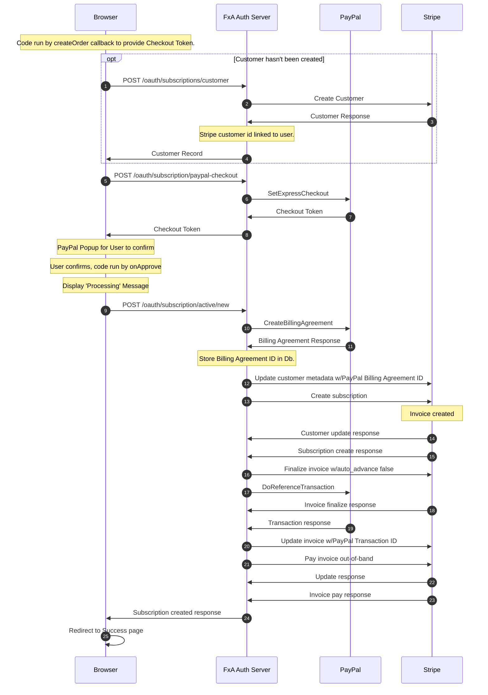

## Getting Started

Current as of `Jan 24, 2022`.

### Pre-Development

To begin working on the subscription platform in the FxA codebase, you will need access to a Stripe account for private and public API developer keys.

If you're a Mozilla employee, you can request access to the Stripe dev (and/or stage) account, created for the FxA Subscription Platform team to easily connect with fake products and plans. Otherwise, you can create your own Stripe account to use for testing that is not linked to any bank account information with your own products and plans. These keys should be taken from Stripe's test environment which you can verify by checking that the key includes the word `test`.

The `fxa-payments-server` needs the Stripe public key (`pk`) and communicates with the `fxa-auth-server` that requires a Stripe private or secret key (`sk`).¹ These can be found in the Stripe Dashboard, and configuration details can be found below.

¹ We have, in the past, given out restricted keys for use (`rk`). We may choose to do this again in the future or even use them in our dev environment.

### Configuration

You will need to create the file `fxa/packages/fxa-auth-server/config/secrets.json` and specify `subscriptions.stripeApiKey` with the value of your private Stripe API key. Ensure the key begins with `sk_test` to guarantee you are using the secret key and testing in the correct environment.

Ex:

```json
{
  "subscriptions": {
    "stripeApiKey": "sk_test_####"
  }
}
```

Additionally create the file `fxa/packages/fxa-payments-server/server/config/secrets.json` and specify `stripe.apiKey` to override the default Mozilla Stripe public API key with your own public key:

```json
{
  "stripe": {
    "apiKey": "pk_test_####"
  }
}
```

:::note
Note that neither `secrets.json` files are tracked in Git, and they take precedence over each server's default configurations, should you need to make any additional local-only modifications.
:::

#### Stripe Product/Plans

To see the available products or create a new one in the Stripe dashboard, navigate to Billing > Products and click into one of the products to see information including the product name, product ID, plan name, plan ID, metadata, logs, and events.

If you are using a new Stripe account, you will need to setup a product and its plan. The product should have additional metadata configured as needed.

:::note
Product Names are the canonical displayed name shown in Sub Plat UI. In some cases these may be paired with a plan's billing interval. Plan names are not displayed to users.
:::

##### Product Metadata {#stripe-product-metadata}

| Key | Description |
| --- | --- |
| ~~downloadURL~~                             | Deprecated. This field has been replaced by successActionButtonURL.                         |
| product:privacyNoticeURL                  | Required. The URL for the webpage containing the Privacy Notice for the product offering.   |
| product:termsOfServiceURL                 | Required. The URL for the webpage containing the Terms of Service for the product offering. |
| product:termsOfServiceDownloadURL         | Required. The URL for a downloadable version of the Terms of Service for the product offering, used in emails. This must be a URL to the FxA CDN at <https://accounts-static.cdn.mozilla.net>. It can be either a) full, direct URL to a PDF (e.g. <https://accounts-static.cdn.mozilla.net/legal/Mozilla_VPN_ToS/en-US.pdf>), or, b) a URL without the language and file extension (e.g. <https://accounts-static.cdn.mozilla.net/legal/mozilla_vpn_tos>). See the ["Legal Document Download URL"](#legal-document-download-url) section for more information.                                |
| webIconURL                                | Required. Image URL for product icon in web content. This must be a URL to the FxA CDN at <https://accounts-static.cdn.mozilla.net>.          |
| webIconBackground                         | Optional. A valid css color, color name or gradient for display behind your product icon on the web. Defaults to `#20123a`         |
| name                                      | Optional. Title string override for the product name.  |
| name:{locale}                             | Optional. Localized title string override for the product name.  |
| capabilities                              | Required if `capabilities:{clientID}` is not provided. Comma-separated list of capabilities enabled by this product for all Relying Parties.                                                                                                   |
| capabilities:{clientID}                   | Required if `capabilities` is not provided. Comma-separated list of capabilities enabled by this product for the Relying Party identified by {clientID}. |
| emailIconURL                              | Optional. Image URL for product icon in email content. This must be a URL to the FxA CDN at <https://accounts-static.cdn.mozilla.net>. |
| appStoreLink                              | Optional. The App store download URL for the product. |
| playStoreLink                             | Optional. The google play store download URL for the product. |
| productSet                                | Optional. An arbitrary string used to group products in a set of upgrades & downgrades. |
| productOrder                              | Optional. A number used for sorting products in a set. |
| product:cancellationSurveyURL             | Optional. Override URL for the Cancellation Survey for the product offering. This parameter is used as a hyperlink in emails sent to the customer when their subscription is cancelled due, manual cancellation, FxA Account deletion, or failed payment.|
| product:details:{n}                       | Optional. Bullet-point feature details for the product, where {n} is a number or ordering the points. |
| product:details:{n}:{locale}              | Optional. Localized string override for product:details:{n}, where {locale} is the locale (e.g. fr-FR, zh-CN, de, etc). |
| product:privacyNoticeURL:{locale}         | Optional. Localized override URL for the webpage containing the Privacy Notice for the product offering. |
| product:privacyNoticeDownloadURL          | Optional. The URL for a downloadable version of the Privacy Notice for the product offering. This has the same requirements as product:termsOfServiceDownloadURL. |
| product:termsOfServiceURL:{locale}        | Optional. Localized override URL for the webpage containing the Terms of Service for the product offering. |
| product:subtitle                          | Optional. A subtitle for the product, usually displayed beneath the name in UI. |
| product:subtitle:{locale}                 | Optional. Localized string override for product:subtitle, where {locale} is the locale (e.g. fr-FR, zh-CN, de, etc). |
| successActionButtonLabel          | Optional. An alternative label for the subscription success action button. The action is specified by `successActionButtonURL`. |
| successActionButtonLabel:{locale} | Optional. Localized override for the alternative label for the subscription success action button. |
| promotionCodes                            | Optional. A comma separated list of promotion codes that are valid for the product. |
| support:app:{x}                           | Optional. An app or service for the support form. The form options will be in the same order as the metadata. These values shouldn't be too long as they are displayed in dropdown options of limited width. The `{x}` part of the key can be any string and will not be used anywhere; the value of the metadata is submitted to Zendesk. |
| successActionButtonURL                    | Required. The download or subscription success action URL for the product. (Replaces downloadURL) |
| upgradeCTA                                | Optional. HTML content string describing available upgrades from this plan. By convention, should include a link back to a product lead page. That lead page links back to FxA's plan subscription pages. |

##### Plan Metadata {#stripe-plan-metadata}
| Key | Description |
| --- | --- |
| appStoreProductIds                        | Optional. _Plan metadata only._ Comma-separated list of Apple App Store [`productIds`](https://developer.apple.com/documentation/appstoreserverapi/productid) that map to this plan. |
| playSkuIds                                | Optional. _Plan metadata only._ Comma-separated list of [Google Play product SKUs (now called product IDs)](https://developer.android.com/google/play/billing/terminology#concepts) that map to this plan. |


##### Product Configuration Documents

:::info
This section is for an upcoming feature that is not yet in production.  Please
continue to use [Stripe product metadata](#stripe-product-metadata) to
configure your subscription products.
:::

While the [Stripe product and plan metadata](https://stripe.com/docs/api/metadata) has enable the Subscription Platform to quickly develop many features, it has multiple shortcomings.

* There are limits on the number of entries and the size of the keys and
  values.  The limit for the number of entries is rather low.
* The strings only key-value pair format necessitates potentially confusing key
  formats and key parsing in code.
* A reliance on Stripe metadata for subscription product configurations means
  the Subscription Platform need to define plans in Stripe for subscription
  plans that are not Stripe based (e.g. App Store subscriptions).

The overcome these limits, the team is moving to [JSON](https://www.json.org)
document based product configurations.  For readability, the configuration is
described below in multiple sections.  To see the overall format of the
configuration documents, take a look at the following sample documents:
* [Sample Product Configuration Document](../assets/product-configs/sample-product-config-doc.json)
* [Sample Plan Configuration Document](../assets/product-configs/sample-plan-config-doc.json)

:::tip
A value in a plan configuration can be used to override the product configuration value.  Another way to think of this is that the values in the product configuration are the defaults for the product's plans.
:::

:::info
The Subscription Platform team is currently developing the process to update these configuration documents.  Documentation for that is forthcoming.
:::

###### Top Level Configuration Document Values

The configuration document is a JSON object.  The top level keys for that object are below.  A property is required unless otherwise noted.

| Key                | Description |
| ------------------ | ----------- |
| id                 | Optional. An identifier for the system storing the document.  It's not intended for manual edits.|
| productConfigId    | _Plan configuration only_.  The identifier of the product configuration document from which the plan configuration inherits its default values.  It's not intended for manual edits.|
| stripeProductId    | Optional. _Product configuration only_.  The [id of the Stripe product](https://stripe.com/docs/api/products/object#product_object-id) for which this document is providing configuration. |
| stripePriceId      | Optional. _Plan configuration only_. The [id of the Stripe price](https://stripe.com/docs/api/prices/object#price_object-id) for which this document is providing configuration. |
| active             | Boolean.  A status to indicate whether the product or plan is accepting new subscriptions. |
| capabilities       | Object.  See [Capabilities Configuration](#production-config-capabilities) below.      |
| productSet         | Optional.  An arbitrary string used to group products in a set of upgrades & downgrades. |
| productOrder       | Optional.  _Plan configuration only_.  A number used to determine a subscription change is an upgrade or a downgrade within the productSet. |
| appStoreProductIds | Optional. _Plan configuration only._ Comma-separated list of Apple App Store [`productIds`](https://developer.apple.com/documentation/appstoreserverapi/productid) that map to this plan. |
| playSkuIds         | Optional. _Plan configuration only._ Comma-separated list of [Google Play product SKUs (now called product IDs)](https://developer.android.com/google/play/billing/terminology#concepts) that map to this plan. |
| promotionCodes     | Optional.  Array of strings.  A list of Stripe promotion codes that are valid for the product or plan. |
| styles             | Object.  Currently the only key in this object is `webIconBackground`, and the value must be a valid CSS color, color name or gradient.  The background color is displayed behind the product icon from the [URLs](#product-config-urls) configuration. Defaults to `#20123a`. |
| support            | Object.  Currently the only key in this object is `app`.  The value is an array of strings that are apps and services for the support form.  The form options will be in the same order the configuration.  These values shouldn't be too long as they are displayed in dropdown options of limited width.  The value is submitted to Zendesk. |
| urls               | Object.  See [URLs Configuration](#product-config-urls) below. |
| uiContent          | Object.  See [UI Content Configuration](#product-config-ui-content) below. |
| locales            | Object.  See [Locales Configuration](#product-config-locales). |

###### Capabilities Configuration {#production-config-capabilities}

See [Capabilities](./../relying-parties/reference/sub-plat-overview.md#capability) for an overview.

This is an object where the keys are: `*` or a relying party client ID.  The values are arrays of capabilities.  At least one key must be present.

| Key                | Description |
| ------------------ | ----------- |
| * | Array.  Capabilities enabled by this product for all Relying Parties. |
| {clientID} | Array.  Capabilities enabled by this product for the Relying Party identified by {clientID}. |

###### URLs Configuration {#product-config-urls}

An object where the values are URLs used in the subscription experience.

| Key                | Description |
| ------------------ | ----------- |
| appStore | Optional. The App Store download URL for the product. |
| playStore | Optional. The Google Play store download URL for the product. |
| webIcon | Image URL for the product icon in web content. This must be a URL to the FxA CDN at <https://accounts-static.cdn.mozilla.net>. |
| emailIcon | Optional. Image URL for the product icon in email content. This must be a URL to the FxA CDN at <https://accounts-static.cdn.mozilla.net>. |
| successActionButton | The download or subscription success action URL for the product after a successful subscription sign-up. |
| privacyNotice | The URL for the webpage containing the Privacy Notice for the product offering. |
| privacyNoticeDownload | Optional. The URL for a downloadable version of the Privacy Notice for the product offering. This has the same requirements as `termsOfServiceDownload` (see below). |
| termsOfService | The URL for the webpage containing the Terms of Service for the product offering. |
| termsOfServiceDownload | The URL for a downloadable version of the Terms of Service for the product offering, used in emails. This must be a URL to the FxA CDN at <https://accounts-static.cdn.mozilla.net>. It can be either a) full, direct URL to a PDF (e.g. <https://accounts-static.cdn.mozilla.net/legal/Mozilla_VPN_ToS/en-US.pdf>), or, b) a URL without the language and file extension (e.g. <https://accounts-static.cdn.mozilla.net/legal/mozilla_vpn_tos>). See the ["Legal Document Download URL"](#legal-document-download-url) section for more information. |
| cancellationSurvey | Optional. Override URL for the Cancellation Survey for the product offering. It is used as a link in the email sent to the customer when their subscription is cancelled. |

###### UI Content Configuration {#product-config-ui-content}

An object with configuration values used as web UI content.

| Key                | Description |
| ------------------ | ----------- |
| subtitle | Optional. A subtitle for the product, usually displayed beneath the name in UI. |
| details | Optional. An array of bullet-point feature details for the product.  The list items will be displayed in the order they appear in the array. |
| successActionButtonLabel | Optional. An alternative label for the subscription success action button. The action is specified by `successActionButton` in the [URLs](#product-config-urls).|
| upgradeCTA | Optional. HTML content string describing available upgrades from this plan. By convention, it should include a link back to a product lead page. That lead page links back to FxA's plan subscription pages. |

###### Locales Configuration {#product-config-locales}

An optional object used for localisation.  It uses language tags as keys (e.g. `en`, `en-CA`, `es`) and the value is an object with the keys `support`, `uiContent`, and `urls`.

| Key                | Description |
| ------------------ | ----------- |
| {language-tag}     | Object with the follow key to value mapping: `support` - the support configuration object, `uiContent` - the [UI content configuration](#product-config-ui-content), `urls` - the [URLs configuration object](#product-config-urls). |

###### Legal Document Download URL {#legal-document-download-url}

For the legal document download URL configurations values, they can be in the
form of an incomplete URL, as they will be handled by a redirect endpoint that
tries to best match the user's locale to a localized version of the document.
For example, if the value of the Terms of Service URL is
'https://accounts-static.cdn.mozilla.net/legal/mozilla_vpn_tos' and the user's
locale is `de`, then the endpoint will redirect the user to
<https://accounts-static.cdn.mozilla.net/legal/mozilla_vpn_tos.de.pdf>.

##### Subscription Metadata

| Key                       | Value                                                                                          |
| ------------------------- | ---------------------------------------------------------------------------------------------- |
| previous_plan_id          | The value of the previous plan that the user had been subscribed to.                           |
| plan_change_date          | Unix timestamp of the date the plan was changed.                                               |
| cancelled_for_customer_at | Unix timestamp of the date when the subscription was cancelled for the customer through FxA UI |

## Navigating the Payment Flow

Once your API keys are set, restart the affected servers (`auth` or `payments`) if needed.

Reference the [workflow](../how-tos/creating-an-account-locally) section of the FxA docs to sign up for and verify an account. You should now be able to access the payment flow at:

```
http://localhost:3030/subscriptions/products/{productId}?plan={planId}
```

The `productId` should match the ID from a product taken from the Stripe dashboard. The `plan` parameter is optional, unless you want to specify a plan.  Otherwise, if the product has multiple plans, the first one in the list as returned by Stripe is used.  If you are running the entire FxA stack and are using the keys from the Stripe FxA dev account, you can navigate to `123done` on port `:8080` to click on the link beginning with "Subscribe" to reach the form with a prepopulated product.

Enter any name, valid expiration date, CVC number, and any card number from the [Stripe test cards docs](https://stripe.com/docs/testing#cards) to successfully create a test subscription.

Navigate back to `http://localhost:3030/subscriptions` to manage your subscriptions.

## Understanding Subscription Status

Stripe defines the [valid states a subscription status can be in their API docs](https://stripe.com/docs/api/subscriptions/object#subscription_object-status).
Since `incomplete` and `incomplete_expired` are subscriptions that have never been paid, FxA ignores them except for the following condition: if a user with a subscription in an `incomplete` state successfully enters valid payment information, the `incomplete` subscription will be paid and activated.

FxA's Stripe account is configured to not allow subscriptions to become `unpaid` and will cancel the subscription instead.

The last 4 states are `active`, `trialing`, `past_due`, and `cancelled`. The first three of these are considered active for the purposes of allowing the user access to the capabilities provided by the subscription, while `cancelled` subscriptions grant none.

### Stripe Radar and Payment Blocking

We use [Stripe Radar](https://stripe.com/docs/radar/rules) to block payments from both potentially abusive sources as well as from potential subscribers in currently unsupported regions. Our production radar rules are [documented in Mana](https://mana.mozilla.org/wiki/display/FJT/Stripe+Radar+Rules).

## Interactions with Stripe

### Payments Server

The payments server is an isolated service that serves all subscription related
pages that utilize the Stripe Javascript SDK. It's isolated from the primary FxA
domain to comply with constraints on 3rd party Javascript on pages handling FxA
authentication.

When a subscription page is loaded, the React application served by the payment
server:

1. Loads the Stripe Javascript SDK (for tokenizing credit cards)
2. Makes direct OAuth authenticated API calls to [account](https://github.com/mozilla/fxa/blob/main/packages/fxa-auth-server/docs/api.md#account)/[subscription endpoints][]
   on the Auth Server as needed

The payments server handles the payment flow as well as serving pages for managing
a user's subscription that are linked from the Settings page.

[subscription endpoints]: https://github.com/mozilla/fxa/blob/main/packages/fxa-auth-server/docs/api.md#subscriptions

### Auth Server

FxA's Auth Server makes Stripe API calls for authenticated FxA users via its [subscription
endpoints][]. Stripe updates are sent back to the Auth Server via Stripe webhooks when a
users subscription has been created/updated/deleted.

Some Stripe webhooks will trigger emails.  These emails are behind a feature flag.  If you wish to send emails in your environment, set the auth server configuration

```json
{
  "subscriptions": {
    "transactionalEmails": {
      "enabled": true
    }
  }
}
```

or the environment variable `SUBSCRIPTIONS_TRANSACTIONAL_EMAILS_ENABLED` to "true".  In order to receive Stripe webhook events in your local development, you need to use the [Stripe CLI](https://stripe.com/docs/stripe-cli/webhooks)'s event forwarding feature.  (For how to view these and other FxA emails, see [the FxA README section on MailDev](https://github.com/mozilla/fxa/#running-with-maildev).)

## PayPal Integration

PayPal can be configured as an additional payment provider in the Subscription Platform.  PayPal's [Express Checkout Reference Transactions](https://developer.paypal.com/docs/archive/express-checkout/integration-guide/ECReferenceTxns/) is the feature that enables the Subscription Platform to use PayPal as a payment provider for recurring subscriptions.  The customer's PayPal Billing Agreement ID is saved for future subscription invoices.  See [the diagram below](#paypal-checkout) for details on this process.

The PayPal paid subscriptions are still driven by Stripe's subscription and invoicing model.  The key difference is that PayPal paid subscriptions have a [collection method](https://stripe.com/docs/api/subscriptions/object#subscription_object-collection_method) of `send_invoice`.  The [PayPal processor](#paypal-processor) is used to pay the invoices with the customer's billing agreement ID.

### PayPal Accounts

You need three types of PayPal accounts for development.

- PayPal Developer Account: allows you to access the PayPal Developer Dashboard
- Sandbox PayPal Personal Account: used for testing as the customer
- Sandbox PayPal Business Account: used for testing

To create a PayPal developer account, sign up at <https://developer.paypal.com/>.  Note that if you are a Mozilla employee, you should contact the Mozilla PayPal admin in Finance to set up a developer account.  Additionally, you should [enable 2FA for the developer account](https://www.paypal.com/businessmanage/profile/loginSecurity).

Once you are in the PayPal developer dashboard, navigate to "Accounts" under the Sandbox section of the menu.  Here you can create [a pair of personal and business sandbox accounts](https://developer.paypal.com/docs/api-basics/sandbox/accounts/).  (To easily create multiple accounts for testing, there's a [bulk account creation feature](https://developer.paypal.com/docs/api-basics/sandbox/bulk-accounts/).)

Once you've added your account pair, navigate to the bussines account by selecting "View/edit account".  Now click on the "API Credentials" tab.  You'll need the "NVP/SOAP Sandbox API Credentials" for the next section.

### Configuration

#### Auth Server

In order to enable and use PayPal in the auth server, set the following configuration options

```json
{
  "subscriptions": {
    "paypalNvpSigCredentials": {
      "enabled": true,
      "sandbox": true,
      "user": "your PayPal NVP API User name",
      "pwd": "your PayPal NVP API password",
      "signature": "your PayPal NVP API signature"
    }
  }
}
```

The environment variables equivalent would be

```shell
SUBSCRIPTIONS_PAYPAL_ENABLED=true \
PAYPAL_SANDBOX=true \
PAYPAL_NVP_USER='your PayPal NVP API User name' \
PAYPAL_NVP_PWD='your PayPal NVP API password' \
PAYPAL_NVP_SIGNATURE='your PayPal NVP API signature'
```

#### Payments Server

The Payments frontend also does not offer PayPal as payment provider by default.  To enable the feature, set the following configuration options

```json
{
  "paypal": {
    "clientId": "sb",
    "apiUrl": "https://www.sandbox.paypal.com",
    "scriptUrl": "https://www.paypal.com"
  }
}
```

Or use the environment variables

```shell
PAYPAL_CLIENT_ID='sb' \
PAYPAL_API_URL='https://www.sandbox.paypal.com' \
PAYPAL_SCRIPT_URL='https://www.paypal.com'
```

The paypal*/PAYPAL_* values are the defaults in the repo.  For local development, you do not need to change them.

### The PayPal Button

The Payments frontend uses the [PayPal JavaScript SDK](https://developer.paypal.com/docs/business/javascript-sdk/) to [add a button](https://developer.paypal.com/docs/business/checkout/configure-payments/single-page-app/) to the checkout process to [integrate with PayPal's NVP/SOAP API](https://developer.paypal.com/docs/business/javascript-sdk/javascript-sdk-configuration/#intent-options-when-integrating-with-older-apis).  This button is loaded and displayed in an iFrame by PayPal.

### Instant Payment Notification (IPN)

[PayPal IPN](https://developer.paypal.com/docs/api-basics/notifications/ipn/) is PayPal's equivalent of Stripe's webhook feature.  We do rely on IPNs in the Subscription Platform.  Unlike Stripe, however, PayPal does not offer any tool that would forward the events to your local environment.  Our team use [ngrok](https://ngrok.com/) for that purpose.

Once you have the services running locally, start ngrok with `ngrok 9000` and note the public URL.  Using your sandbox business account and the public URL fron ngrok, complete [these steps to set up IPNs](https://developer.paypal.com/docs/api-basics/notifications/ipn/IPNSetup/).

### PayPal Processor

After the initial payment during subscription creation, the recurring payments for future invoices are handled by the PayPal processor script.  To simulate or debug charging additional invoices paid by PayPal, you need to run this script.  It is located at `packages/fxa-auth-server/scripts/paypal-process.ts`.

The script will make up to a configurable number of [attempts to pay](https://developer.paypal.com/docs/archive/express-checkout/ec-set-up-reference-transactions/#capture-future-payments) an invoice before cancelling the subscription.  This attempts count is saved to the invoice itself as metadata.  The invoice's metadata is also used to prevent sending multiple failed payment emails per invoice from the PayPal payment attempts.

## Google IAP Integration

The Subscription Platform supports RP integrations with Google IAP (In-App Purchases).

Unlike subscriptions created through the payments server website (referred to internally as "web subscriptions"), Google IAP subscriptions are managed and processed entirely outside of Stripe as required by Google. Consequently, while SubPlat maintains an awareness of subscription state in Firestore, we rely on RPs to register a Google IAP subscription for a particular FxA user when it's created, and we rely on [Real-Time Developer Notifications](https://developer.android.com/google/play/billing/rtdn-reference) to inform us of state changes, which we broadcast to RPs via the `fxa-event-broker`.

### Configuration

The Google IAP integration is behind a feature flag. Set `subscriptions.playApiServiceAccount.enabled` in `./config/secrets.json` (see below) or the environment variable `SUBSCRIPTIONS_PLAY_API_ENABLED` to `true` before starting the auth server.

In `fxa-auth-server/config/secrets.json`, set the following config values under `subscriptions`:

```js
{
    // ...
    "subscriptions": {
        // ...
        "playApiServiceAccount": {
            "enabled": true,
            "keyFilename": "",
            "projectId": ""
        }
    }
}
```
Use the same values for `keyFilename` and `projectId` as used for `authFirestore` config in [Testing IAP subscriptions locally](#testing-iap-subscriptions-locally).

:::note
To make API calls to the [Google Play Developer API](https://developer.android.com/google/play/developer-api), the service account referenced by the keyfile [must have the API enabled](https://developers.google.com/android-publisher/authorization). This is not required for most Google IAP development, so consider skipping that step.
:::

## Apple IAP Integration

The Subscription Platform supports RP integrations with Apple IAP (In-App Purchases).

Unlike subscriptions created through the payments server website (referred to internally as "web subscriptions"), Apple IAP subscriptions are managed and processed entirely outside of Stripe as required by Apple. Consequently, while SubPlat maintains an awareness of subscription state in Firestore, we rely on RPs to register an Apple IAP subscription for a particular FxA user when it's created, and we rely on [App Store Server notifications](https://developer.apple.com/documentation/appstoreservernotifications) to inform us of state changes, which we broadcast to RPs via the `fxa-event-broker`.

### Terminology and Stripe analogs

At the time of writing, the overwhelming majority of subscriptions (> 95%) are web subscriptions mediated all or in part by Stripe. Given that, it may be helpful to draw analogies between Stripe and Apple identifiers to better understand how Apple IAP subscriptions are processed.

| Stripe ID | Apple ID |
|--------------|--------------|
| [`productId`](https://stripe.com/docs/api/products/object#product_object-id) | [`bundleId`](https://developer.apple.com/documentation/appstoreserverapi/bundleid) |
| [`planId`](https://stripe.com/docs/api/plans/object#plan_object-id) | [`productId`](https://developer.apple.com/documentation/appstoreserverapi/productid) |
| [`subscriptionId`](https://stripe.com/docs/api/subscriptions/object#subscription_object-id) | [`originalTransactionId`](https://developer.apple.com/documentation/appstoreserverapi/originaltransactionid) |

### Configuration

The Apple IAP integration is behind a feature flag. Set `subscriptions.appStore.enabled` in `fxa-auth-server/config/secrets.json` or the environment variable `SUBSCRIPTIONS_APP_STORE_API_ENABLED` to `true` before starting the auth server.

In `fxa-auth-server/config/secrets.json`:

```js
{
    // ...
    "subscriptions": {
        // ...
        "appStore": {
            "credentials": {
                // one set of credentials for each RP iOS app
                "org_mozilla_ios_FirefoxVPN": {
                    "issuerId": "",
                    "serverApiKey": "",
                    "serverApiKeyId": ""
                }
            },
            "enabled": true,
            "sandbox": true
        }
    }
}
```

Replace the value for `issuerId`, `serverApiKey` and `serverApiKeyId` with credentials from the respective app's [App Store Connect](https://appstoreconnect.apple.com/) account.

:::note
* These credentials are only needed for making API calls to the [App Store Server API](https://developer.apple.com/documentation/appstoreserverapi). Consider omitting or stubbing them if your work does not require it.
* Each key under `credentials` is the App Store `bundleId` for an iOS app with the `.` replaced with `_` due to a [node-convict bug](https://github.com/mozilla/node-convict/issues/250). The `bundleId` can be found in App Store Connect for the given iOS app.
:::

To obtain these credentials for a given iOS app, file a bug in the `App Stores` product and `App Store Access` component in Bugzilla ([example bug](https://bugzilla.mozilla.org/show_bug.cgi?id=1710928)). You will need someone with an existing Admin or similar role in App Store Connect to vouch for you.

### Notifications

We use [V2 App Store Server Notifications](https://developer.apple.com/documentation/appstoreservernotifications/app_store_server_notifications_v2) which are compatible with [StoreKit](https://developer.apple.com/documentation/storekit) 1 and StoreKit 2 iOS apps.

Unfortunately, unlike Stripe webhooks, Apple does not store their server notifications anywhere (even temporarily) for debugging. Further, Sandbox subscriptions can only be made with an iOS device via [TestFlight](https://developer.apple.com/testflight/), so it can be difficult as a developer to generate test notifications.

#### Debugging sandbox notifications

:::caution
* If your local FxA is not running in a VM or Docker container, consider the security implications of this temporary setup before proceeding.
* Only use this approach for Sandbox notifications, as the payloads are not encrypted at rest.
:::

Before you begin, make sure you have App Store API credentials set up in the auth server config. These are needed to decode and process notifications (see "Configuration" above).

1. Set up a reverse proxy with [`ngrok`](https://ngrok.com/).
    - The `ngrok` URL is a public URL, so try not to leave this running for more than a couple of hours.
2. Temporarily [forward V2 Sandbox App Store Server notifications](https://help.apple.com/app-store-connect/#/dev0067a330b) to your local FxA using the `ngrok` URL from #1 as the base URL (i.e. `${ngrok_base_URL}/v1/oauth/subscriptions/iap/app-store-notification`).
    - Let the team know that you are temporarily changing the Sandbox notification URL, as this will affect any Apple IAP testing in Stage.
3. Ask QA to trigger the desired scenarios using TestFlight.
4. Restore the Sandbox notification URL in App Store Connect.

## Testing IAP subscriptions locally

The test subscriptions described in this section are not true IAP subscriptions (i.e. there is no record of them in Apple or Google's databases), but rather, they are representations in SubPlat's Firestore database, which we use internally. As such, this approach can only be used to test code that assumes the IAP subscription is already cached in our database.

### Configure the auth server and set up a GCP project

:::note
Step 3 will change once [FXA-5381](https://mozilla-hub.atlassian.net/browse/FXA-5381) is resolved.
:::

1. Configure the `fxa-auth-server` for IAP
    - Enable the IAP integration and provide the needed credentials. See [Google IAP Integration](#google-iap-integration) for Google IAP and [Apple IAP Integration](#apple-iap-integration) for Apple IAP.
2. Get access to Mozilla's `firefox.gcp.mozilla.com` organization.
    - Part of this access should include read access to FxA Firestore stage ([example ticket](https://mozilla-hub.atlassian.net/browse/FXA-4031)). 
3. Create a new GCP project with Firestore
    - Create a new `developer` GCP project in the `firefox.gcp.mozilla.com` org. See [GCP's Quick Start Guide](https://firebase.google.com/docs/firestore/quickstart).
    - [Generate a keyfile](https://cloud.google.com/iam/docs/creating-managing-service-account-keys) with the service account for the project.
    - Save the keyfile to your computer. Recommended location: `fxa-auth-server/config/secret_${GCP-project-id}-key_file.json`.
4. Link the GCP project's Firestore instance to the auth server in `fxa-auth-server/config/secrets.json`.
      - Add the below configuration key/value pairs under `subscriptions`.
      - Replace the value for `keyFilename` with the absolute path to the keyfile created in step 3.
      - Replace the value for `projectId` with the project ID for the GCP project created in step 3.

```js
{
    // ...
    "subscriptions": {
        // ...
    },
    "authFirestore": {
        "keyFilename": "",
        "projectId": ""
    }
}
```
5. Restart the auth server to point to the new Firestore instance
    - We use a Firestore emulator by default for local development, but for IAP, we want to point our local FxA to the newly created Firestore instance. We can do this by unsetting the `FIRESTORE_EMULATOR_HOST` environment variable and restarting the auth server.

```
FIRESTORE_EMULATOR_HOST='' pm2 restart auth --update-env
```

### Put the subscription in Firestore

#### Google IAP

1. In the GCP project, create a new Firestore collection named `${authFirestore.prefix}iap-play-purchases`. You can find the default prefix in `fxa-auth-server/config/index.ts`.
2. Copy a test Google IAP subscription purchase object from the `fxa-auth-stage-iap-play-purchases` collection in [FxA stage Firestore](https://console.cloud.google.com/firestore/data/fxa-auth-stage-iap-play-purchases?project=moz-fx-fxa-nonprod-375e) as a new document in the new collection.
3. Manually edit `expiryTimeMillis` to be a date in the distant future.
4. Create a new FxA user locally and set their user id as the `userId` value.

See [Verify it worked](#verify-it-worked) to confirm everything works correctly.

#### Apple IAP

1. In the GCP project, create a new Firestore collection named `${authFirestore.prefix}iap-app-store-purchases`. You can find the default prefix in `fxa-auth-server/config/index.ts`.
2. After [QA-1391](https://mozilla-hub.atlassian.net/browse/QA-1391) is resolved, copy a test Apple IAP subscription purchase object from the `fxa-auth-stage-iap-app-store-purchases` collection in [FxA stage Firestore](https://console.cloud.google.com/firestore/data/fxa-auth-stage-iap-play-purchases?project=moz-fx-fxa-nonprod-375e) into the new collection.
3. Manually edit `expiresDate` to be a date in the distant future and set `status` to `1`.
4. Create a new FxA user locally and set their user id as the `userId` value.

See [Verify it worked](#verify-it-worked) to confirm everything works correctly.

### Verify it worked

There are many ways this can be verified locally after following the steps above once logged in as the user with the test IAP subscription.

The easiest method is to go directly to the Subscription Management page: `localhost:${PORT}/subscriptions`, where `PORT` is defined in `fxa-payments-server/pm2.config.js`.

If things were set up correctly, you'll see the IAP subscription listed.

## Ladder Diagrams of Payment Interactions

### PayPal Checkout

Conditions for this flow:

- User has no payment source on file, or is a new customer.
- User clicks the displayed [PayPal Smart Button](https://developer.paypal.com/docs/checkout/integrate/#3-render-the-smart-payment-buttons) to pay with PayPal.

This diagram represents the activity after the PayPal button is clicked.


