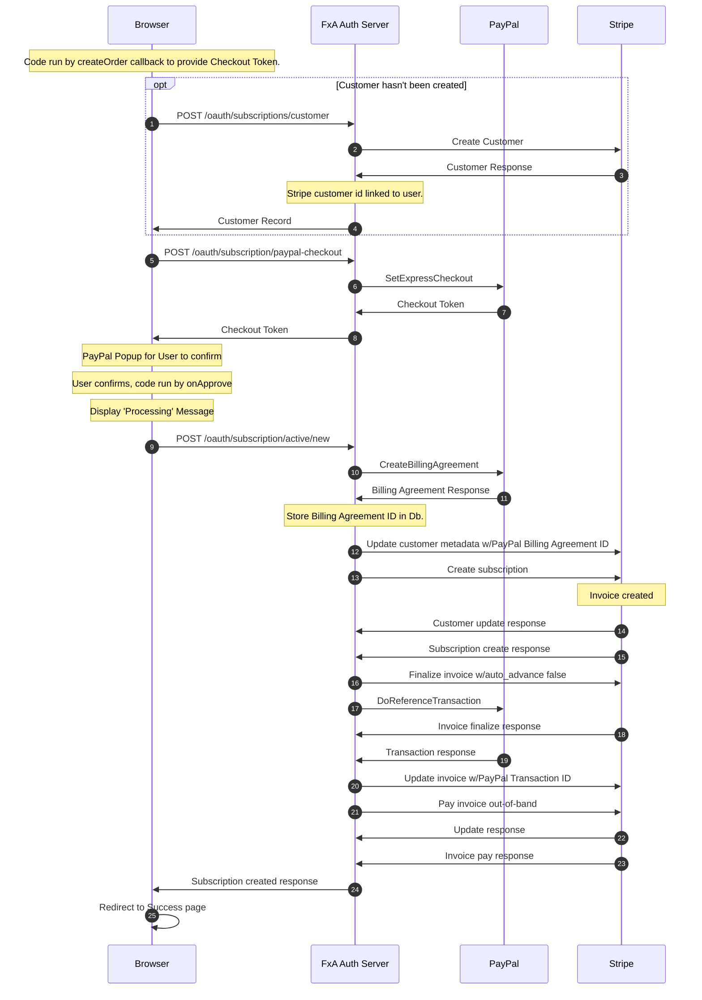

## Getting Started

Current as of `Jan 24, 2022`.

### Pre-Development

To begin working on the subscription platform in the FxA codebase, you will need access to a Stripe account for private and public API developer keys.

If you're a Mozilla employee, you can request access to the Stripe dev (and/or stage) account, created for the FxA Subscription Platform team to easily connect with fake products and plans. Otherwise, you can create your own Stripe account to use for testing that is not linked to any bank account information with your own products and plans. These keys should be taken from Stripe's test environment which you can verify by checking that the key includes the word `test`.

The `fxa-payments-server` needs the Stripe public key (`pk`) and communicates with the `fxa-auth-server` that requires a Stripe private or secret key (`sk`).¹ These can be found in the Stripe Dashboard, and configuration details can be found below.

¹ We have, in the past, given out restricted keys for use (`rk`). We may choose to do this again in the future or even use them in our dev environment.

### Configuration

You will need to create the file `fxa/packages/fxa-auth-server/config/secrets.json` and specify `subscriptions.stripeApiKey` with the value of your private Stripe API key. Ensure the key begins with `sk_test` to guarantee you are using the secret key and testing in the correct environment.

Ex:

```json
{
  "subscriptions": {
    "stripeApiKey": "sk_test_####"
  }
}
```

Additionally create the file `fxa/packages/fxa-payments-server/server/config/secrets.json` and specify `stripe.apiKey` to override the default Mozilla Stripe public API key with your own public key:

```json
{
  "stripe": {
    "apiKey": "pk_test_####"
  }
}
```

:::note
Note that neither `secrets.json` files are tracked in Git, and they take precedence over each server's default configurations, should you need to make any additional local-only modifications.
:::

#### Stripe Product/Plans

To see the available products or create a new one in the Stripe dashboard, navigate to Billing > Products and click into one of the products to see information including the product name, product ID, plan name, plan ID, metadata, logs, and events.

If you are using a new Stripe account, you will need to setup a product and its plan. The product should have additional metadata configured as needed.

:::note
Product Names are the canonical displayed name shown in Sub Plat UI. In some cases these may be paired with a plan's billing interval. Plan names are not displayed to users.
:::

##### Product Metadata

| Key | Description |
| --- | --- |
| downloadURL                               | Required. The download or subscription success action URL for the product.                 |
| product:privacyNoticeURL                  | Required. The URL for the webpage containing the Privacy Notice for the product offering.   |
| product:termsOfServiceURL                 | Required. The URL for the webpage containing the Terms of Service for the product offering. |
| product:termsOfServiceDownloadURL         | Required. The URL for a downloadable version of the Terms of Service for the product offering, used in emails. This must be a URL to the FxA CDN at https://accounts-static.cdn.mozilla.net. It can be either a) full, direct URL to a PDF (e.g. https://accounts-static.cdn.mozilla.net/legal/Mozilla_VPN_ToS/en-US.pdf), or, b) a URL without the language and file extension (e.g. https://accounts-static.cdn.mozilla.net/legal/mozilla_vpn_tos). See the "Legal Document Download URL Metadata" section below for more information.                                |
| webIconURL                                | Required. Image URL for product icon in web content. This must be a URL to the FxA CDN at https://accounts-static.cdn.mozilla.net.          |
| webIconBackground                         | Optional. A valid css color, color name or gradient for display behind your product icon on the web. Defaults to `#20123a`         |
| capabilities                              | Required if `capabilities:{clientID}` is not provided. Comma-separated list of capabilities enabled by this product for all Relying Parties.                                                                                                   |
| capabilities:{clientID}                   | Required if `capabilities` is not provided. Comma-separated list of capabilities enabled by this product for the Relying Party identified by {clientID}. |
| emailIconURL                              | Optional. Image URL for product icon in email content. This must be a URL to the FxA CDN at https://accounts-static.cdn.mozilla.net. |
| appStoreLink                              | Optional. The App store download URL for the product. |
| playStoreLink                             | Optional. The google play store download URL for the product. |
| productSet                                | Optional. An arbitrary string used to group products in a set of upgrades & downgrades. |
| productOrder                              | Optional. A number used for sorting products in a set. |
| product:details:{n}                       | Optional. Bullet-point feature details for the product, where {n} is a number or ordering the points. |
| product:details:{n}:{locale}              | Optional. Localized string override for product:details:{n}, where {locale} is the locale (e.g. fr-FR, zh-CN, de, etc). |
| product:privacyNoticeURL:{locale}         | Optional. Localized override URL for the webpage containing the Privacy Notice for the product offering. |
| product:privacyNoticeDownloadURL          | Optional. The URL for a downloadable version of the Privacy Notice for the product offering. This has the same requirements as product:termsOfServiceDownloadURL. |
| product:termsOfServiceURL:{locale}        | Optional. Localized override URL for the webpage containing the Terms of Service for the product offering. |
| product:subtitle                          | Optional. A subtitle for the product, usually displayed beneath the name in UI. |
| product:subtitle:{locale}                 | Optional. Localized string override for product:subtitle, where {locale} is the locale (e.g. fr-FR, zh-CN, de, etc). |
| product:successActionButtonLabel          | Optional. An alternative label for the subscription success action button. The action is specified by `downloadURL`. |
| product:successActionButtonLabel:{locale} | Optional. Localized override for the alternative label for the subscription success action button. |
| support:app:{x}                           | Optional. An app or service for the support form. The form options will be in the same order as the metadata. These values shouldn't be too long as they are displayed in dropdown options of limited width. The `{x}` part of the key can be any string and will not be used anywhere; the value of the metadata is submitted to Zendesk. |
| upgradeCTA                                | Optional. HTML content string describing available upgrades from this plan. By convention, should include a link back to a product lead page. That lead page links back to FxA's plan subscription pages. |
| promotionCodes                            | Optional. A comma separated list of promotion codes that are valid for the product. |
###### Product Metadata defaults

Some of the metadata properties listed above [have defaults][product-details-defaults] that are used when they're not defined in Stripe:

```json
  subtitle: 'Full-device VPN',
  details: [
    'Device-level encryption',
    'Servers in 30+ countries',
    'Connect 5 devices with one subscription',
    'Available for Windows, iOS and Android',
  ],
  termsOfServiceURL:
    'https://www.mozilla.org/about/legal/terms/firefox-private-network',
  termsOfServiceDownloadURL:
    'https://accounts-static.cdn.mozilla.net/legal/Mozilla_VPN_ToS/en-US.pdf',
  privacyNoticeURL: 'https://www.mozilla.org/privacy/firefox-private-network',
  privacyNoticeDownloadURL:
    'https://accounts-static.cdn.mozilla.net/legal/mozilla_vpn_privacy_notice/en-US.pdf',
```

[product-details-defaults]: https://github.com/mozilla/fxa/blob/main/packages/fxa-shared/subscriptions/metadata.ts#L14

###### Legal Document Download URL Metadata

For the legal document download URL metadata,
`product:termsOfServiceDownloadURL` and `product:privacyNoticeDownloadURL`,
they can be in the form of an incomplete URL, as they will be handled by a
redirect endpoint that tries to best match the user's locale to a localized
version of the document.  For example, if the value of
`product:termsOfServiceDownloadURL` is
'https://accounts-static.cdn.mozilla.net/legal/mozilla_vpn_tos' and the user's
locale is `de`, then the endpoint will redirect the user to
https://accounts-static.cdn.mozilla.net/legal/mozilla_vpn_tos.de.pdf.

##### Subscription Metadata

| Key                       | Value                                                                                          |
| ------------------------- | ---------------------------------------------------------------------------------------------- |
| previous_plan_id          | The value of the previous plan that the user had been subscribed to.                           |
| plan_change_date          | Unix timestamp of the date the plan was changed.                                               |
| cancelled_for_customer_at | Unix timestamp of the date when the subscription was cancelled for the customer through FxA UI |

## Navigating the Payment Flow

Once your API keys are set, restart the affected servers (`auth` or `payments`) if needed.

Reference the [workflow](../how-tos/creating-an-account-locally) section of the FxA docs to sign up for and verify an account. You should now be able to access the payment flow at:

```
http://localhost:3030/subscriptions/products/{productId}?plan={planId}
```

The `productId` should match the ID from a product taken from the Stripe dashboard. The `plan` parameter is optional, unless you want to specify a plan.  Otherwise, if the product has multiple plans, the first one in the list as returned by Stripe is used.  If you are running the entire FxA stack and are using the keys from the Stripe FxA dev account, you can navigate to `123done` on port `:8080` to click on the link beginning with "Subscribe" to reach the form with a prepopulated product.

Enter any name, valid expiration date, CVC number, and any card number from the [Stripe test cards docs](https://stripe.com/docs/testing#cards) to successfully create a test subscription.

Navigate back to `http://localhost:3030/subscriptions` to manage your subscriptions.

## Understanding Subscription Status

Stripe defines the [valid states a subscription status can be in their API docs](https://stripe.com/docs/api/subscriptions/object#subscription_object-status).
Since `incomplete` and `incomplete_expired` are subscriptions that have never been paid, FxA ignores them except for the following condition: if a user with a subscription in an `incomplete` state successfully enters valid payment information, the `incomplete` subscription will be paid and activated.

FxA's Stripe account is configured to not allow subscriptions to become `unpaid` and will cancel the subscription instead.

The last 4 states are `active`, `trialing`, `past_due`, and `cancelled`. The first three of these are considered active for the purposes of allowing the user access to the capabilities provided by the subscription, while `cancelled` subscriptions grant none.

### Stripe Radar and Payment Blocking

We use [Stripe Radar](https://stripe.com/docs/radar/rules) to block payments from both potentially abusive sources as well as from potential subscribers in currently unsupported regions. Our production radar rules are [documented in Mana](https://mana.mozilla.org/wiki/display/FJT/Stripe+Radar+Rules).

## Interactions with Stripe

### Payments Server

The payments server is an isolated service that serves all subscription related
pages that utilize the Stripe Javascript SDK. It's isolated from the primary FxA
domain to comply with constraints on 3rd party Javascript on pages handling FxA
authentication.

When a subscription page is loaded, the React application served by the payment
server:

1. Loads the Stripe Javascript SDK (for tokenizing credit cards)
2. Makes direct OAuth authenticated API calls to [account](https://github.com/mozilla/fxa/blob/main/packages/fxa-auth-server/docs/api.md#account)/[subscription endpoints][]
   on the Auth Server as needed

The payments server handles the payment flow as well as serving pages for managing
a user's subscription that are linked from the Settings page.

[subscription endpoints]: https://github.com/mozilla/fxa/blob/main/packages/fxa-auth-server/docs/api.md#subscriptions

### Auth Server

FxA's Auth Server makes Stripe API calls for authenticated FxA users via its [subscription
endpoints][]. Stripe updates are sent back to the Auth Server via Stripe webhooks when a
users subscription has been created/updated/deleted.

Some Stripe webhooks will trigger emails.  These emails are behind a feature flag.  If you wish to send emails in your environment, set the auth server configuration

```json
{
  "subscriptions": {
    "transactionalEmails": {
      "enabled": true
    }
  }
}
```

or the environment variable `SUBSCRIPTIONS_TRANSACTIONAL_EMAILS_ENABLED` to "true".  In order to receive Stripe webhook events in your local development, you need to use the [Stripe CLI](https://stripe.com/docs/stripe-cli/webhooks)'s event forwarding feature.  (For how to view these and other FxA emails, see [the FxA README section on MailDev](https://github.com/mozilla/fxa/#running-with-maildev).)

## PayPal Integration

PayPal can be configured as an additional payment provider in the Subscription Platform.  PayPal's [Express Checkout Reference Transactions](https://developer.paypal.com/docs/archive/express-checkout/integration-guide/ECReferenceTxns/) is the feature that enables the Subscription Platform to use PayPal as a payment provider for recurring subscriptions.  The customer's PayPal Billing Agreement ID is saved for future subscription invoices.  See [the diagram below](#paypal-checkout) for details on this process.

The PayPal paid subscriptions are still driven by Stripe's subscription and invoicing model.  The key difference is that PayPal paid subscriptions have a [collection method](https://stripe.com/docs/api/subscriptions/object#subscription_object-collection_method) of `send_invoice`.  The [PayPal processor](#paypal-processor) is used to pay the invoices with the customer's billing agreement ID.

### PayPal Accounts

You need three types of PayPal accounts for development.

- PayPal Developer Account: allows you to access the PayPal Developer Dashboard
- Sandbox PayPal Personal Account: used for testing as the customer
- Sandbox PayPal Business Account: used for testing

To create a PayPal developer account, sign up at https://developer.paypal.com/.  Note that if you are a Mozilla employee, you should contact the Mozilla PayPal admin in Finance to set up a developer account.  Additionally, you should [enable 2FA for the developer account](https://www.paypal.com/businessmanage/profile/loginSecurity).

Once you are in the PayPal developer dashboard, navigate to "Accounts" under the Sandbox section of the menu.  Here you can create [a pair of personal and business sandbox accounts](https://developer.paypal.com/docs/api-basics/sandbox/accounts/).  (To easily create multiple accounts for testing, there's a [bulk account creation feature](https://developer.paypal.com/docs/api-basics/sandbox/bulk-accounts/).)

Once you've added your account pair, navigate to the bussines account by selecting "View/edit account".  Now click on the "API Credentials" tab.  You'll need the "NVP/SOAP Sandbox API Credentials" for the next section.

### Configuration

#### Auth Server

In order to enable and use PayPal in the auth server, set the following configuration options

```json
{
  "subscriptions": {
    "paypalNvpSigCredentials": {
      "enabled": true,
      "sandbox": true,
      "user": "your PayPal NVP API User name",
      "pwd": "your PayPal NVP API password",
      "signature": "your PayPal NVP API signature"
    }
  }
}
```

The environment variables equivalent would be
```shell
SUBSCRIPTIONS_PAYPAL_ENABLED=true \
PAYPAL_SANDBOX=true \
PAYPAL_NVP_USER='your PayPal NVP API User name' \
PAYPAL_NVP_PWD='your PayPal NVP API password' \
PAYPAL_NVP_SIGNATURE='your PayPal NVP API signature'
```

#### Payments Server

The Payments frontend also does not offer PayPal as payment provider by default.  To enable the feature, set the following configuration options

```json
{
  "paypal": {
    "clientId": "sb",
    "apiUrl": "https://www.sandbox.paypal.com",
    "scriptUrl": "https://www.paypal.com"
  }
}
```

Or use the environment variables

```shell
PAYPAL_CLIENT_ID='sb' \
PAYPAL_API_URL='https://www.sandbox.paypal.com' \
PAYPAL_SCRIPT_URL='https://www.paypal.com'
```

The paypal*/PAYPAL_* values are the defaults in the repo.  For local development, you do not need to change them.

### The PayPal Button

The Payments frontend uses the [PayPal JavaScript SDK](https://developer.paypal.com/docs/business/javascript-sdk/) to [add a button](https://developer.paypal.com/docs/business/checkout/configure-payments/single-page-app/) to the checkout process to [integrate with PayPal's NVP/SOAP API](https://developer.paypal.com/docs/business/javascript-sdk/javascript-sdk-configuration/#intent-options-when-integrating-with-older-apis).  This button is loaded and displayed in an iFrame by PayPal.

### Instant Payment Notification (IPN)

[PayPal IPN](https://developer.paypal.com/docs/api-basics/notifications/ipn/) is PayPal's equivalent of Stripe's webhook feature.  We do rely on IPNs in the Subscription Platform.  Unlike Stripe, however, PayPal does not offer any tool that would forward the events to your local environment.  Our team use [ngrok](https://ngrok.com/) for that purpose.

Once you have the services running locally, start ngrok with `ngrok 9000` and note the public URL.  Using your sandbox business account and the public URL fron ngrok, complete [these steps to set up IPNs](https://developer.paypal.com/docs/api-basics/notifications/ipn/IPNSetup/).


### PayPal Processor

After the initial payment during subscription creation, the recurring payments for future invoices are handled by the PayPal processor script.  To simulate or debug charging additional invoices paid by PayPal, you need to run this script.  It is located at `packages/fxa-auth-server/scripts/paypal-process.ts`.

The script will make up to a configurable number of [attempts to pay](https://developer.paypal.com/docs/archive/express-checkout/ec-set-up-reference-transactions/#capture-future-payments) an invoice before cancelling the subscription.  This attempts count is saved to the invoice itself as metadata.  The invoice's metadata is also used to prevent sending multiple failed payment emails per invoice from the PayPal payment attempts.

## Ladder Diagrams of Payment Interactions

### PayPal Checkout

Conditions for this flow:

- User has no payment source on file, or is a new customer.
- User clicks the displayed [PayPal Smart Button](https://developer.paypal.com/docs/checkout/integrate/#3-render-the-smart-payment-buttons) to pay with PayPal.

This diagram represents the activity after the PayPal button is clicked.


